# ADDRLIB

**第一章：为什么需要 Mipmap（3 页）**

- **纹理缩小时遇到的问题**
  用近处和远处的同一张纹理说明：大量纹理细节落入少量屏幕像素，容易出现锯齿、摩尔纹和闪烁。解释直接从高分辨率纹理采样的局限。
- **Mipmap 如何解决这些问题**
  展示逐级缩小、经过预过滤的纹理金字塔。解释 mip level，以及如何根据屏幕上的覆盖尺度选择合适层级。LOD 和三线性过滤只介绍作用。
- **Mipmap 的收益与代价**
  讲清画质、采样效率与额外存储之间的关系。用普通二维纹理说明各级数据量的变化，区分理想数据量和考虑对齐后的实际占用。

**第二章：为什么还需要 Mip Tail（3 页）**

- **GPU 纹理的分块存储**
  简单介绍线性布局与 tiled 布局，以及 tile/block、对齐的含义。让听众理解：实际分配空间受到块大小和布局规则约束。
- **小 Mip 带来的空间浪费**
  用示意图说明：纹理层级越来越小，如果每级仍独占完整的大块，大量空间会空着。比较有效数据量与分配空间。
- **Mip Tail 的基本思路**
  将多个小 mip 按规则放入共享区域，提高空间利用率。介绍普通 mip、tail mip 和“第一个进入 tail 的层级”。说明各级仍然独立，tail 中仍需要地址映射。

**第三章：AddrLib 在工程中负责什么（2 页）**

- **输入与输出**
  输入包括纹理尺寸、格式、mip 数量、资源类型和布局模式。输出包括对齐尺寸、各级位置、tail 信息及资源占用。
- **布局计算与地址计算的关系**
  先确定各级 mip 在资源中的布局，再确定指定 texel 的位置。通过一张流程图串起 mip、block、块内坐标和 swizzle；swizzle 只讲作用与输入输出。

**第四章：完整计算过程与贯穿算例（6 页，重点章节）**

使用同一张纹理贯穿整章，建议选择 **二维 RGBA8、单采样、完整 mip 链、GFX10 的一种明确支持的 64KB 布局模式**。普通 mip 和 tail mip 各选一个坐标进行计算。

| 页次 | 讲解内容                                                     | 本页要得到的结果                              |
| ---- | ------------------------------------------------------------ | --------------------------------------------- |
| 1    | 明确输入参数、资源基址、布局模式和计算目标，解释每个参数的单位 | 一张可复算的输入表                            |
| 2    | 逐级计算 mip 尺寸，结合块尺寸说明对齐、pitch 和普通 mip 的块数 | 各级尺寸与空间需求表                          |
| 3    | 逐级检查进入 tail 的条件，同时考虑尺寸限制和剩余层级数量     | 第一个 tail mip，以及普通 mip/tail mip 的分界 |
| 4    | 按所选模式的实际规则计算普通 mip 偏移、共享 tail 分配和资源总占用 | 带数值与偏移标注的内存布局图                  |
| 5    | 选取一个普通 mip 内的 texel，计算所属块、块内坐标、swizzle 结果并组合地址 | 一个完整的普通 mip 地址                       |
| 6    | 选取一个 tail mip 内的 texel，计算 tail 原点、平移后的坐标，再进行 swizzle 和地址组合 | 一个完整的 tail mip 地址，并与普通路径对照    |

这一章的讲解要求：

- 每一步都展示“输入、计算方法、中间结果、结果用途”，避免只列公式。
- 全章使用同一套参数，明确区分元素数、块数和字节数。
- swizzle 展示所需映射及代入结果，最多挑一两个地址位解释，不展开整张位映射表。
- tail 原点与最终 texel 地址分别说明，避免重复叠加 tail 偏移。
- 用一个简短的非整齐尺寸例子补充说明对齐，不再引入第二套完整算例。

**第五章：工程对照与关键认识（2 页）**

- **讲解内容与工程资料的对应关系**
  指出概念说明、tail 分析、计算示例和版本核对资料各自的位置，并标明相关上游源码入口，便于听众后续阅读。
- **容易混淆的概念**
  回顾 mip 层级与内存排列顺序、逻辑尺寸与对齐尺寸、tail 原点与最终地址。说明 tail 的具体规则需要结合架构代际和布局模式理解。

> 补全依据：当前 [ADDRLIB.md](ADDRLIB.md)，SHA-256 为 `537CFA6D9FAFBAF3601B219B686D94CAA4B7C69FDFE89005DFF36A0B4CB6D3BB`。原稿已原样保存于 Git 提交 `669bb678a76dee066d8719833590abf03df71e6d`，原稿 SHA-256 为 `3D6E332C0D1522D990323B2321748B2BDCE301129FF35C48D3EB24C2926A70EC`。
>
> 本文保留原稿提纲、说明和已写公式，在缺失处补充。后文算例沿用原稿已有的 **256³、1 BPE、SW_256KB_3D** 参数；上方提纲中“二维 RGBA8、GFX10 64KB”是另一种选例建议，不与本次算例混用。具体规则以当前主文档为准，不把整条计算路径直接称为 GFX10.2 或某一代 GPU 的完整实现。
>
> 新增框图使用 **Mermaid** 绘制，同时提供 SVG 插图和可编辑的 `.mmd` 源码。原稿配图仅复制到项目内并改为相对链接，没有修改图片内容。

### addrlib解决的问题

​	addrlib是把输入坐标、元素的bpp、swizzle mode、mip0尺寸、base addr、mipmap_level、max mipmap id、sample num和msaa等信息作为输入，通过一系列计算，得到当前元素对应的tiled surface地址的模块。

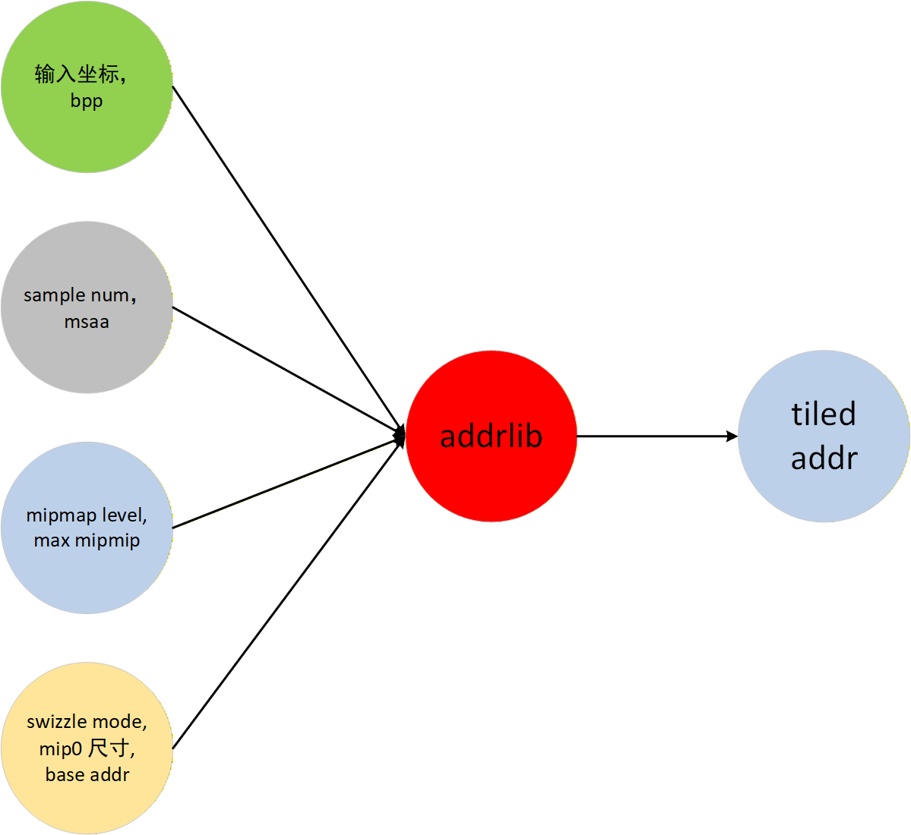

#### 为什么需要mipmap

​	GPU 纹理模块经常会遇到以下两种情况。低分辨率纹理插值出高分辨率的目标图，以及高分辨率的纹理插值出低分辨率的目标图。这是因为在GPU的渲染中，视角会一直变，同一个物体，可能突然会用很近的视角去观察，之后又会用很远的视角去观察。

​	低分辨率纹理插值出高分辨率的目标图，会遇到目标图清晰度很低的问题。

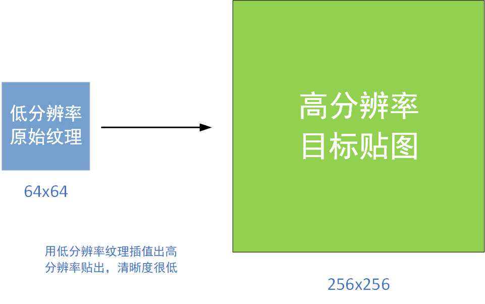

​	而高分辨率的纹理插值出低分辨率的目标图，会遇到cache miss率很高，性能很差的问题。

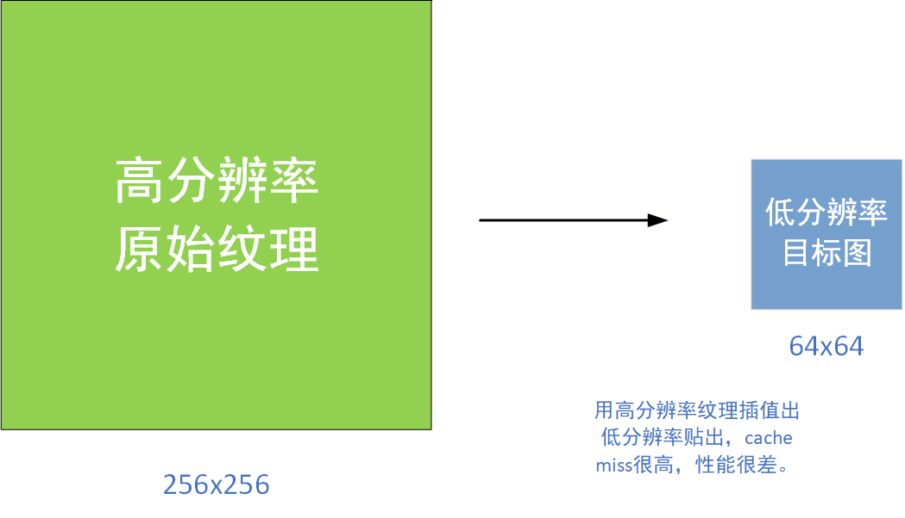

​	左边的图是高分辨率纹理插值低分辨率目标图的场景，一些纹理样点没被使用或者使用频率低。反而造成了大量cache miss。右边是比较理想的插值情况，这种情况下，即不会造成清晰度变差，也不会导致cache miss变高。

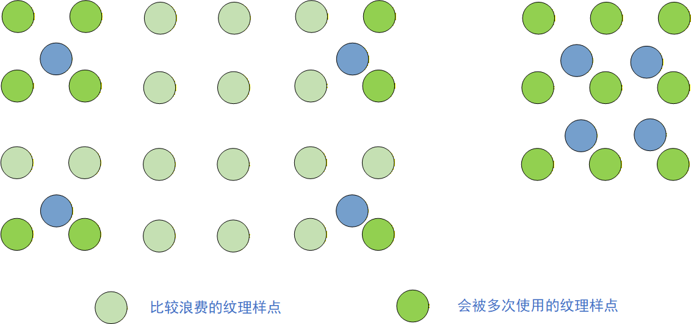

​	补充：纹理缩小除了可能降低 cache 利用率，还会出现走样、摩尔纹以及运动中的闪烁，因为一个屏幕像素覆盖了多个 texel，而少量采样不足以代表整个覆盖区域。具体 cache miss 取决于访问模式、过滤方式和缓存实现，不能仅由“原图分辨率高”推出一定很高。

​	Mipmap 的主要用途是改善缩小采样。放大纹理时，mipmap 不会凭空增加原图没有的细节；双线性插值可以让过渡平滑，但不能恢复缺失的高频内容。

#### 	mipmap方案

​	下图分辨是在GPU中对纹理的真实的存储方式，不仅需要把原始mip_id = 0的图片存储，还需要把它多次2倍抽样出的纹理图存下来。当进行纹理渲染时，可以直接使用分辨率接近的mipmap图用来插值。

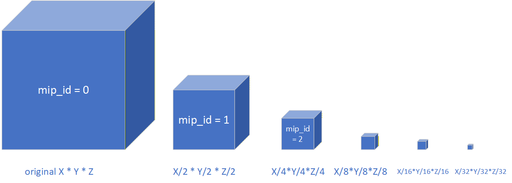

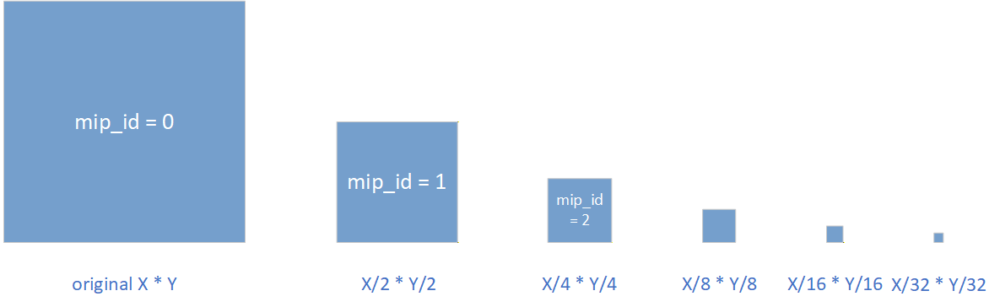

#### mipmap 的选择、收益与代价

​	各级 mip 应由适当的低通预过滤生成，而不是简单丢掉隔行、隔列的样点。缩小采样时，根据像素在纹理上的覆盖范围选择 LOD；双线性过滤在一个 mip 内插值，三线性过滤再混合相邻两个 mip，以减少层级切换的突变。当前地址模块接收已经确定的 `mip_level` 和坐标，不负责选择 LOD、生成 mip 或计算过滤权重。

​	对于边长为二次幂、未压缩、单采样的正方形二维纹理（W=H），每级宽高减半，因此理想数据量如下：

| mip | 宽高示意 | 相对 mip0 的元素数 |
| ---- | -------- | ----------------- |
| 0 | W × H | 1 |
| 1 | W/2 × H/2 | 1/4 |
| 2 | W/4 × H/4 | 1/16 |
| 3 | W/8 × H/8 | 1/64 |

~~~text
全部 mip 的理想数据量 < mip0 数据量 × (1 + 1/4 + 1/16 + ...) = mip0 × 4/3
~~~

​	所以常说这类完整二维 mip 链的额外数据量约为 1/3。长宽相差很大的纹理在一个方向先缩到 1 后，后续级别不再每次缩为 1/4，不能直接套用该比例。这个估算也不包含 block 对齐、tail 布局、压缩格式约束或元数据，不能原样用于三维纹理；实际占用应按具体布局计算。

#### 	mipmap tail

​	对于某一个mipmap，会按macro block来对齐。macro block是tiled surface的最大的tile单位。使用macro block可以方便计算，并且使得拥有更好的空间关联性。对于mip_id比较小的mipmap来说，通常由很多macro block组成。对于mip_id比较大的mimap来说，通常由1个或者几个macro block组成。而对于mip_id更大的mimap来说，存储它所有样点所需要的存储空间都远不到一个macro block的尺寸。如果按macro block来对齐，每一个mip_id更大的mimap都会占用一个macro block的存储空间，会非常浪费。因此会把这些mipmap全部打包到一个macro block当中一起存储，这个macro block叫做mipmap_tail。

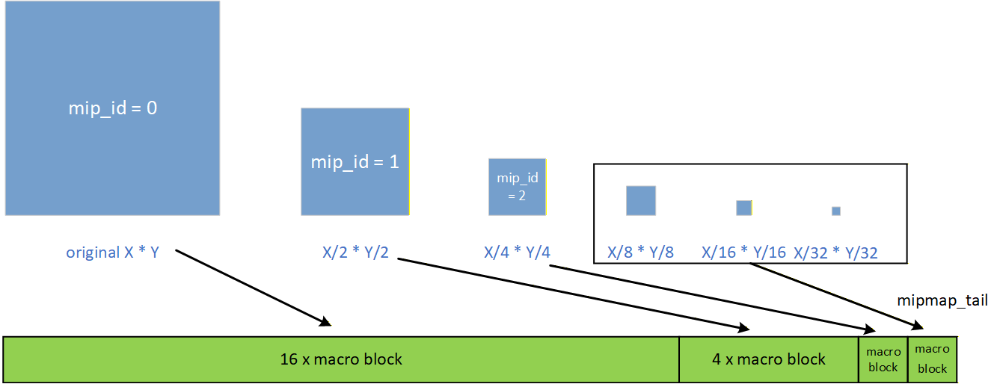

​	例如最后 6 级二维小 mip 的有效数据分别为 1024、256、64、16、4、1 B，合计只有 1365 B。若每级都独占一个 64KB block，就需要 384KB；若所选布局允许这些 mip 进入同一个 tail，则该共享区域只计一次分配。这个例子只说明打包的收益，是否能入 tail 还必须检查实际尺寸、剩余 mip 数量和所选模式的规则。

​	入 tail 不等于多个 mip 的有效 texel 重叠。各级有各自的原点和位映射位置，地址计算仍要先识别当前 mip，再完成 tail 内寻址。

#### 	tiled surface排布

​	阅读本节配图时，`bpp=1` 或 `1bpp` 的原稿写法按其乘法实际表示 **1 byte per element，即 1 BPE = 8 bits per element**。本文后续统一用 BPE 表示字节数，用 bpp 表示位数。4KB 是 4096 B，256KB 是 262144 B。

​	standard/zorder 段落用于说明“块外排列”和“块内排列”的层次。后面的具体地址必须查当前 `sw_mode / l2_ns / l2_eb` 对应的位映射表，不能只凭 standard 或 zorder 名称套用一个通用 Morton 公式。

##### 	standard

​	下图表示了某一个不属于mipmap tail的mipmap的常见排布方式，swizzle mode是standard。

​	一张以tiled方式排布的图像，首先会以macro block的方式把图像切成很多块，macro block常见的大小有256B、4KB、64KB、256KB，以raster的顺序排列。如果swizzle mode是standard，macro block接下来会以256B的大小切割成很多micro block。micro block的排列顺序按照morton排序。在一个micro block内部，多个样点之间依然采取raster order。

​	下图中一个macro block的size是4KB，bpp=1，64x64x1=4KB。macro block的元素有64x64个。micro block的size是256B，16x16x1 = 256B，micro block的元素有16x16个。

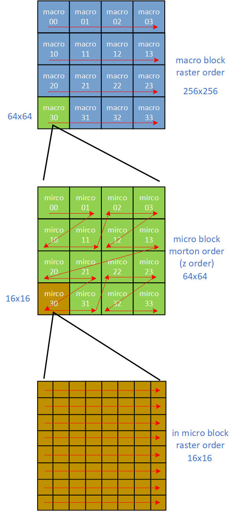

​	morton排序是一种特殊的排序方式，多运用在对空间关联性要求比较高的场景。以上图为例，假设X坐标用2bit表示X[1:0], Y坐标用2bit表示Y[1:0]，morton排序的方式是，先把每个坐标的每个bit抽出来得到：X[1], X[0], Y[1], Y[0]。接下来对bit进行高低位排列，比如{Y[1], X[1], Y[0], X[0]} = order[3:0]。那么以morton排序的micro block的顺序就是[order=0, order=1 .... order=15]. 再把每个order值换算成对应的[X, Y]坐标，如下表。这是一种最简单的morton排序方式。

​	morton排序的坐标的维度可以是任意，每个轴的bit数也可以任意，每个bit的排序也是任意的，因此morton排序能够构建出无数种排序方式。把每个轴的低bit放在低位，高bit放在高位，即可得到空间关联性很强的排序方式。

| order      | [X, Y] 坐标 |
| ---------- | ----------- |
| order = 0  | [0, 0]      |
| order = 1  | [1, 0]      |
| order = 2  | [0, 1]      |
| order = 3  | [1, 1]      |
| order = 4  | [2, 0]      |
| order = 5  | [3, 0]      |
| order = 6  | [2, 1]      |
| order = 7  | [3, 1]      |
| order = 8  | [0, 2]      |
| order = 9  | [1, 2]      |
| order = 10 | [0, 3]      |
| order = 11 | [1, 3]      |
| order = 12 | [2, 2]      |
| order = 13 | [3, 2]      |
| order = 14 | [2, 3]      |
| order = 15 | [3, 3]      |

##### 	zorder

​	下图表示了某一个不属于mipmap tail的mipmap的常见排布方式，swizzle mode是zorder。

​	一张以tiled方式排布的图像，首先会以macro block的方式把图像切成很多块，macro block常见的大小有256B、4KB、64KB、256KB，以raster的顺序排列。如果swizzle mode是zorder，macro block的排列顺序按照morton排序。也就是说，standard是以micro block做morton排序，micro block内部做raster排序。而zorder是在macro block内部直接以元素为单位做morton排序。

​	下图中一个macro block的size是4KB，bpp=1，64x64x1=4KB。macro block的元素有64x64个。morton排序会在64x64大小的macro block来做。X轴一共有6个bit，Y轴有6个bit，也就说一共是12个bit的morton排序。图中省略了morton排序的

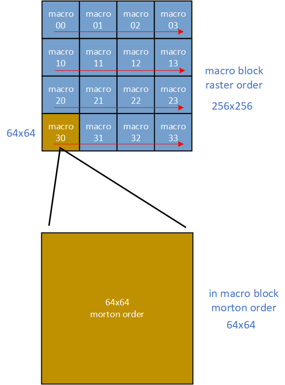

​	补全图注：图中省略的是大块内部更多层级的位交织细节，只保留主要的空间次序。这里讨论的 Morton 排列发生在一个 macro block **内部**；不同 macro block 的块坐标仍通过后文的 `block_index_calc` 计算。原稿上一段“macro block 的排列顺序按照 morton”应结合这个层次理解。

### 计算方式

#### 输入、输出与单位

​	顶层 `addr_calc_full_gc` 接收一个访问请求，输出该元素的字节地址和是否位于 tail 的标志。其内部 `mipmap_param_calc_core_gc` 只计算布局参数，不输出最终 texel 地址。

| 顶层输入 | 含义 | 单位或编码 |
| -------- | ---- | ---------- |
| x / y / z | 当前 mip 内的局部坐标 | 元素；不再右移 mip_level |
| s | 当前 sample 的编号 | 0 ～ samples-1 |
| map0_w_minus_1 / map0_h_minus_1 / map0_d_minus_1 | mip0 的尺寸减一 | 实际尺寸为输入值 + 1 |
| baseAddr256B | 文档定义的基址字段，含可提取的 swizzle 位 | 256B 单位 |
| log2_element_bytes = l2_eb | 元素字节数的 log2 | 0/1/2/3/4 对应 1/2/4/8/16 BPE |
| log2_num_samples = l2_ns | 采样数的 log2 | 0/1/2/3 对应 1/2/4/8 samples |
| sw_mode | 布局模式 | 由下一节的表解码 |
| mip_level | 当前访问的 mip | 从 0 编号 |
| maxmip | 本次资源最后一个有效 mip | 总数为 maxmip + 1 |

| mipmap_param_calc_core_gc 输出 | 含义 | 单位 |
| ----------------------------- | ---- | ---- |
| pitch | 当前 mip 对齐后的横向跨度 | 元素 |
| slice | 有效 mip 的 XY 对齐贡献累计后恢复的面积量 | XY 元素位置数；不是完整三维资源字节数 |
| mip_in_tail | 当前 mip 相对首个 tail mip 的编号 | 0 起；不在 tail 时为 MAXMIP=17 |
| mip_offset_b | 当前 mip 的宏块偏移 | **256B 单位**，转字节需左移 8 |
| l2_ms | macro block 字节数的 log2 | 指数 |
| l2_blk_w / l2_blk_h / l2_blk_d | macro block 宽、高、深的 log2 | 元素尺寸的指数，共 3 个输出 |
| l2_blk_w_slice | slice 计算使用的块宽指数 | Linear 的 slice 按 256B 对齐 |

~~~text
element_bytes = 1 << l2_eb
num_samples = 1 << l2_ns
bpp = 8 × element_bytes
MAXMIP = 17                         // 内部处理 mip0～mip16
mip_offset_bytes = mip_offset_b << 8
~~~

​	`slice` 在普通单采样情形可乘元素字节数换算为一层对应的字节步长；厚块模式中，`block_index_calc` 还会按 `l2_blk_d` 把 Z 换成宏块深度单位，不能再次随意乘整个资源深度。二维多采样的容量还要计入有效采样数。

​	虽然 mip 参数模块列出了 `x/y/z/s/map0_d_minus_1`，当前给出的布局公式没有使用它们。坐标和 sample 后续参与寻址；不要为了“补完整”而给 mip 参数公式新增深度乘法或坐标依赖。

​	本文复算保留明确写出的位切片；未给出的信号宽度不自行截断。有关符号位与地址宽度的算例约定放在“计算举例”中。变量别名统一按下表阅读，不修改原稿中的拼写：

| 原稿写法 | 本文补充使用的名称 |
| -------- | ------------------ |
| maxmip_in | maxmip |
| mips_in_tail | num_mips_in_tail |
| pad_sz_w / pad_sz_h | pad_data_sz_w / pad_data_sz_h |
| l2_blk_width / l2_blk_height_ / l2_blk_depth | l2_blk_w / l2_blk_h / l2_blk_d |
| l2_block_ms | l2_ms |

#### 	swizzle mode decoder

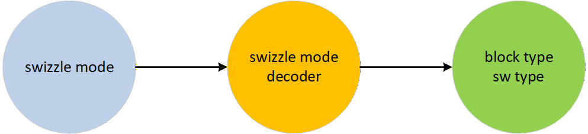

linear = sw_type == `SW_LINEAR

| swizzle mode | blk_type         | sw_type |
| ------------ | ---------------- | ------- |
| SW_LINEAR    | SZ_LIN (SZ_128B) | SW_L    |
| SW\_256B_2D  | SZ_256B          | SW_D_2D |
| SW\_4KB_2D   | SZ_4KB           | SW_D_2D |
| SW\_64KB_2D  | SZ_64KB          | SW_D_2D |
| SW\_256KB_2D | SZ_256KB         | SW_D_2D |
| SW\_4KB_3D   | SZ_4K            | SW_S_3D |
| SW\_64KB_3D  | SZ_64KB          | SW_S_3D |
| SW\_256KB_3D | SZ_256KB         | SW_S_3D |

​	按主文档，`sw_mode` 是解码前的输入，`sw_type` 是解码后的类型。上方原稿中的判断应按下式阅读：

~~~text
linear = (sw_type == SW_L)
// 等价地，也可从输入判断 sw_mode == SW_LINEAR
~~~

​	表中 `SW_4KB_3D` 行的 `SZ_4K` 按主文档名称 `SZ_4KB` 阅读。二维块尺寸公式与当前主文档一致，本次不替换为上游的另一套公式。

#### 	macro block size

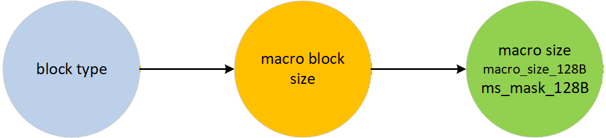

| blk_type | l2_ms | l2_ms_128B | ms_mask_128B(mask of ms bits used) |
| -------- | ----- | ---------- | ---------------------------------- |
| SZ_LIN   | 7     | 0          | 0                                  |
| SZ_256B  | 8     | 1          | 1                                  |
| SZ_4KB   | 12    | 5          | 1f                                 |
| SZ_64KB  | 16    | 9          | 1ff                                |
| SZ_256KB | 18    | 11         | 7ff                                |

#### 	macro block dimention calculation

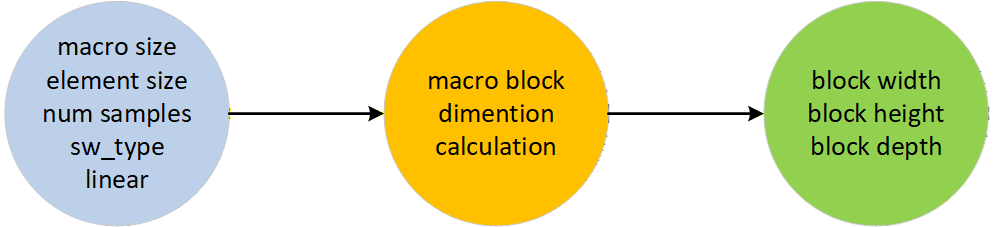

dim3D = (sw_type == \`SW_S_3D)

msaa = (dim3D | linear) ? 2'd0 : l2_ns **//l2_ns is log2 of num samples**

block_size_elements = l2_ms - (l2_eb + msaa) **//l2_ms is log2 of macro size //l2_eb is log2 of element size** 

if {linear, sw_type} == {1'b0, \`SW_D_2D} //2D

{

​	l2_blk_w = block_size_elements[4:1] + (block_size_elements[0] & (l2_eb[0] || l2_ns[0]))

​	l2_blk_h = block_size_elements[4:1]

​	l2_blk_d = 4'h0

}

else if {linear, sw_type} == {1'b0, \`SW_S_3D} //3D

{

​	l2_blk_w = sheet(l2_ms[4:1] l2_eb[2:0])  **//log2 of block width**

​	l2_blk_h =  sheet(l2_ms[4:1] l2_eb[2:0]) **//log2 of block height**

​	l2_blk_d =  sheet(l2_ms[4:1] l2_eb[2:0]) **//log2 of block depth**

}

else //1D or linear

{

​	l2_blk_w = block_size_elements

​	l2_blk_h = 4'h0

​	l2_blk_d = 4'h0

}

| IN macro size, element size | IN l2_ms[4:1], l2_eb[2:0] | OUT l2_blk_w_3d log2 of 3d blk width | OUT l2_blk_h_3d log2 of 3d blk height | OUT l2_blk_d_3d log2 of 3d blk depth |
| -------------------------------- | ------------------------------ | ---------------------------------------------- | ----------------------------------------------- | ---------------------------------------------- |
| 4KB, 8bpp                        | 4'b0110, 3'd0                  | 4 (16)                                         | 4 (16)                                          | 4 (16)                                         |
| 4KB, 16bpp                       | 4'b0110, 3'd1                  | 3 (8)                                          | 4 (16)                                          | 4 (16)                                         |
| 4KB, 32bpp                       | 4'b0110, 3'd2                  | 3 (8)                                          | 4 (16)                                          | 3 (8)                                          |
| 4KB, 64bpp                       | 4'b0110, 3'd3                  | 3 (8)                                          | 3 (8)                                           | 3 (8)                                          |
| 4KB, 128bpp                      | 4'b0110, 3'd4                  | 2 (4)                                          | 3 (8)                                           | 3 (8)                                          |
| 64KB, 8bpp                       | 4'b1000, 3'd0                  | 6 (64)                                         | 5 (32)                                          | 5 (32)                                         |
| 64KB, 16bpp                      | 4'b1000, 3'd1                  | 5 (32)                                         | 5 (32)                                          | 5 (32)                                         |
| 64KB, 32bpp                      | 4'b1000, 3'd2                  | 5 (32)                                         | 5 (32)                                          | 4 (16)                                         |
| 64KB, 64bpp                      | 4'b1000, 3'd3                  | 5 (32)                                         | 4 (16)                                          | 4 (16)                                         |
| 64KB, 128bpp                     | 4'b1000, 3'd4                  | 4 (16)                                         | 4 (16)                                          | 4 (16)                                         |
| 256KB, 8bpp                      | 4'b1001, 3'd0                  | 6 (64)                                         | 6 (64)                                          | 6 (64)                                         |
| 256KB, 16bpp                     | 4'b1001, 3'd1                  | 5 (32)                                         | 6 (64)                                          | 6 (64)                                         |
| 256KB, 32bpp                     | 4'b1001, 3'd2                  | 5 (32)                                         | 6 (64)                                          | 5 (32)                                         |
| 256KB, 64bpp                     | 4'b1001, 3'd3                  | 5 (32)                                         | 5 (32)                                          | 5 (32)                                         |
| 256KB, 128bpp                    | 4'b1001, 3'd4                  | 4 (16)                                         | 5 (32)                                          | 5 (32)                                         |

#### 	macro size 256B align

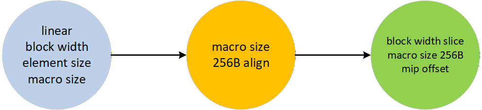

l2_blk_w_slice = (linear && (l2_blk_w < 'd8)) ? ('d8 - l2_eb) : l2_blk_w; //256B align

l2_ms_256B = (l2_ms_128B=='d0) ? 'd0 : (l2_ms_128B - 1) // log 256B align

l2_mip_offset = (l2_ms < 5'd8) ? 5'd0 : l2_ms - 5'd8

#### 	calculate num mips in tail

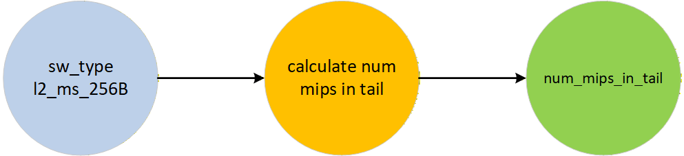

​	is_3d_blk_size = (sw_type == `SW_S_3D) //not always the same as dim_type == \`dim_3D

​	case(l2_ms_256B)

​	{

​		4'd4: l2_ms_256B_3d = 4'd3 //12-4/3 - 8 = 3 (4kB)

​		4'd8: l2_ms_256B_3d = 4'd6 //16-8/3 - 8 = 6 (64KB)

​		4'd10: l2_ms_256B_3d = 4'd7 //18 - 10/3 - 8 = 7 (256KB)

​	}

​	l2_ms_256B_eff = (is_3d_blk_size) ? l2_ms_256B_3d : l2_ms_256B

​	//this assumes that l2_ms_256B can only be 256B, 4K, 64K, VAR

​	//VAR sizes are : l2_ms = 14 ... 20

​	//GFX12: Block sizes are: 256B(8), 4KB(12), 64KB(16), 256KB(18)

​	case (l2_ms_256B_eff)

​	4'd0: num_mips_in_tail = 'd1 //this will handle the linear cases as well (l2_ms = 7)

​	4'd3: num_mips_in_tail = 'd5 //(1+(1<<(l2_ms_256B_eff + 8 - 9)))

​	4'd4, 4'd6, 4'd7, 4'd8, 4'd9, 4'd10, 4'd11, 4'd12: num_mips_in_tail = (l2_ms_256B_eff + 4'd4) // (((effective_block_size_log2_256B + 8) - 11) + 7) => (l2_ms_256B_eff + 4'd4)

#### 	in_tail_chk for num

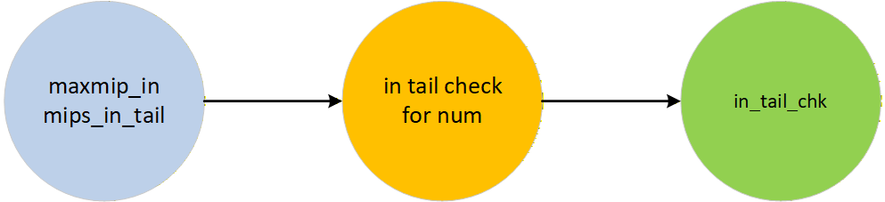

//you can fit only some number of mips inside a tail, everything else will be outside

//this condition needs to be in conjunction with the mipsizes check

mips_outside_tail = (maxmip_in - mips_in_tail) //extra bit to allow for negative result

for (m=0; m<MAXMIP;m=m+1)

{

​		in_tail_chk[m] = ((m > mips_outside_tail) | mips_outside_tail[msb]) // if mips_outside_tail is -ve, then in_tail_chk is true, mips_outside_tail[msb] only use mips_outside_tail's msb bit, only 1 bit

}

#### 	calculate per mip size(block unit)

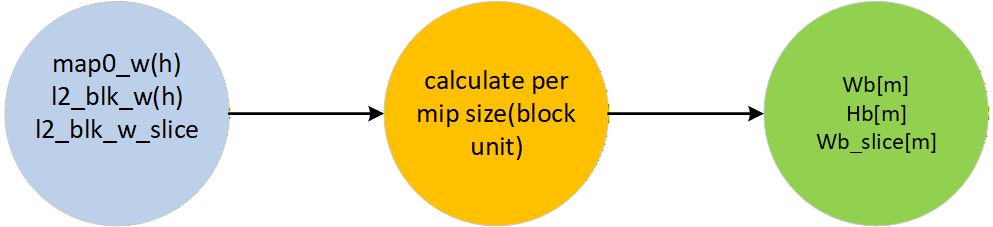

​	function pad_to_log2sz_gc (input dim_in, input l2_pad_sz_in, output pad_out)
​	{

​		//total "after padding" bits required depends on what is the minimum size of the padding supported

​		//pads to at least one block

​		//in some cases, user can pass 'PAD_WIDTH' to override this

​		pad_sz_mask = (1'b1 << l2_pad_sz_in) - 1'b1

​		pad_out = (dim_in >> l2_pad_sz_in) + |(dim_in & pad_sz_mask)

​	}

​	Wb0 = pad_to_log2sz_gc(map0_w, l2_blk_w)

​	Hb0 = pad_to_log2sz_gc(map0_h, l2_blk_h)

​	Wb_slice0 = pad_to_log2sz_gc(map0_w, l2_blk_w_slice)

​	pad_data_sz_w = 1'b1 << l2_blk_w

​	pad_data_sz_h = 1'b1 << l2_blk_h

​	for(m=1;m<MAXMIP;m=m+1) { // W_H_block_calc

​		Wb[m] = (Wb0 >> m) + |Wb0[\`PAD_W_MSB(m):0];

​		Hb[m] = (Hb0 >> m) + |Hb0[\`PAD_H_MSB(m):0];

​		Wb_slice[m] = (Wb_slice0 >> m) + |Wb_slice0[\`PAD_W_MSB(m):0]

​	}

​	这里 `pad_out` 的单位是“块数”，不是对齐后的元素数。主文档的 `PAD_W_MSB(m)/PAD_H_MSB(m)` 分别取 `min(m-1, W0_B_WIDTH-1)` 和 `min(m-1, H0_B_WIDTH-1)`，限制低位检查范围；在存储宽度足以容纳输入的正尺寸范围内：

~~~text
pad_to_log2sz_gc(dim, k) = ceil(dim / 2^k)
对齐后的尺寸 = pad_out << k
Wb[m] = ceil(Wb0 / 2^m)
Hb[m] = ceil(Hb0 / 2^m)
~~~

​	非整齐尺寸补充：若宽高为 257×129、块宽高为 64×64，则 mip0 的 `Wb0=5、Hb0=3`，对齐尺寸为 320×192；按当前递推式，mip1 的块数为 `ceil(5/2)×ceil(3/2)=3×2`，对应 192×128。这个例子只演示 padding，不另设一条完整地址计算路径。

#### 	final in mip tail check

​	先补上本节使用但原稿尚未定义的 `y_bias`：

~~~text
y_bias = (sw_type == SW_S_3D) && (blk_type 为 4KB 或 256KB)
w_tail_sz = y_bias ? pad_data_sz_w : (pad_data_sz_w >> 1)
h_tail_sz = y_bias ? (pad_data_sz_h >> 1) : pad_data_sz_h

in_miptail[0] = (map0_w <= w_tail_sz)
             && (map0_h <= h_tail_sz)
             && in_tail_chk[0]
~~~

​	主文档用 `blk_type[0]` 表达“4KB 或 256KB”，完整枚举编码没有给出，因此这里按主文档注释解释。下方原稿中的 `W/H` 在 mip0 直接检查时对应 `map0_w/map0_h`；循环则使用前一级的块数推导下一级能否入 tail。

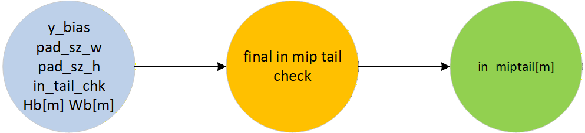

​	w_tail_sz = y_bias ? pad_sz_w : (pad_sz_w >> 1)

​	h_tail_sz = y_bias ? (pad_sz_h>>1) : pad_sz_h

​	in_miptail = (H<= h_tail_sz) & (W<= w_tail_sz) & in_tail_chk

​	for(m=0;m<MAXMIP-1;m=m+1) begin: CHK_NEXT_IN_MIPTAIL

​		//y_bias_intail is special condition for checking in_tail

​		//in_tail_chk[m+1] is check if the mip is outside the number of levels that can fit inside a tail 

​		//next_in_tail[m+1]  //=1, if the next mip is inside the miptail

​		height_in_tail = y_bias ? (Hb[m] <=1) : (Hb[m]<=2);

​		width_in_tail = y_bias ? (Wb[m] <=2) : (Wb[m]<=1);

​		in_miptail[m+1] = next_in_tail[m+1] = height_in_tail && width_in_tail && in_tail_chk[m+1]

​	end

####  calculate mip_id and mip_size

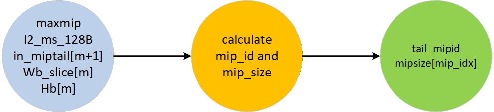

//set the tail mipid to max to indicate no tails are supported

tail_mipid_raw = {MAXMIP} // no tail

for(i=0; i<MAXMIP; i++) begin

​	if(i==0) begin if(in_miptail[i]) tail_mipid_raw = i; end

​	else begin if(in_miptail[i]^in_miptail[i-1]) tail_mipid_raw = i; end

end

tail_mipid = ((maxmip == 0) | ((l2_ms_128B>>1) == 0) ? MAXMIP : tail_mipid_raw) // linear and SW_\*_256B are treated  same - no miptails

for (int mip_idx=MAXMIP-1;mip_idx >=6; --mip_idx) begin

​	if(mip_idx > tail_mipid) begin

​		mipsize[mip_idx] = 'd0;

​	end else if ((mip_idx==tail_mipid) || (mip_idx == (MAXMIP-1))) begin

​		mipsize[mip_idx] = 'd1;

​	end else begin

​		mipsize[mip_idx] = Wb_slice[mip_idx] * Hb[mip_idx];

​	end

end

​	上方原稿只列出了 S1 的 mip16～mip6 分支。主文档还在 S2 计算 mip5～mip0；先补齐这部分，再进行后面的求和：

~~~text
for (int mip_idx = 5; mip_idx >= 0; --mip_idx) {
    if (mip_idx > tail_mipid)
        mipsize[mip_idx] = 0;
    else if (mip_idx == tail_mipid)
        mipsize[mip_idx] = 1;
    else
        mipsize[mip_idx] = Wb_slice[mip_idx] * Hb[mip_idx];
}
~~~

​	`mipsize` 是用于布局累计的块贡献：tail 前按 XY 块数计，首个 tail 计 1，后续 tail mip 计 0，因为它们共享已经分配的 tail。计 0 不表示这些 mip 没有 texel。S1 对 mip16 的特殊分支仍按原文保留；是否参与总和由 `maxmip_mask` 决定。

mip_mask = ((1'b1<<(mip_level + 4'd1)) - 1'b1); //for SLICE_CALC, ignore mip

maxmip_mask = ((1'b1 << (maxmip + 4'd1)) - 1'b1); 

slice_input_en = maxmip_mask; //所有有效mip的en，用于总mipsize的累加计算

mip_off_input_en = slice_input_en & ~mip_mask; //

mip_offset_in_blks = (mip_off_input_en[16] ? mipsize[16] : 'd0) + 

​				     (mip_off_input_en[15] ? mipsize[15] : 'd0) + 

​				     (mip_off_input_en[14] ? mipsize[14] : 'd0) + 

​				     (mip_off_input_en[13] ? mipsize[13] : 'd0) + 

​				     (mip_off_input_en[12] ? mipsize[12] : 'd0) + 

​				     (mip_off_input_en[11] ? mipsize[11] : 'd0) + 

​				     (mip_off_input_en[10] ? mipsize[10] : 'd0) + 

​				     (mip_off_input_en[9] ? mipsize[9] : 'd0) + 

​				     (mip_off_input_en[8] ? mipsize[8] : 'd0) + 

​				     (mip_off_input_en[7] ? mipsize[7] : 'd0) + 

​				     (mip_off_input_en[6] ? mipsize[6] : 'd0) +

​					(mip_off_input_en[1] ? mipsize[1] : 'd0) + 

​					 (mip_off_input_en[2] ? mipsize[2] : 'd0) + 

​					 (mip_off_input_en[3] ? mipsize[3] : 'd0) + 

​					 (mip_off_input_en[4] ? mipsize[4] : 'd0) +

​					 (mip_off_input_en[5] ? mipsize[5] : 'd0) ;

slice_b = (slice_input_en[16] ? mipsize[16] : 'd0) + 

​		 (slice_input_en[15] ? mipsize[15] : 'd0) + 

​		 (slice_input_en[14] ? mipsize[14] : 'd0) + 

​		 (slice_input_en[13] ? mipsize[13] : 'd0) + 

​		 (slice_input_en[12] ? mipsize[12] : 'd0) + 

​		 (slice_input_en[11] ? mipsize[11] : 'd0) + 

​		 (slice_input_en[10] ? mipsize[10] : 'd0) + 

​		 (slice_input_en[9] ? mipsize[9] : 'd0) + 

​		 (slice_input_en[8] ? mipsize[8] : 'd0) + 

​		 (slice_input_en[7] ? mipsize[7] : 'd0) + 

​		 (slice_input_en[6] ? mipsize[6] : 'd0) +

​		(slice_input_en[0] ? mipsize[0] : 'd0) + 

​		 (slice_input_en[1] ? mipsize[1] : 'd0) + 

​		 (slice_input_en[2] ? mipsize[2] : 'd0) + 

​		 (slice_input_en[3] ? mipsize[3] : 'd0) + 

​		 (slice_input_en[4] ? mipsize[4] : 'd0) + 

​		 (slice_input_en[5] ? mipsize[5] : 'd0) ;

slice= slice_b << ({1'b0, l2_blk_w_slice} + {1'b0, l2_blk_h});

pitch = Wb[mip_level] << l2_blk_w;

mip_offset_b= mip_offset_in_blks << l2_mip_offset;

mip_in_tail= (mip_level < tail_mipid) ? {MAXMIP} : (mip_level - tail_mipid);

l2_blk_width = l2_blk_w;

l2_blk_height_= l2_blk_h;

l2_blk_depth= l2_blk_d;

l2_ms = l2_ms

#### tail origin calculation

​	来源为主文档 `calc_mip_inside_tail_xyz_orig`。输入是相对 tail 编号 `mip_in_tail`、模式和元素/采样指数；输出是当前 mip 在共享区域中的坐标原点。这里使用的是 **256B micro block** 的尺寸，不要覆盖前面 macro block 的 `l2_blk_w/h/d`。

~~~text
l2_block_ms = l2_ms
l2_ms_odd = l2_block_ms[0]
l2_block_ms_128B = l2_ms - 7
l2_data_block_size_256B =
    (l2_block_ms_128B == 0) ? 0 : (l2_block_ms_128B - 1)

block_bits = 4'(8 - (l2_eb + l2_ns))
l2_2d_blk_w = block_bits[3:1] + block_bits[0]
l2_2d_blk_h = block_bits[3:1]
~~~

​	三维分支对 `block_bits=4…8` 按主文档查商和余数 `q_3/r_3`，对应除以 3 的结果：

~~~text
l2_3d_blk_d = q_3 + (r_3 > 0)
l2_3d_blk_w = q_3 + (r_3 > 1)
l2_3d_blk_h = q_3
~~~

​	选择二维或三维候选后，记为 `l2_ublk_w/h/d`。三维演示只用单采样；不为未列出的组合补造查表项。随后按 tail 容量逆序定位：

~~~text
reverse = num_mips_in_tail - (mip_in_tail + 1)

if reverse 的符号位为 1:
    byte_offset = 0
else if reverse > 6:
    byte_offset = 16 << reverse
else:
    byte_offset = reverse << 8
~~~

​	按主文档的交织顺序，并沿用后文 `BYTE_OFFSET_IN_MIPTAIL_WIDTH=20` 的复算约定，`byte_offset[19:8]` 拆成：

~~~text
{x_micro[5], y_micro[5], ..., x_micro[0], y_micro[0]}
x_micro 取原 byte_offset 的 bit 9、11、13、15、17、19
y_micro 取原 byte_offset 的 bit 8、10、12、14、16、18
~~~

​	如果 `l2_ms_odd=1`，交换这两个 micro block 坐标；再左移对应的 micro block 尺寸指数。原文对 X/Y 原点显式保留低 10 位，Z 原点固定为 0：

~~~text
x_mip_in_tail_orig = 10'(x_micro_final << l2_ublk_w)
y_mip_in_tail_orig = 10'(y_micro_final << l2_ublk_h)
z_mip_in_tail_orig = 0

x_in_sheet = x_mip_in_tail_orig + x
y_in_sheet = y_mip_in_tail_orig + y
z_in_sheet = z_mip_in_tail_orig + z
~~~

​	`byte_offset` 在这条路径中只用来构造原点；加上原点后还要查位表，不能再把 `byte_offset` 当成另一项加到最终地址。

#### blk_offset calculation

​	以 `sw_mode、l2_ns、l2_eb` 选择主文档中的一行位映射，将 `x_in_sheet/y_in_sheet/z_in_sheet/s` 的对应位拼接成 `blk_offset`。表格左侧是高位，元素内部的字节位由末尾常数 0 表示。表的注释虽写 `blk_offset[6:0]`，具体 tiled 表项可能有 8、12、16 或 18 位，应以所选行的完整拼接为准。

​	为避免重复维护整张表，所有模式的映射仍以 [ADDRLIB.md](ADDRLIB.md) 的位表为准；本稿在贯穿算例中展开实际使用的 18 位行。

#### block_index_calc

​	输入坐标先换算成 macro block 坐标。本文两条贯穿算例使用原始 mip 局部坐标；加入 tail 原点前后的 X/Y 都不跨宏块边界，因此结果不受该连接选择影响。

~~~text
log2_blk_slice = l2_blk_w_slice + l2_blk_h
pitch_b = pitch >> l2_blk_w
slice_b = slice >> log2_blk_slice

xb = x >> l2_blk_w
yb = y >> l2_blk_h
zb = z >> l2_blk_d

slice_times_z_l = slice_b[15:0] * zb
slice_times_z_h = slice_b[SLICE_WIDTH_B-1:16] * zb
pitch_times_y = pitch_b * yb
blk_index_pitch = pitch_times_y + xb
blk_index_slice = slice_times_z_l + (slice_times_z_h << 16)

l2_ms_slice = (l2_ms < 8) ? 8 : l2_ms
blk_index = (blk_index_pitch << l2_ms)
          + (blk_index_slice << l2_ms_slice)
~~~

​	`pitch_b/slice_b/xb/yb/zb` 在乘加前都是块单位；最后两个左移完成字节换算，因此输出 `blk_index` 虽然名字含 index，实际已经是 **字节偏移**。对于 tiled 模式，块序号部分可以读成 `zb*slice_b + yb*pitch_b + xb`；Linear 则保留 128B 的横向块尺度与 256B 的 slice 尺度。

#### base address、XOR swizzle 与 address_final

​	先从输入基址中提取 swizzle 种子并清理，再加入 mip 偏移。保持主文档原式的运算顺序：

~~~text
swizzle_bits_256B = baseAddr256B[11:0] & (ms_mask_128B >> 1)[11:0]

baseAddr256B_out = {
    baseAddr256B[ADDR_WIDTH_256B-1:BLK_256B_WIDTH],
    (baseAddr256B[BLK_256B_WIDTH-1:0] & ~ms_mask_128B >> 1)
}

mipoffset_BaseAddr256B_out = baseAddr256B_out + mip_offset_b
~~~

​	`~ms_mask_128B >> 1` 的结果受信号位宽和取反/移位顺序影响，不擅自改为另一种掩码公式。本文示例基址低字段全 0，且采用足宽无符号解释，清理不改变基址。

~~~text
micro_offset_linear[6:0] = x[6:0] << l2_eb
ms_mask_256B = ms_mask_128B >> 1

blk_offset_final = linear
    ? {1'b0, micro_offset_linear}
    : blk_offset[7:0]

swizzle_bits =
    (blk_offset[DATA_BLK_OFFSET_WIDTH-1:8]
     & ms_mask_256B[DATA_BLK_OFFSET_WIDTH-8-1:0])
    ^ swizzle_bits_256B

addr_offset =
    blk_index[47:0]
    | (swizzle_bits << 8)[19:0]
    | blk_offset_final[45:0]

address_final = ({mipoffset_BaseAddr256B_out, 8'd0}) + addr_offset
mipid_in_tail = (mip_in_tail != MAXMIP)
~~~

​	特别注意：最新主文档的非 Linear 路径只取 `blk_offset[7:0]` 作为最终低位候选，高位经 XOR 后再合成。原文对 Linear 候选明确声明了 7 位宽，不能把左移后的完整值当成该信号的值。更宽的引用按算例约定零扩展；这些宽度说明不构成 RTL 仿真结果。

### 计算流程图

​	框图按数据依赖画出“布局参数 → tail 原点／块索引 → 块内映射 → 最终地址”。S0/S1/S2 名称沿用主文档，但图中不额外推断寄存器、时钟周期或握手信号。

##### 顶层数据通路


[Mermaid 源码](assets/addrlib_mas/diagrams/01_address_pipeline.mmd)

​	布局输入决定 pitch、slice 和 mip 偏移；当前坐标决定宏块位置和块内位置。只有位映射路径使用加上 tail 原点后的 X/Y/Z，sample 编号 s 直接参与位表，示例中的块索引按原始局部坐标计算。两路最终在地址合成处汇合。

##### mipmap 参数模块的 S0／S1／S2


[Mermaid 源码](assets/addrlib_mas/diagrams/02_mipmap_stages.mmd)

​	S0 准备块尺寸、tail 容量与 mip0 块数；S1 形成所有 mip 的块数和 tail 标记；S2 补上低 mip 贡献并汇总。原稿按两组求和是为了对应分段计算，数学上仍是各个有效 mip 的贡献相加。

#### mipmap tail布局

​	普通 mip 与 tail mip 的差别有两层：布局阶段，普通 mip 单独计块，tail 区域只在首个 tail mip 计一次；寻址阶段，tail mip 先把局部坐标平移到共享区域内。


[Mermaid 源码](assets/addrlib_mas/diagrams/03_tail_origin.mmd)

| 量 | 作用 | 是否直接作为最终字节地址加项 |
| -- | ---- | -------------------------- |
| tail_mipid | 整条链中第一个进入 tail 的 mip | 否 |
| mip_in_tail | 当前 mip 在 tail 中的相对编号 | 否 |
| byte_offset | 生成 tail 原点的拆位输入 | **否** |
| x/y/z_mip_in_tail_orig | 当前 mip 的坐标原点 | 加到坐标，再查位表 |
| mip_offset_b | mip 所在宏块区域的偏移 | 以 256B 单位加到基址 |
| blk_offset | 平移后坐标的块内映射结果 | 经高低位拆分和 XOR 合成 |

​	后文算例中，mip3～mip12 共享 tail，但 mip4 的原点是 (32,0,0)，不是 tail 区域的基址；原点对应的真实块内字节位置也不等于中间的 `byte_offset=0x2000`。

#### y_bias翻转

​	“翻转”应理解为 **哪一个方向使用半块作为入 tail 的阈值**，不是把所有输入坐标直接交换。

| y_bias | 宽度阈值 | 高度阈值 | 由前一级推导下一级的块数条件 |
| ------ | -------- | -------- | -------------------------- |
| 0 | block_width / 2 | block_height | Wb[m] ≤ 1 且 Hb[m] ≤ 2 |
| 1 | block_width | block_height / 2 | Wb[m] ≤ 2 且 Hb[m] ≤ 1 |

​	当前定义中，仅 `SW_S_3D` 的 4KB 和 256KB 模式取 `y_bias=1`；64KB 三维和二维模式取 0。两行都还需要 `in_tail_chk[m+1]` 为真，不能省略剩余 mip 数量限制。


[Mermaid 源码](assets/addrlib_mas/diagrams/04_axis_rules.mmd)

​	另一个独立条件 `l2_ms_odd` 才控制 tail 原点计算中的 micro block X/Y 交换。当前 tiled 宏块的 `l2_ms=8/12/16/18` 都是偶数，因此这些模式不触发该交换；Linear 的 7 虽为奇数，但当前规则不支持 tail。不能将 `y_bias` 和 `l2_ms_odd` 当成同一标志。

#### XOR的意义

​	XOR 可以把种子参与的地址位重新排列，用于改变访问在硬件通道或 bank 选择位上的分布；它不增加存储容量，也不改变元素低字节位。具体对应哪些硬件资源仍取决于架构，当前文档只给出了地址位运算。

~~~text
0 XOR 0 = 0       0 XOR 1 = 1
1 XOR 0 = 1       1 XOR 1 = 0

(offset_high XOR seed) XOR seed = offset_high
~~~

下图展开 tiled 路径；Linear 路径的低位候选仍使用前文的 7 位 `micro_offset_linear`。


[Mermaid 源码](assets/addrlib_mas/diagrams/05_xor_compose.mmd)

​	以 `blk_offset=0x8175` 为例，只演示块内字段：

~~~text
low8 = 0x75
high = 0x81
seed = 0x01
high XOR seed = 0x80
重新合成的块内结果 = (0x80 << 8) | 0x75 = 0x8075
~~~

​	如果错误地把原来的完整 `0x8175` 也 OR 进去，被 XOR 清零的 bit8 会重新变成 1。因此当前主文档明确使用 `blk_offset[7:0]`。可信 case0 采用的早期源版本曾使用完整候选；其 seed=0，最终数值恰好相同，不能用该例证明两种写法普遍等价。

​	主文档注释提到 XOR 只对特定 X/T 模式启用，但当前顶层没有完整给出该使能端口及模式映射。本稿保留现有公式，贯穿算例使用 seed=0；上述 seed=1 仅用于解释位运算，不冒充已验证的硬件模式用例。

### 计算举例

//计算举例需要把每一个中间的重要变量计算出来

​	这一章以原稿已经选定的 256³ 表面贯穿，采用两个可信用例的输入：普通 mip0 的 (69,134,195) 和 tail 内 mip4 的 (5,6,3)。每个小节先给共同量，再给两条访问路径的区别。参考：[case1](case/case1_mip0_xyz_69_134_195.md)、[case0](case/case0_mip4_xyz_5_6_3.md)。

| 输入 | 普通 mip0 | tail mip4 |
| ---- | --------- | --------- |
| sw_mode | SW_256KB_3D | 相同 |
| map0_w/h/d_minus_1 | 255 / 255 / 255 | 相同 |
| l2_eb / l2_ns | 0 / 0，即 1 BPE、单采样 | 相同 |
| maxmip | 12，共 13 个请求 mip | 相同 |
| mip_level | 0 | 4 |
| x / y / z / s | 69 / 134 / 195 / 0 | 5 / 6 / 3 / 0 |
| baseAddr256B | 0x00300000 | 相同 |
| 对应字节基址 | 0x30000000 | 相同 |

​	`maxmip=12` 沿用可信用例。256³ 按常规连续缩小到 1³ 的完整链到 mip8，本例并不把 mip9～12 宣称为通常图形 API 必然接受的资源配置；它们用于按当前文档公式复算。mip0 和 mip4 的访问坐标均在其逻辑尺寸范围内。

​	位宽解释沿用用例：`MAXMIP=17`；`MAXMIP_WIDTH=5` 时 reverse 用 7 位补码判断负数；`BYTE_OFFSET_IN_MIPTAIL_WIDTH=20`；字节地址取 48 位、256B 基址取 40 位、低字段 `BLK_256B_WIDTH=12`。未明确的乘加按足宽整数处理，不能当作 RTL 位宽已经确认。

#### 简单参数计算

map0_w = 256

map0_h = 256

map0_d = 256

l2_eb = 0 //log2 of 元素size

l2_ns = 0 //log2 of msaa采样

blk_type = SZ_256KB //macro block size 64 x 64 x 64 x 1bpp = 256KB

SW_type = SW_S_3D

linear = 0 

l2_ms = 18 //log2 of macro size 256KB

l2_ms_128B = 11 // log2 of macro size, 128B unit, 256KB

l2_ms_256B = 10 // log2 of macro size, 256B unit, 256KB

ms_mask_128B = 0x7FF

dim3D = 1

msaa = 0

block_size_elements //一个macro block，元素个数的log2

l2_blk_w = 6 //一个macro block width的log2

l2_blk_h = 6 //一个macro block height的log2

l2_blk_d = 6 //一个macro block depth的log2

​	补齐上面的未赋值变量和后续公共量：

~~~text
element_bytes = 1 << 0 = 1 B
num_samples = 1 << 0 = 1
block_size_elements = 18 - (0 + 0) = 18
macro block = 64 × 64 × 64 × 1 B = 262144 B = 256KB

l2_blk_w_slice = 6
l2_ms_256B = 11 - 1 = 10
l2_mip_offset = 18 - 8 = 10
l2_ms_slice = max(18, 8) = 18

is_3d_blk_size = 1
l2_ms_256B_3d = 7
l2_ms_256B_eff = 7
num_mips_in_tail = 7 + 4 = 11
y_bias = 1

pad_sz_mask = (1 << 6) - 1 = 0x3F
Wb0 = Hb0 = Wb_slice0 = (256 >> 6) + |(256 & 0x3F) = 4
pad_data_sz_w = pad_data_sz_h = 64
~~~

​	结果用途：6/6/6 决定坐标如何切成宏块坐标与块内坐标；容量 11 和阈值 64×32 用于后面的入 tail 判定。

#### in_miptail compution

​	先检查剩余层级数量，再检查尺寸：

~~~text
mips_outside_tail = maxmip - num_mips_in_tail = 12 - 11 = 1
in_tail_chk[m] = (m > 1)
mip0、mip1 为 0；mip2～mip16 为 1

Wb = Hb = Wb_slice = [4,2,1,1,1,1,1,1,1,1,1,1,1,1,1,1,1]

w_tail_sz = 64
h_tail_sz = 32
in_miptail[0] = (256 <= 64) && (256 <= 32) && 0 = 0
~~~

​	因为 `y_bias=1`，检查下一级时使用前一级的 `Wb≤2、Hb≤1`：

| 待判定 mip | 检查哪一级块数 | Wb≤2 | Hb≤1 | 本级 in_tail_chk | in_miptail |
| ---------: | -------------- | ----: | ----: | ---------------: | ----------: |
| 1 | mip0：4×4 | 0 | 0 | 0 | 0 |
| 2 | mip1：2×2 | 1 | 0 | 1 | 0 |
| 3 | mip2：1×1 | 1 | 1 | 1 | 1 |
| 4～16 | 前一级：1×1 | 1 | 1 | 1 | 1 |

~~~text
首次 0→1 出现在 mip3
tail_mipid_raw = 3

maxmip != 0
(l2_ms_128B >> 1) = (11 >> 1) = 5 != 0
tail_mipid = 3

mip0: mip_in_tail = 17
mip4: mip_in_tail = 4 - 3 = 1
~~~

​	内部数组继续计算到 mip16；本资源只有 mip0～mip12 有效，mip13～16 的标志不会让它们参与存储累计。17 是“当前 mip 不在 tail”的哨兵，不是合法的相对 tail 层级。

#### mip_offset_in_blks and slice computation

​	将每个 mip 的块数、tail 贡献和宏块偏移放在一起。偏移以当前 Z 宏块深度分组的起点为参照；表中逻辑尺寸仅帮助理解，本例不由它重新替换文档的块数递推。

| mip | 逻辑宽×高×深 | Wb×Hb | in_tail_chk | in_miptail | mipsize | 本资源启用 | 宏块偏移／字节 |
| ---: | ------------ | ----- | -----------: | ---------: | ------: | ---------- | -------------- |
| 0 | 256×256×256 | 4×4 | 0 | 0 | 16 | 是 | 6／0x180000 |
| 1 | 128×128×128 | 2×2 | 0 | 0 | 4 | 是 | 2／0x080000 |
| 2 | 64×64×64 | 1×1 | 1 | 0 | 1 | 是 | 1／0x040000 |
| 3 | 32×32×32 | 1×1 | 1 | 1 | 1 | 是 | 0／0 |
| 4 | 16×16×16 | 1×1 | 1 | 1 | 0 | 是 | 0／0 |
| 5 | 8×8×8 | 1×1 | 1 | 1 | 0 | 是 | 0／0 |
| 6 | 4×4×4 | 1×1 | 1 | 1 | 0 | 是 | 0／0 |
| 7 | 2×2×2 | 1×1 | 1 | 1 | 0 | 是 | 0／0 |
| 8 | 1×1×1 | 1×1 | 1 | 1 | 0 | 是 | 0／0 |
| 9～12 | 1×1×1 | 1×1 | 1 | 1 | 0 | 是，沿用用例输入 | 0／0 |
| 13～16 | 1×1×1 | 1×1 | 1 | 1 | 0 | 否 | 不参与有效资源 |

~~~text
maxmip_mask = (1 << 13) - 1 = 0x01FFF
slice_input_en = 0x01FFF
slice_b = 16 + 4 + 1 + 1 = 22
slice = 22 << (6 + 6) = 90112 = 0x16000
~~~

| 量 | mip0 | mip4 |
| -- | ---- | ---- |
| mip_mask | 0x00001 | 0x0001F |
| mip_off_input_en | 0x01FFE | 0x01FE0 |
| mip_offset_in_blks | 4+1+1 = 6 | mip5～12 的贡献全为 0 |
| mip_offset_b | 6 << 10 = 0x1800 | 0 |
| mip_offset_bytes | 0x1800 << 8 = 0x180000 | 0 |
| pitch | 4 << 6 = 256 | 1 << 6 = 64 |
| slice | 90112 | 90112 |
| mip_in_tail | 17 | 1 |

​	两条访问的 `l2_ms=18、l2_blk_w/h/d=6/6/6、l2_blk_w_slice=6` 相同。mip4 的逻辑宽是 16，而模块输出 pitch 是 64，它们分别描述有效尺寸与文档中的对齐跨度。


[Mermaid 源码](assets/addrlib_mas/diagrams/06_example_memory.mmd)

​	图中从低地址到高地址依次是共享 tail、mip2、mip1、mip0，因此 mip0 的偏移不是 0。一个 Z 宏块深度分组的链步长为：

~~~text
22 × 256KB = 0x580000 B = 5767168 B = 5.5 MiB
~~~

​	`slice=90112` 不是整个三维表面的大小。若只按本文统一步长覆盖 mip0 深度所需的 4 个 64 层分组，其地址跨度是 `4×0x580000=0x1600000 B=22 MiB`；这是当前公式下的步长覆盖量，不是上游接口返回的精确三维资源总占用，也不是理想逐 mip 体素数之和。

#### blk_offset computation

​	本节先算 tail 原点，再对两组坐标使用同一行 swizzle 位表。

~~~text
l2_block_ms = 18
l2_ms_odd = 0
l2_block_ms_128B = 11
l2_data_block_size_256B = 10
num_mips_in_tail = 11

block_bits = 8 - (0 + 0) = 8
q_3 = 2, r_3 = 2
l2_ublk_w/h/d = 3/2/3
micro block = 8 × 4 × 8 × 1 B = 256B
~~~

| 中间量 | 普通 mip0 | tail mip4 |
| ------ | --------- | --------- |
| mip_in_tail | 17 | 1 |
| mip_in_tail_reverse | 11-(17+1)=-7 | 11-(1+1)=9 |
| 7 位补码／符号位 | 1111001／1 | 0001001／0 |
| byte_offset | 0，命中负数分支 | 16 << 9 = 0x2000 |
| byte_offset[19:8] | 0 | 0x020 |
| x/y_mip_micro_block | 0 / 0 | 4 / 0 |
| l2_ms_odd 交换 | 不交换 | 不交换 |
| tail origin | (0,0,0) | (4<<3,0<<2,0)=(32,0,0) |
| 查表坐标 x/y/z_in_sheet | (69,134,195) | (37,6,3) |

​	mip0 的更高坐标位交给宏块索引，当前 256KB 三维位表只读取 x/y/z 的低 6 位。mip4 的 X 坐标加入原点后为 37，使 x[5] 从 0 变成 1。

~~~text
SW_256KB_3D, AA_1X, BPE_1:

blk_offset[17:0] =
{y5,z5,x5,y4,z4,x4,y3,z3,x3,y2,z2,x2,z1,y1,y0,z0,x1,x0}
~~~

| 地址位 | 取自坐标位 | mip0 的值 | mip4 的值 |
| -----: | ---------- | --------: | --------: |
| 17 | y[5] | 0 | 0 |
| 16 | z[5] | 0 | 0 |
| 15 | x[5] | 0 | 1 |
| 14 | y[4] | 0 | 0 |
| 13 | z[4] | 0 | 0 |
| 12 | x[4] | 0 | 0 |
| 11 | y[3] | 0 | 0 |
| 10 | z[3] | 0 | 0 |
| 9 | x[3] | 0 | 0 |
| 8 | y[2] | 1 | 1 |
| 7 | z[2] | 0 | 0 |
| 6 | x[2] | 1 | 1 |
| 5 | z[1] | 1 | 1 |
| 4 | y[1] | 1 | 1 |
| 3 | y[0] | 0 | 0 |
| 2 | z[0] | 1 | 1 |
| 1 | x[1] | 0 | 0 |
| 0 | x[0] | 1 | 1 |

~~~text
mip0:
blk_offset = 0x100 + 0x40 + 0x20 + 0x10 + 0x4 + 0x1
           = 0x175 = 373

mip4:
blk_offset = 0x8000 + 0x175 = 0x8175 = 33141
~~~

​	位表展示了原点的用途：mip4 的 `byte_offset=0x2000` 经拆位得到 X 原点 32，X[5] 又被位表映射为地址 bit15，即 0x8000。不能跳过坐标变换而直接把 0x2000 加到最终地址。

#### address_final and mipid_in_tail compution

​	先提取并清理基地址。两次访问的基址相同，种子都为 0：

~~~text
ms_mask_256B = 0x7FF >> 1 = 0x3FF
baseAddr256B[11:0] = 0
swizzle_bits_256B = 0 & 0x3FF = 0
baseAddr256B_out = 0x00300000

mip0: mipoffset_BaseAddr256B_out = 0x00300000 + 0x1800 = 0x00301800
mip4: mipoffset_BaseAddr256B_out = 0x00300000 + 0      = 0x00300000
~~~

​	然后计算宏块索引。注意本节的 `slice_b` 是从模块输出右移恢复的块数，数值仍为 22：

| 中间量 | mip0 | mip4 |
| ------ | ---- | ---- |
| log2_blk_slice | 6+6=12 | 12 |
| pitch_b | 256>>6=4 | 64>>6=1 |
| slice_b | 90112>>12=22 | 22 |
| xb / yb / zb | 1 / 2 / 3 | 0 / 0 / 0 |
| slice_times_z_l | 22×3=66 | 0 |
| slice_times_z_h | 0 | 0 |
| pitch_times_y | 4×2=8 | 0 |
| blk_index_pitch | 8+1=9 | 0 |
| blk_index_slice | 66 | 0 |
| l2_ms_slice | 18 | 18 |
| blk_index | (9<<18)+(66<<18)=0x012C0000 | 0 |

​	最后拆分块内高低位并合成。Linear 候选也列出，但两例都是 tiled，不选用它：

| 中间量 | mip0 | mip4 |
| ------ | ---- | ---- |
| micro_offset_linear[6:0] | 69 | 5 |
| blk_offset | 0x175 | 0x8175 |
| blk_offset_final = blk_offset[7:0] | 0x75 | 0x75 |
| swizzle_bits | (0x1 & 0x3FF) XOR 0 = 1 | (0x81 & 0x3FF) XOR 0 = 0x81 |
| swizzle_bits << 8 | 0x100 | 0x8100 |
| addr_offset | 0x012C0000 OR 0x100 OR 0x75 = 0x012C0175 | 0 OR 0x8100 OR 0x75 = 0x8175 |

~~~text
普通 mip0:
address_final = (0x00301800 << 8) + 0x012C0175
              = 0x31440175 = 826540405
mipid_in_tail = (17 != 17) = 0

tail 内 mip4:
address_final = (0x00300000 << 8) + 0x8175
              = 0x30008175 = 805339509
mipid_in_tail = (1 != 17) = 1
~~~

​	普通 mip0 还可按宏块数量检查算术关系：

~~~text
相对原始基址的宏块数 = 6 + 3×22 + 2×4 + 1 = 81
0x30000000 + 81×0x40000 + 0x175 = 0x31440175
~~~

​	这两个最终值与可信 case1/case0 的结论一致。case0 的旧源中 `blk_offset_final` 曾取完整 0x8175；本稿按最新主文档取 0x75，其余高位经 `swizzle_bits<<8` 进入，因此在 seed=0 的本例仍得到同一个地址。原用例及其源哈希保持不变。

​	本章仅展开已有可信输入的文档计算关系，没有重新运行云端随机对比，也没有新增 RTL、硬件或开源 C++ 全域一致性结论。

### 工程对照与关键认识

| 本稿内容 | 工程依据与阅读入口 |
| -------- | ------------------ |
| 顶层输入与最终输出 | [ADDRLIB.md](ADDRLIB.md) 的 addr_calc_full_gc，起始行 7 |
| 块尺寸、tail 判定、pitch/slice/mip 偏移 | 同文件 mipmap_param_calc_core_gc，起始行 43 |
| tail 原点与坐标平移 | 同文件 calc_mip_inside_tail_xyz_orig，起始行 583 |
| 全部 swizzle 位映射 | 同文件位表，起始行 712 |
| 基址、宏块索引与最终地址 | 同文件起始行 819、829 和 915 |
| 普通 mip0 的逐步来源 | [case1](case/case1_mip0_xyz_69_134_195.md) |
| tail mip4 的逐步来源 | [case0](case/case0_mip4_xyz_5_6_3.md) |
| 另一组 64KB 三维 tail 输入 | [case2](case/case2_mip6_xyz_1_1_17.md) |
| 公开 GFX10/GFX12 对照源码索引 | [SOURCES.md](scripts/mipmap_compare/SOURCES.md)；固定 PAL 提交 c5e800072a32f68b6ccc4422936d96167c6e0728 |
| 可信范围与文件字节校验 | [TRUSTED_BASELINE.json](docs/TRUSTED_BASELINE.json) |

​	工程上应始终区分：**mip 逻辑编号与内存排列顺序、逻辑尺寸与对齐 pitch、tail 原点与字节偏移、相对 tail 编号与顶层布尔标志**。尤其是 `mip_in_tail=1` 表示 tail 内第二级，而 `mipid_in_tail=1` 只表示“在 tail 中”。

​	`ADDRLIB_MAS.md` 是当前主文档的讲解稿，不自动加入可信基准。它保留原稿并补注容易误读的写法，完整差异由 Git 保存。新增框图和数字说明适用于本文列出的公式、输入与位宽约定；版本对应与边界合法性仍应使用独立的算法比较资料判断。

​		

