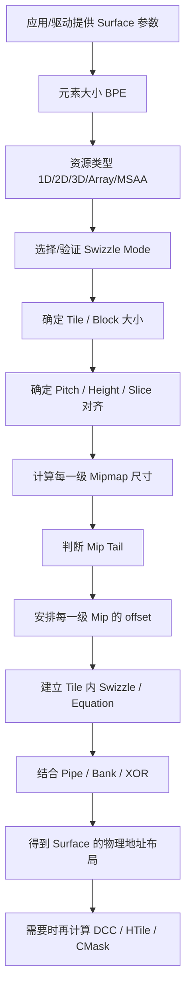
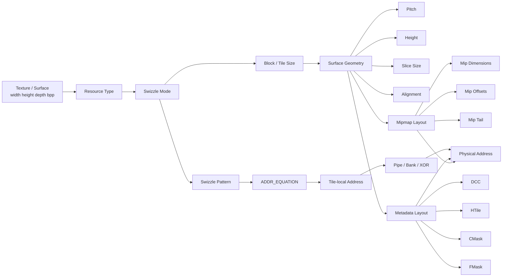

# GFX10 AddrLib：深入浅出总览

> 目标：先建立“整个 GFX10 AddrLib 到底在干什么”的全局认识，再进入具体公式、swizzle pattern、pipe/bank/XOR 和 RTL。
>
> 本文刻意**不追求逐行解释源码**，而是回答两个问题：
> 1. **为什么需要这些计算？**
> 2. **这些计算整体上是怎样一步一步把一个图像变成 GPU 能使用的内存布局和地址的？**
>
> 本文主要依据 Mesa 官方上游的 AMD AddrLib 代码结构和 GFX10 实现。Mesa 官方文档说明其上游 Git 仓库位于 freedesktop.org；Mesa 源码树中 `src/amd/addrlib` 是“creating images”的 AMD 地址布局代码。本文以 Mesa 26.2.2 作为当前研究基线。citehttps://docs.mesa3d.org/repository.html

---

## 1. 先给结论：AddrLib 到底是干什么的？

一句话：

> **AddrLib 是 GPU 图像/纹理“内存地图规划器 + 地址计算器”。**

应用程序只会告诉 GPU：

- 图像宽度是多少？
- 高度是多少？
- 深度是多少？
- 每个像素多少 bit？
- 有多少 mip level？
- 是 2D、3D、array 还是 MSAA？
- 希望怎样的 tiling / swizzle？

但 GPU 真正访问内存时，需要知道：

> **某个 `(x,y,z,layer,mip,sample)` 到底应该落在哪一个物理地址？**

而且这个地址不能简单理解成：

```text
address = y * pitch + x * bytes_per_pixel
```

因为现代 GPU 会同时考虑：

```text
像素坐标
   ↓
元素大小 / BPE
   ↓
Tile / Swizzle
   ↓
Tile 内部的 bit 排列
   ↓
Pipe / Bank / XOR
   ↓
Mipmap level / array slice / 3D slice
   ↓
DCC / HTile / CMask 等 metadata
   ↓
最终 GPU 地址
```

所以，AddrLib 的核心不是“一个地址公式”，而是**一整套 surface layout algorithm**。

---

# 2. 为什么 GPU 不能简单按照 X、Y 顺序存图像？

## 2.1 最简单的线性布局

假设有一张 8×8 的图片，每个像素 4 Byte：

```text
线性内存：

Row 0:  P00 P01 P02 P03 P04 P05 P06 P07
Row 1:  P10 P11 P12 P13 P14 P15 P16 P17
Row 2:  P20 P21 ...
...
```

地址大致就是：

```text
Address = base + y * pitch + x * 4
```

这个布局非常容易理解。

但是 GPU 的典型访问模式不是“只访问一行”。

例如一个 shader 可能同时访问：

```text
(x,y)
(x+1,y)
(x,y+1)
(x+1,y+1)
```

甚至一个 wave 中几十个线程会访问一大片邻近区域。

---

# 3. 为什么需要 Tile / Tiling？

线性布局的问题是：

> **二维空间上相邻的像素，在内存中并不一定形成最适合 GPU cache / memory system 的访问模式。**

因此 GPU 会把图像切成很多小块：

```text
整个 Image

+---------+---------+---------+
|  Tile   |  Tile   |  Tile   |
|         |         |         |
+---------+---------+---------+
|  Tile   |  Tile   |  Tile   |
|         |         |         |
+---------+---------+---------+
|  Tile   |  Tile   |  Tile   |
|         |         |         |
+---------+---------+---------+
```

每个 Tile 是一块连续的内存区域。

这样 GPU 访问一个局部区域时，更容易让：

- cache 命中
- memory transaction 合并
- DRAM burst 更有效
- GPU 各个 memory pipe 更均衡

Mesa 的 tiling 文档也把核心思想概括为：把二维图像分成 tile，并重新排列 tile 内的数据，使空间上相邻的像素更可能在内存中相邻。citehttps://docs.mesa3d.org/isl/tiling.html

---

# 4. Tile 还不够，为什么还要 Swizzle？

假设一个 Tile 有 64KB：

```text
64KB Tile

+---------------------------+
|                           |
|       many pixels         |
|                           |
|                           |
+---------------------------+
```

问题来了：

> Tile 内部到底应该怎样排列这些像素？

最简单的方法是：

```text
X0 X1 X2 X3 ...
Y0 Y1 Y2 ...
```

但 GPU 可以进一步重新排列地址 bit：

```text
Address bit 8  ← X4
Address bit 9  ← Y2
Address bit 10 ← X5 XOR Y3
Address bit 11 ← Y4
...
```

这就是 **swizzle** 的核心思想。

所以：

> **Tiling 决定“大块怎么组织”，Swizzle 决定“块里面的 bit 怎么排列”。**

GFX10 AddrLib 中甚至会把 swizzle pattern 转换成 `ADDR_EQUATION`，最后得到一组按 bit 描述的地址方程。

可以把它理解成：

```text
(x,y,z)
   │
   ▼
取 X/Y/Z 的各个 bit
   │
   ▼
按照 GFX10 swizzle pattern 重新排列
   │
   ▼
得到 tile 内地址 bit
```

---

# 5. 为什么会出现 256B、4KB、64KB？

这是理解 GFX10 AddrLib 最重要的概念之一。

可以先不要把它理解成复杂的枚举名称，只理解成：

> **GPU 有不同粒度的“基本内存块”。**

典型地可以把它想象成：

```text
256B
 ↓
更小的 micro tile

4KB
 ↓
更大的 tile

64KB
 ↓
更大的 macro tile
```

GFX10 的 swizzle mode 中可以看到 256B、4KB、64KB 以及 Variable 等类别；64KB 类又进一步区分 Standard、Display、XOR、Z-order、Rotated 等形式。GFX10 代码中的 swizzle-mode table 正是用这些属性描述布局。citehttps://fossies.org/linux/mesa/src/amd/addrlib/src/gfx10/gfx10addrlib.h

直观理解：

```text
                Surface
                   │
        ┌──────────┴──────────┐
        │                     │
      Linear                Tiled
                              │
             ┌────────────────┼──────────────┐
             │                │              │
            256B             4KB            64KB
```

实际硬件当然比这张图复杂，但这张图足够建立第一层认识。

---

# 6. 为什么需要 Mipmap？

这是第二个特别重要的“为什么”。

假设一个物体距离摄像机非常远，它在屏幕上只占：

```text
20 × 20 像素
```

但原始纹理可能是：

```text
4096 × 4096
```

如果 GPU 每次都从 4096×4096 原图中采样，会产生大量无意义的数据访问。

所以图形系统提前准备：

```text
Mip 0: 4096 × 4096
Mip 1: 2048 × 2048
Mip 2: 1024 × 1024
Mip 3:  512 ×  512
Mip 4:  256 ×  256
...
Mip N:     1 × 1
```

可以理解为：

> **Mipmap 是同一张图片的多级缩小版。**

远处物体用小 mip，近处物体用大 mip。

好处是：

- 少读内存
- cache 更容易命中
- 减少带宽
- 降低纹理采样成本
- 减少远处纹理的 aliasing

因此 AddrLib 必须知道：

> 每一级 mip 的尺寸是多少？从哪里开始？占多少空间？对齐到哪里？

GFX10 的代码中有非常直接的 mip 尺寸计算：每进入一级 mip，宽、高、深度都会按照 mip level 做缩减。citehttps://fossies.org/linux/mesa/src/amd/addrlib/src/gfx10/gfx10addrlib.h

---

# 7. 为什么 Mipmap 不能简单地一个接一个放？

假设：

```text
Mip0 = 4096×4096
Mip1 = 2048×2048
Mip2 = 1024×1024
...
```

如果每一级都必须满足 GPU 的大 Tile 对齐，那么到了后面：

```text
Mip5 = 很小
Mip6 = 更小
Mip7 = 更小
Mip8 = 很小
```

每一级如果仍然强制单独占一个完整的 64KB tile，浪费会非常严重。

于是就出现一个非常重要的概念：

# Mipmap Tail

可以把它想象成：

```text
大 mip：

+-------------------------+
| Mip0                    |
|                         |
+-------------------------+

+-----------+
| Mip1      |
+-----------+

+------+ 
|Mip2  |
+------+

进入很小的 mip 后：

+---------------------------+
| MipTail                   |
|                           |
|  MipN | MipN+1 | MipN+2   |
|-------+--------+----------|
|  ...                    |
+---------------------------+
```

也就是说：

> **小 mip 不再各自浪费一个完整的大 Tile，而是把多个小 mip 打包进一个固定区域。**

这就是 mip tail 存在的根本原因：

**减少小 mip 带来的对齐浪费，同时保持硬件喜欢的 tile 化布局。**

GFX10 的类定义中明确存在 `GetMaxNumMipsInTail()`；AddrLib 的输出结构也会告诉调用者 mip tail 从哪一级开始。citehttps://fossies.org/linux/mesa/src/amd/addrlib/src/gfx10/gfx10addrlib.h

---

# 8. 所以 Mipmap 在 AddrLib 中到底变成什么？

可以把它简化成：

```text
Input
 │
 │ width / height / depth / numMipLevels
 ▼
计算每一级 mip 的尺寸
 │
 ▼
决定每一级需要多少 tile
 │
 ▼
决定 pitch / height / slice size
 │
 ▼
决定哪些 mip 进入 mip tail
 │
 ▼
产生：
  mip[i].offset
  mip[i].pitch
  mip[i].height
  mip[i].sliceSize
  mip[i].mipTailOffset
```

所以 AddrLib 不是“生成 mipmap 图片”。

它主要负责：

> **给已经存在的 mipmap levels 安排物理内存位置。**

---

# 9. 为什么还需要 Pipe？

现代 AMD GPU 并不是只有一个“内存通道”。

可以非常粗略地画成：

```text
                    GPU
                     │
       ┌─────────────┼─────────────┐
       │             │             │
     Pipe0          Pipe1         Pipe2 ...
       │             │             │
      memory        memory        memory
```

如果所有连续数据都集中到 Pipe0：

```text
Pipe0: ███████████████████
Pipe1: ██
Pipe2: ██
Pipe3: ██
```

那么 Pipe0 会成为瓶颈。

理想情况是：

```text
Pipe0: █████████
Pipe1: █████████
Pipe2: █████████
Pipe3: █████████
```

因此 AddrLib 要参与决定：

> **地址的哪些 bit 用来决定 pipe？**

但 GFX10 并不只是简单地取某几位作为 pipe。更复杂的 swizzle/XOR 会把坐标 bit 混合起来。

因此更准确的理解是：

```text
Coordinate bits
      │
      ▼
Tile / Swizzle equation
      │
      ├──► address bits
      │
      └──► pipe/bank-related distribution
```

GFX10 AddrLib 明确提供 `HwlComputePipeBankXor()` 和 `HwlComputeSlicePipeBankXor()` 等接口。citehttps://fossies.org/linux/mesa/src/amd/addrlib/src/gfx10/gfx10addrlib.h

---

# 10. 为什么需要 Bank？

Pipe 可以粗略理解成更高一级的并行路径，而 Bank 可以理解成 memory system 内部进一步的并行组织。

可以把它类比成：

```text
GPU
 │
 ├── Pipe 0
 │    ├── Bank 0
 │    ├── Bank 1
 │    ├── Bank 2
 │    └── Bank 3
 │
 ├── Pipe 1
 │    ├── Bank 0
 │    ├── Bank 1
 │    └── ...
```

如果相邻访问总是撞在同一个 bank：

```text
访问：A A A A A A A
      ↓
    Bank 0
```

就可能出现 bank conflict / 热点。

所以地址布局会有意让不同空间区域分布到不同 bank。

这也是为什么你在 GFX10 的 swizzle equation 里会看到各种 XOR：

```text
BankBit0 = Xbit ^ Ybit ^ ...
```

其核心目标之一就是：

> **让空间上的规律访问，不要在硬件 memory organization 中形成过强的规律性热点。**

---

# 11. XOR 到底是干什么的？

初看 GFX10 AddrLib 时，XOR 很容易让人觉得“这是一个非常神秘的地址算法”。

其实先把它想简单一点：

```text
普通：
A = X5

XOR：
A = X5 ^ Y3
```

为什么这么做？

因为如果：

```text
A = X5
```

那么地址分布会非常规则。

而：

```text
A = X5 ^ Y3
```

会把 X、Y 两个方向的信息混合起来。

于是二维空间中的规律访问可以更均匀地映射到 memory system。

GFX10 AddrLib 更进一步，把一个 swizzle pattern 转换成 `ADDR_EQUATION`。从概念上看，每个 tile-local address bit 都可以理解成：

```text
A[i] = direct_term
       XOR xor_term_1
       XOR xor_term_2
```

而每一个 term 本质上来自 X/Y/Z 的某一个 bit。

这就是我们以后深入研究 GFX10 swizzle equation 时最重要的入口。

---

# 12. 为什么 GFX10 会有 S、D、Z、R、X、T 这么多名字？

不要一开始背这些名字。

把它们理解成“布局策略的不同组合”即可。

例如：

```text
64KB_S
64KB_D
64KB_S_X
64KB_D_X
64KB_Z_X
64KB_R_X
64KB_S_T
64KB_D_T
```

其中：

```text
64KB       → 大块大小
S / D      → 不同的 tile / swizzle 语义
X          → XOR 类布局
Z          → Z-order 类布局
R          → rotated / rotate-opt 类布局
T          → thick / 3D 相关布局
```

GFX10 源码的 `SwizzleModeTable` 正是把这些性质拆成 `is64kb`、`isStd`、`isDisp`、`isXor`、`isZ`、`isT`、`isRot` 等属性，而不是把它们当成完全独立的算法。citehttps://fossies.org/linux/mesa/src/amd/addrlib/src/gfx10/gfx10addrlib.h

这给我们一个非常好的理解方式：

> **Swizzle mode 本质上是一个“layout recipe”。**

---

# 13. 为什么 3D texture 会出现 Thick？

2D 图片只有：

```text
X × Y
```

3D texture 则是：

```text
X × Y × Z
```

所以一个 tile 不一定只能在 X/Y 平面上组织，还可以在 Z 方向上组织：

```text
       Z
       ↑
   +-------+
  /       /|
 +-------+ |
 |       | +
 |       |/
 +-------+
   → X
```

这就是 thick tiling 的直观来源。

GFX10 的代码中明确区分 thin 和 thick：1D/2D 资源天然属于 thin，而 3D 资源在某些 standard/display swizzle 下会成为 thick。citehttps://fossies.org/linux/mesa/src/amd/addrlib/src/gfx10/gfx10addrlib.h

因此：

```text
2D
  ↓
主要组织 X/Y

3D thick
  ↓
同时组织 X/Y/Z
```

这也是为什么 GFX10 的 block dimension table 不只是 width/height，而是有 `Dim3d`。

---

# 14. 为什么需要 MSAA / Sample 相关计算？

普通纹理可以粗略理解成：

```text
Pixel → 1 sample
```

MSAA 则可能是：

```text
Pixel
 ├── sample 0
 ├── sample 1
 ├── sample 2
 └── sample 3
```

于是一个 pixel 不再对应一个简单的 element。

AddrLib 必须考虑：

- sample 数量
- sample 的布局
- FMask
- tile/block size
- metadata

GFX10 的 AddrLib 类明确把 `Gfx10DataFmask` 作为一种数据 surface 类型，并存在 FMask 相关接口。citehttps://fossies.org/linux/mesa/src/amd/addrlib/src/gfx10/gfx10addrlib.h

直观理解：

```text
普通：
Pixel → data

MSAA：
Pixel → 多个 sample → data layout
                 │
                 └→ FMask 等辅助 metadata
```

---

# 15. 为什么还需要 DCC、HTile、CMask？

这些不是“普通 texture data”。

它们是 GPU 为了提高性能而建立的 **metadata surface**。

可以简单理解为：

```text
Color Data
████████████████████

DCC Metadata
▒▒▒▒▒▒▒▒▒▒▒▒▒▒▒▒▒▒
```

DCC 可以理解成：

> **告诉 GPU 某个区域的数据压缩/状态信息。**

这样 GPU 不需要每次都读取完整 color data 才能知道怎么处理。

---

## HTile

深度/模板数据也有类似需求。

```text
Depth Buffer
████████████████

HTile
▒▒▒▒▒▒▒▒▒▒▒▒▒▒▒
```

HTile 可以帮助 depth/stencil 路径进行更高效的处理。

GFX10 AddrLib 直接提供：

```text
HwlComputeHtileInfo
HwlComputeHtileAddrFromCoord
HwlComputeHtileCoordFromAddr
```

说明 AddrLib 不仅计算普通 color surface，也计算 metadata surface 的布局和地址。citehttps://fossies.org/linux/mesa/src/amd/addrlib/src/gfx10/gfx10addrlib.h

---

## CMask

CMask 同样属于辅助 metadata。

所以可以把 AddrLib 的工作理解成两层：

```text
              Surface
                 │
        ┌────────┴────────┐
        │                 │
    Data Surface      Metadata Surface
        │                 │
     Color/Depth      DCC/HTile/CMask
```

这也是为什么不能把 AddrLib 简化成“texture address calculator”。

它实际上是在计算一整套 GPU surface memory layout。

---

# 16. AddrLib 最重要的工作：决定 Surface Layout

现在把前面的所有概念合起来：



这张图基本就是整个 GFX10 AddrLib 的“骨架”。

---

# 17. 一个最核心的例子：访问 `(x,y)` 到底发生了什么？

假设：

```text
Texture:
1024 × 1024
RGBA8
64KB swizzle
```

shader 想访问：

```text
(x = 100, y = 200)
```

AddrLib 思维下，不是直接：

```text
100 + 200 * 1024
```

而是大概经历：

```text
             (x=100,y=200)
                    │
                    ▼
          当前 mip level 是多少？
                    │
                    ▼
             当前 mip 的尺寸
                    │
                    ▼
          当前属于哪个 64KB tile？
                    │
              ┌─────┴─────┐
              │           │
           tile X       tile Y
              │           │
              └─────┬─────┘
                    ▼
             tile base address
                    │
                    ▼
          tile 内部 X/Y bits
                    │
                    ▼
          GFX10 swizzle equation
                    │
                    ▼
       tile-local address bits
                    │
                    ▼
            pipe / bank / XOR
                    │
                    ▼
              final address
```

**理解到这里，其实已经抓住 AddrLib 80% 的核心思想。**

---

# 18. 为什么 AddrLib 还要提供“反向计算”？

因为有些场景需要：

```text
coordinate → address
```

也有些场景需要：

```text
address → coordinate
```

例如 GFX10 的 HTile 相关接口就同时提供：

```text
ComputeHtileAddrFromCoord
ComputeHtileCoordFromAddr
```

原因很简单：

> **GPU/驱动有时候已经知道内存地址，需要反推出它属于哪个 tile / 坐标区域。**

所以 AddrLib 实际上是在维护一个“坐标 ↔ 内存布局”的映射体系。

---

# 19. Preferred Swizzle 是干什么的？

AddrLib 并不是让驱动随便选一个 swizzle。

不同 GPU / display / resource / bpp / usage 对布局的要求不同。

所以 GFX10 有：

```text
HwlGetPossibleSwizzleModes
HwlGetPreferredSurfaceSetting
```

它们可以粗略理解成：

```text
输入：
  我有这样一个 surface

        ↓

AddrLib：
  哪些 layout 可以用？
  哪一种更合适？

        ↓

输出：
  推荐的 swizzle/layout
```

因此 AddrLib 不只是“计算器”，还承担了一部分 **layout policy / hardware constraint filtering** 的角色。citehttps://fossies.org/linux/mesa/src/amd/addrlib/src/gfx10/gfx10addrlib.h

---

# 20. GFX10 AddrLib 的源码结构应该怎样理解？

不要一上来钻 `gfx10addrlib.cpp` 的几千行代码。

先分成三层。

```text
                    AddrLib
                       │
        ┌──────────────┴──────────────┐
        │                             │
    Common Layer                  GFX10 Layer
        │                             │
        │                     gfx10addrlib.cpp/.h
        │                     gfx10SwizzlePattern.h
        │                             │
        ▼                             ▼
统一接口 / 通用布局逻辑          GFX10 特有算法
```

Mesa 的 AMD AddrLib 源码树本身就是按照 common/core、gfx9、gfx10、gfx11 等层次组织的；GFX10 版本由 `Gfx10Lib` 实现具体硬件相关行为。citehttps://docs.mesa3d.org/sourcetree.html

---

# 21. GFX10Lib 到底提供了哪些“大类”能力？

从 GFX10 类的接口可以直接看到几个大的方向：

```text
Gfx10Lib
│
├── Surface Layout
│   ├── ComputeSurfaceInfo
│   ├── Linear
│   └── Tiled
│
├── Address
│   ├── Coord → Address
│   └── Equation
│
├── Swizzle
│   ├── Possible Swizzle Modes
│   └── Preferred Surface Setting
│
├── Pipe / Bank
│   ├── PipeBankXor
│   └── SlicePipeBankXor
│
├── Mipmap
│   └── Mip / MipTail
│
├── Metadata
│   ├── DCC
│   ├── HTile
│   └── CMask
│
├── MSAA
│   └── FMask
│
└── Special Views / Copy
    ├── Non-block-compressed View
    ├── CopyMemToSurface
    └── CopySurfaceToMem
```

这些接口在 GFX10 的类声明中都有对应实现入口。citehttps://fossies.org/linux/mesa/src/amd/addrlib/src/gfx10/gfx10addrlib.h

---

# 22. 把整个 AddrLib 看成一个“编译器”

这是我认为最适合理解 AddrLib 的类比。

普通编译器：

```text
高级语言
   ↓
中间表示
   ↓
优化
   ↓
机器指令
```

AddrLib：

```text
Surface 描述
   ↓
布局参数
   ↓
Tile / Mip / Block
   ↓
Swizzle / Equation
   ↓
硬件地址布局
```

甚至可以进一步类比：

```text
Surface 参数
    │
    ▼
“高层描述”
    │
    ▼
Tile / Mip / Block
    │
    ▼
Swizzle Pattern
    │
    ▼
ADDR_EQUATION
    │
    ▼
最终 address
```

所以我们之前研究的 `ConvertSwizzlePatternToEquation()`，实际上相当于在做：

> **把一种高层的 GFX10 swizzle 描述，编译成可以直接计算地址 bit 的 Boolean equation。**

---

# 23. 最重要的一张总图



如果以后我们要深入代码，这张图就是整个研究地图。

---

# 24. 什么时候 AddrLib 最重要？

可以把 GPU texture 创建过程想象成：

```text
应用程序
   │
   ▼
“我要一张 4096×4096 RGBA8 texture”
   │
   ▼
驱动
   │
   ▼
AddrLib
   │
   ├── 推荐 swizzle
   ├── 算 pitch
   ├── 算 height
   ├── 算 alignment
   ├── 算 mip offsets
   ├── 算 mip tail
   ├── 算 tile equation
   ├── 算 pipe/bank/xor
   ├── 算 DCC
   ├── 算 HTile
   └── 算其他 metadata
   │
   ▼
驱动拿到完整 Surface Layout
   │
   ▼
GPU descriptor / hardware programming
```

所以 AddrLib 实际上处于：

> **图形 API → AMD GPU 硬件内存布局**

之间的桥梁位置。

---

# 25. 我们接下来真正值得深入的顺序

如果目标是最终把 GFX10 AddrLib 完全理解到可以写 RTL，我建议不要按照源码文件顺序学习，而按照下面顺序：

## 第一阶段：Surface 基础

```text
1. BPE / element size
2. resource type
3. linear vs tiled
4. 256B / 4KB / 64KB
5. pitch / height / slice / alignment
```

目标：能回答：

> “一张图片整体在内存里长什么样？”

## 第二阶段：Mipmap

```text
6. mip dimension
7. mip offset
8. mip alignment
9. mip tail
10. 3D mip
```

目标：能回答：

> “一张图片有很多 mip 时，内存到底怎么排？”

## 第三阶段：Tile 内部地址

```text
11. block dimension
12. swizzle pattern
13. nibble table
14. ADDR_EQUATION
15. ComputeOffsetFromEquation
```

目标：能回答：

> “一个 tile 里面的像素，为什么会落到这些 address bits？”

## 第四阶段：Pipe / Bank / XOR

```text
16. pipe interleave
17. pipe selection
18. bank selection
19. pipe/bank XOR
20. RB+
```

目标：能回答：

> “为什么同样的二维坐标最终能均匀分布到 GPU 的 memory system？”

## 第五阶段：Metadata

```text
21. DCC
22. HTile
23. CMask
24. FMask
```

目标：能回答：

> “GPU 为什么除了 color/depth data 之外，还需要另一套地址布局？”

## 第六阶段：完整闭环

最终建立：

```text
(x,y,z,mip,layer,sample)
          │
          ▼
     surface layout
          │
          ▼
     tile selection
          │
          ▼
     tile-local equation
          │
          ▼
    pipe/bank/xor
          │
          ▼
      final address
```

这时候再进入 Verilog，会比现在直接翻译 RTL 容易很多。

---

# 26. 最后用一句话记住整个 GFX10 AddrLib

> **AddrLib 的本质，就是把“图形世界中的坐标和资源描述”，转换成“GPU memory system 能高效工作的物理内存布局”。**

而 GFX10 中最核心的几个层次可以记成：

```text
Surface
  ↓
Mip
  ↓
Tile / Block
  ↓
Swizzle
  ↓
Equation
  ↓
Pipe / Bank / XOR
  ↓
Address
```

再加上旁边的一条支线：

```text
Surface
  ↓
Metadata
  ├── DCC
  ├── HTile
  ├── CMask
  └── FMask
```

**如果这两张图真正理解了，后面再看 GFX10 的几千行 AddrLib 源码，就不会再觉得它是在“凭空做大量奇怪的位运算”。每一组位运算都可以追溯到一个硬件布局问题。**

---

## 研究基线与资料说明

- Mesa 当前稳定版本基线：**Mesa 26.2.2**，发布日期为 2026-09-02。citehttps://docs.mesa3d.org/relnotes/26.2.2.html
- Mesa 官方源码仓库：freedesktop.org 上的 Mesa Git 仓库。citehttps://docs.mesa3d.org/repository.html
- Mesa 官方源码树说明：`src/amd/addrlib` 是 AMD-specific 的 image creation/address-layout 代码。citehttps://docs.mesa3d.org/sourcetree.html
- GFX10 关键实现：`src/amd/addrlib/src/gfx10/gfx10addrlib.cpp`、`gfx10addrlib.h`、`gfx10SwizzlePattern.h`。
- 本文的目标是**算法理解**，不是逐行代码注释；对于 register pipeline staging、debug assert、极少数 chip-specific workaround 等细节暂不展开。

## 一句话学习路线

**先理解“为什么要这样布局”，再理解“布局长什么样”，最后才理解“每一个 bit 为什么这么算”。**
