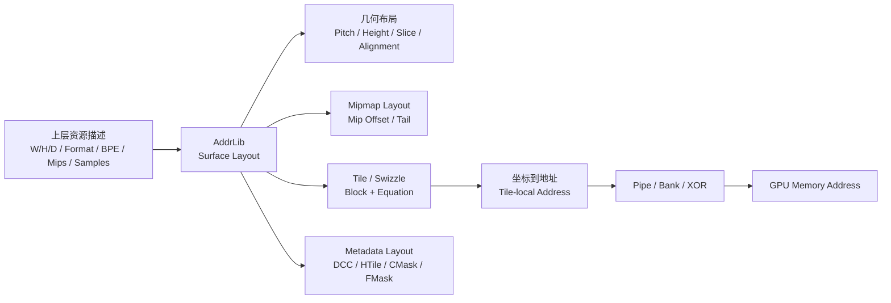
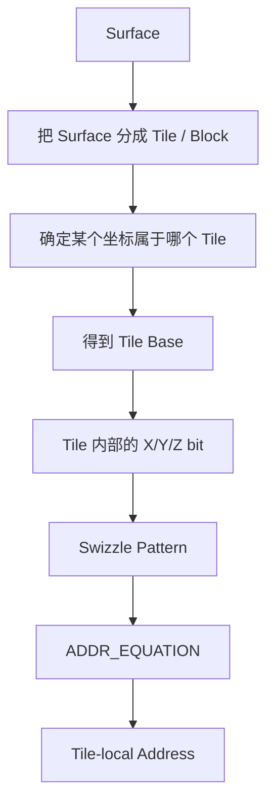
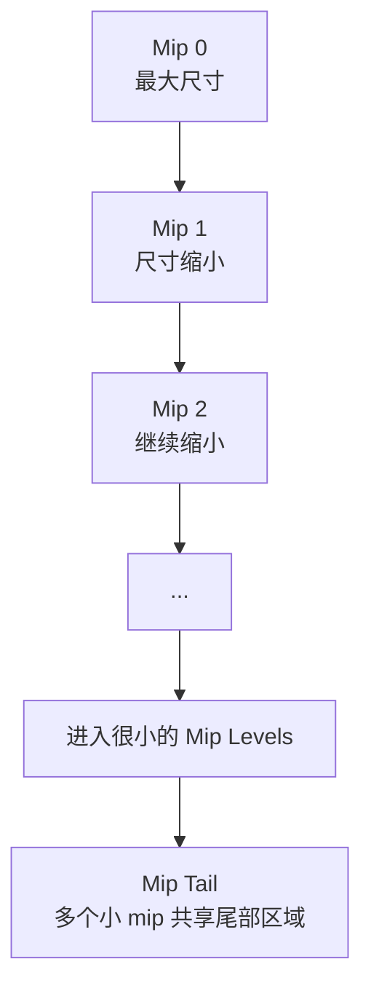
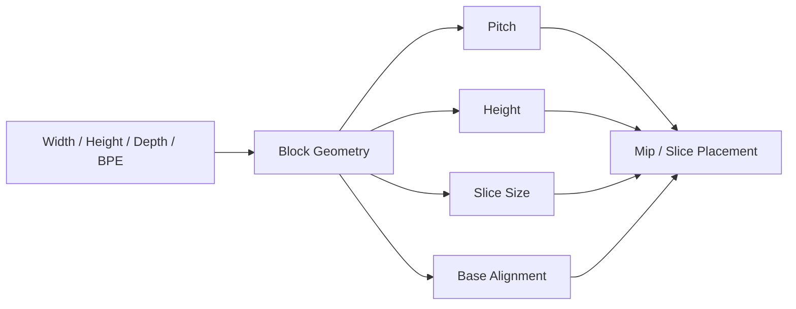
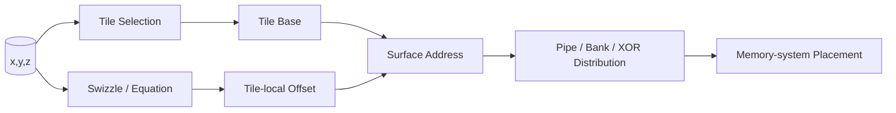
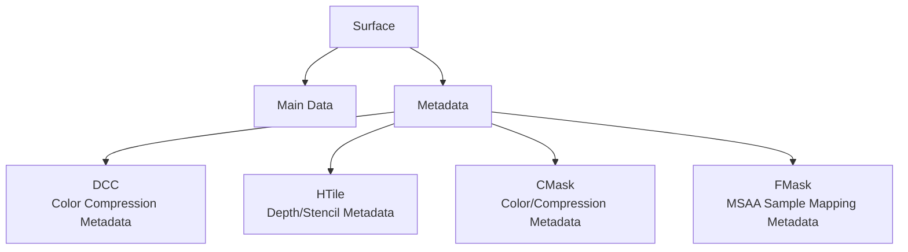
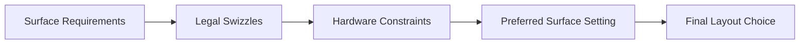
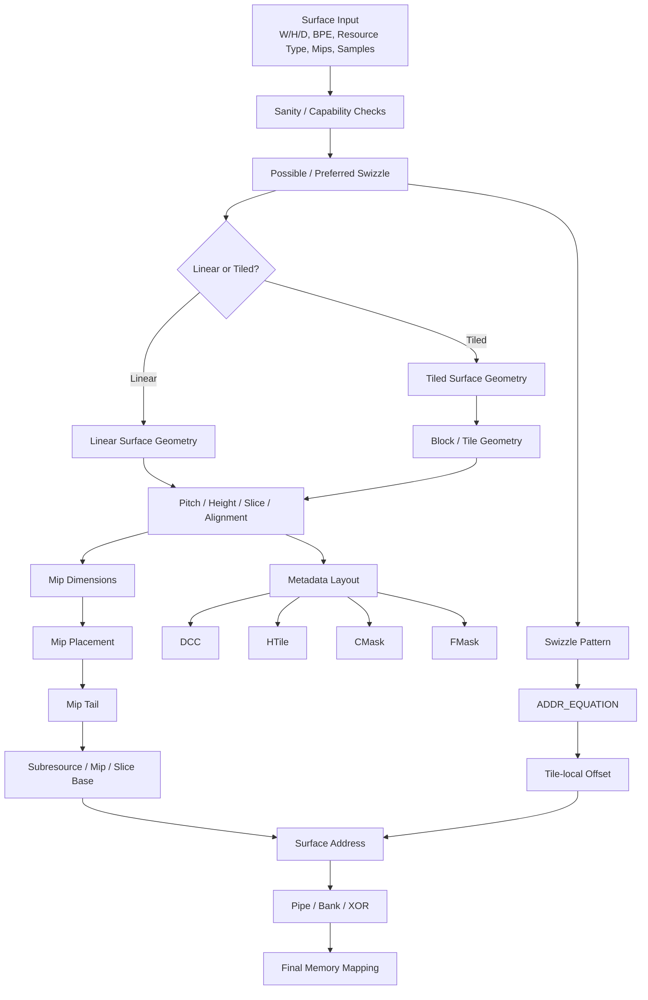
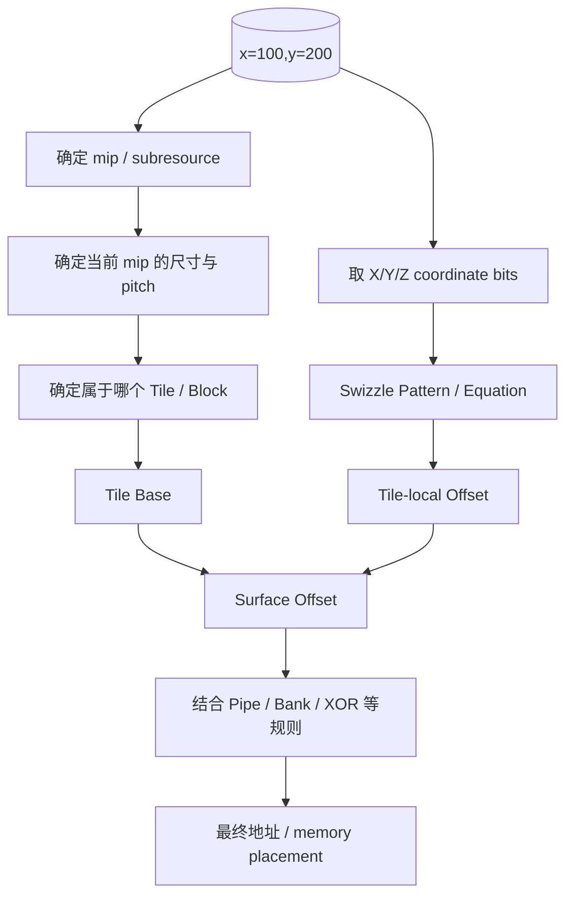

# GFX10 AddrLib：深入浅出总览

> 目标：先建立“整个 GFX10 AddrLib 到底在干什么”的全局认识，再进入具体公式、swizzle pattern、pipe/bank/XOR 和 RTL。
>
> 本文刻意**不追求逐行解释源码**，而是回答两个问题：
> 1. **为什么需要这些计算？**
> 2. **这些计算整体上怎样一步一步把一个 Surface 变成 GPU 能使用的内存布局和地址？**
>
> 本版在上一版基础上增加了多张**根据 GFX10 AddrLib 源码结构重新绘制的示意图**。这些图不是从网上搬来的 GFX10 图片；图中的流程、函数和数据关系以 GFX10 AddrLib 的实际代码为依据，图形本身用于帮助理解。
>
> 本次核对采用AMD官方PAL固定提交 c5e800072a32f68b6ccc4422936d96167c6e0728；旧稿的Mesa 26.2.2没有对应快照/标签验证，不能作为本文已核验基线。[固定源码](https://github.com/GPUOpen-Drivers/pal/blob/c5e800072a32f68b6ccc4422936d96167c6e0728/src/core/imported/addrlib/src/gfx10/gfx10addrlib.cpp)

---

# 1. 先给结论：AddrLib 到底是干什么的？

一句话：

> **AddrLib 是 GPU 图像/纹理的“内存地图规划器 + 地址计算器”。**

上层只需要描述：

- width / height / depth
- format / BPE
- mip levels
- 1D / 2D / 3D / array
- samples / fragments
- usage / flags
- 希望使用的 tiling / swizzle

而 GPU 真正访问内存时，需要知道：

> **某个 `(x, y, z, mip, layer, sample)` 最终应该落到哪里。**

最简单的线性图像可以写成：

```text
address = base + y * pitch + x * bytes_per_pixel
```

但 GFX10 tiled surface 远比这复杂。可以先建立下面这个总模型：

```text
Surface 描述
     │
     ▼
┌──────────────────────┐
│ Resource / Format    │
│ W/H/D / BPE / MSAA   │
└──────────┬───────────┘
           ▼
     Swizzle Mode
           │
           ▼
   Block / Tile Geometry
           │
     ┌─────┴─────┐
     ▼           ▼
 Mipmap       Alignment
 Layout
     │           │
     └─────┬─────┘
           ▼
    Tile-local Mapping
           │
           ▼
    Swizzle Pattern
           │
           ▼
     ADDR_EQUATION
           │
           ▼
   Pipe / Bank / XOR
           │
           ▼
      Final Address

同时还有：
Surface ──► DCC / HTile / CMask / FMask
```

因此 AddrLib 的核心不是“一条地址公式”，而是一套 **surface layout algorithm**。

---

# 2. 第一张图：AddrLib 究竟在解决什么问题？

这是整篇最重要的第一张图。它把“图形 API 的世界”和“GPU memory system 的世界”连起来。



这张图最值得记住的是：

> **AddrLib 不是只负责最后一步“算地址”，而是先把整个 Surface 的内存地图规划出来。**

这也是为什么 `Gfx10Lib` 同时存在 SurfaceInfo、Swizzle、Equation、Pipe/Bank、DCC、HTile、CMask、FMask 等多类接口。[来源](https://github.com/GPUOpen-Drivers/pal/blob/c5e800072a32f68b6ccc4422936d96167c6e0728/src/core/imported/addrlib/src/gfx10/gfx10addrlib.h)

---

# 3. 为什么不能简单按照 X、Y 顺序存图像？

## 3.1 最简单的线性布局

假设有一张 8×8 图片，每个像素 4 Byte：

```text
Row 0: P00 P01 P02 P03 P04 P05 P06 P07
Row 1: P10 P11 P12 P13 P14 P15 P16 P17
Row 2: P20 P21 P22 P23 P24 P25 P26 P27
...
```

线性布局非常容易理解：

```text
address ≈ base + y * pitch + x * 4
```

问题在于 GPU 常见访问不是“只顺序读一行”，而是一个 wave 中很多线程同时访问二维邻域：

```text
(x,y)     (x+1,y)

(x,y+1)   (x+1,y+1)
```

GPU 希望这些访问尽量形成高效的 cache / transaction / memory-system 行为。

---

# 4. 为什么需要 Tile / Tiling？

最直观的做法是把大图切成很多块：

```text
                Image

      +---------+---------+---------+
      |  Tile   |  Tile   |  Tile   |
      +---------+---------+---------+
      |  Tile   |  Tile   |  Tile   |
      +---------+---------+---------+
      |  Tile   |  Tile   |  Tile   |
      +---------+---------+---------+
```

这样二维空间中的局部区域可以更集中地组织到内存中。

Mesa 对 tiling 的通用解释也是：把图像组织成 tile，并重新安排 tile 内的数据，使空间局部性更适合 GPU。[来源](https://docs.mesa3d.org/isl/tiling.html)

但是注意：

> **Tile 只是第一层。Tile 内部怎么排，才是 GFX10 AddrLib 后面大量位运算真正开始的地方。**

---

# 5. 第二张图：Tiling 和 Swizzle 到底有什么区别？

这是理解 GFX10 最容易混淆的地方之一。



可以把它记成：

```text
Tiling 解决：
“大块在哪里？”

Swizzle 解决：
“块里面的 bit 怎么排？”
```

因此看到：

```text
64KB_S_X
64KB_D_X
64KB_Z_X
```

不要把它们简单理解成“几个不同大小的 tile”。

更准确地说，它们是 GFX10 定义的不同 **layout recipes**：包括 tile 粒度以及 tile 内部的组织方式。

---

# 6. 为什么会出现 256B、4KB、64KB？

GFX10 的 swizzle mode table 中确实存在 256B、4KB、64KB、Variable 等类别，并进一步区分 standard/display/XOR/Z/rotated/thick 等属性。[来源](https://github.com/GPUOpen-Drivers/pal/blob/c5e800072a32f68b6ccc4422936d96167c6e0728/src/core/imported/addrlib/src/gfx10/gfx10addrlib.h)

建立第一层概念时，可以先这样看：

```text
Surface
  │
  ├── Linear
  │
  └── Tiled
       │
       ├── 256B class
       ├── 4KB class
       ├── 64KB class
       └── Variable class
```

然后再加第二层属性：

```text
64KB
 │
 ├── Standard
 ├── Display
 ├── XOR
 ├── Z-order
 ├── Rotated
 └── Thick / 3D-related variants
```

**不要一开始背枚举名称。**先把它们看成不同的“布局配方”。

---

# 7. 为什么需要 Mipmap？

假设纹理原图是：

```text
4096 × 4096
```

但远处物体在屏幕上只有几十个像素。如果每次都从原图采样，会读取大量并不需要的细节。

所以图形系统准备多个尺寸：

```text
Mip 0    4096 × 4096
Mip 1    2048 × 2048
Mip 2    1024 × 1024
Mip 3     512 ×  512
Mip 4     256 ×  256
...
Mip N       1 ×  1
```

因此 AddrLib 需要解决的不是“生成 mipmap 图片”，而是：

> **已经有这么多 mip level，怎么把它们安排到 GPU surface 的物理内存中？**

GFX10 `GetMipSize()` 对 width/height/depth 做按 mip level 的缩减，随后 surface-layout 路径继续计算各级 mip 的空间和 offset。[来源](https://github.com/GPUOpen-Drivers/pal/blob/c5e800072a32f68b6ccc4422936d96167c6e0728/src/core/imported/addrlib/src/gfx10/gfx10addrlib.h)

---

# 8. 第三张图：Mipmap 在内存里到底是什么？



把它画成内存地图则更直观：

```text
Surface Memory

+------------------------------------------+
| Mip 0                                    |
|                                          |
+------------------------------------------+
| Mip 1                    |               |
+--------------------------+               |
| Mip 2       |            |               |
+-------------+------------+               |
| Mip 3 | Mip 4 | Mip 5 | Mip 6 | ...     |
+------------------------------------------+
                       ↑
                    小 mip
                 逐渐进入 tail
```

这里不要把示意图中的具体分割比例当成硬件常数。它表达的是**布局思想**：大的 mip 单独占主要区域，小 mip 到一定阶段后进入 tail 组织。

GFX10 类中存在 `GetMaxNumMipsInTail()`，AddrLib 的 surface-layout 输出也会记录 `firstMipIdInTail` / mip-tail offset 一类信息。[来源](https://github.com/GPUOpen-Drivers/pal/blob/c5e800072a32f68b6ccc4422936d96167c6e0728/src/core/imported/addrlib/src/gfx10/gfx10addrlib.h)

---

# 9. 为什么需要 Mip Tail？

如果每一个小 mip 都必须单独满足大 tile / alignment：

```text
Mip N       → 一块
Mip N+1     → 一块
Mip N+2     → 一块
Mip N+3     → 一块
```

实际数据很小，但 alignment 带来的空间开销很大。

所以 tail 的核心思想是：

```text
小 mip 1 ─┐
小 mip 2 ─┤
小 mip 3 ─┼──► 一个共同的 tail 区域
小 mip 4 ─┤
小 mip 5 ─┘
```

一句话：

> **Mip Tail 的核心目的，是在保持 tile/alignment 约束的同时减少小 mip 的空间浪费。**

这也是为什么在源码中看到 `mipTailOffset`、`firstMipIdInTail` 等字段时，不要把它们理解成“额外 metadata”；它们本身就是 surface layout 的一部分。

---

# 10. Surface Geometry：AddrLib 先算“大地图”

在真正计算某个 `(x,y)` 的 tile-local address 之前，AddrLib 必须先知道整个 surface 的几何尺寸。

核心概念包括：

```text
Pitch
Height
Slice Size
Base Alignment
Block Width / Height / Depth
Mip Offset
```

可以把它看成：



这一步回答的是：

> **整个 Surface 的“大地图”怎么铺？**

而后面的 Equation 才回答：

> **地图中某个 tile 内的“小地址”怎么产生？**

这是理解源码时非常重要的一层分界。

---

# 11. 为什么 3D texture 会出现 Thin / Thick？

2D 资源只有：

```text
X × Y
```

3D 资源则是：

```text
X × Y × Z
```

因此 tile 可以只组织一个 XY 平面，也可以把 Z 方向一起纳入局部布局。

```text
Thin：

        X
   +---------+
   |         |
 Y |         |
   +---------+

Thick：

        Z
        ↑
   +---------+
  /         /|
 +---------+ |
 |         | +
 |         |/
 +---------+
      → X
```

GFX10 源码中对 thin/thick 有明确判断逻辑：1D/2D 是 thin；3D 在特定 standard/display swizzle 下会进入 thick 语义。[来源](https://github.com/GPUOpen-Drivers/pal/blob/c5e800072a32f68b6ccc4422936d96167c6e0728/src/core/imported/addrlib/src/gfx10/gfx10addrlib.h)

所以看到 GFX10 的 3D block-dimension 表时，不能只想着 `width × height`，还要考虑 `depth`。

---

# 12. Swizzle Mode 不只是名字，而是一组属性

GFX10 源码的一个非常重要的设计思想是：swizzle mode 被拆成多个属性，而不是把每个枚举都当成完全独立算法。

概念上可以画成：

```text
                 Swizzle Mode
                       │
       ┌───────────────┼────────────────┐
       ▼               ▼                ▼
   Tile Size       Layout Type       Special Flags
   256B/4KB/64KB   Std/Disp/...       XOR/Z/R/T
```

例如：

```text
64KB_S_X
```

首先说明“大块类别 + S 类布局 + XOR 类属性”，而不是一个完全不可拆分的黑盒名字。

这正是 `SwizzleModeTable` 设计值得注意的地方：代码可以根据 `is64kb`、`isStd`、`isDisp`、`isXor`、`isZ`、`isT`、`isRot` 等属性走不同算法路径。[来源](https://github.com/GPUOpen-Drivers/pal/blob/c5e800072a32f68b6ccc4422936d96167c6e0728/src/core/imported/addrlib/src/gfx10/gfx10addrlib.h)

---

# 13. 第四张图：Swizzle Pattern 为什么最终会变成 Equation？

这是以后深入 GFX10 源码时最关键的一座桥。

GFX10 `gfx10SwizzlePattern.h` 中可以看到 pattern info、nibble table 和 `ADDR_BIT_SETTING` 等结构；GFX10 实现再把 swizzle pattern 转换成 `ADDR_EQUATION`。

把代码压缩成一个概念流程：


可以进一步把一个地址 bit 想成：

```text
A[i]
 │
 ├── direct X/Y/Z term
 │
 ├── XOR term 1
 │
 └── XOR term 2
```

概念上就是：

```text
A[i] = term0 XOR term1 XOR term2
```

这里的 `term` 来自 X/Y/Z 的具体 coordinate bit。

**这张图比直接背一堆 nibble table 更重要。**因为它告诉我们：

> pattern table 是“描述布局”的数据；Equation 是“真正执行地址 bit 映射”的形式。

---

# 14. XOR 到底在干什么？

先不要把 XOR 想得神秘。

最简单：

```text
普通：
A = X5

XOR：
A = X5 ^ Y3
```

它把两个方向的信息混合起来。

如果某个地址选择位只依赖 X：

```text
A = X5
```

那么二维访问的分布可能很规律。

而：

```text
A = X5 ^ Y3
```

会让 X/Y 两个方向共同影响这一位。

GFX10 的实际 pattern 更复杂，可能包含多种 bit term，但理解入口就是：

> **XOR 是把多个 coordinate bit 混合进某个地址 bit 的工具。**

不要在这一阶段把它等同于“所有 XOR 都只用于 bank”。它更准确地属于 GFX10 tile-local/swizzle address mapping 的组成部分；pipe/bank distribution 是后面另一层需要单独分析的问题。

---

# 15. Pipe 为什么重要？

GPU memory system 可以粗略想象成多个并行路径：

```text
                    GPU
                     │
       ┌─────────────┼─────────────┐
       ▼             ▼             ▼
    Pipe 0         Pipe 1        Pipe 2 ...
```

如果访问长期集中到某个 pipe：

```text
Pipe0: █████████████████
Pipe1: ██
Pipe2: ██
Pipe3: ██
```

并行能力就没有被充分利用。

AddrLib 因此不仅要知道 tile 内部地址，还需要参与 pipe/bank 相关的布局计算。

GFX10 `Gfx10Lib` 明确提供：

```text
HwlComputePipeBankXor()
HwlComputeSlicePipeBankXor()
```

这说明 pipe/bank/XOR 是 GFX10 地址布局中独立的一层能力。[来源](https://github.com/GPUOpen-Drivers/pal/blob/c5e800072a32f68b6ccc4422936d96167c6e0728/src/core/imported/addrlib/src/gfx10/gfx10addrlib.h)

---

# 16. 第五张图：Tile-local Address 和 Pipe/Bank 不要混为一谈

这一点非常重要，因为后面深入源码时很容易混淆。



理解上可以分成两个问题：

### 第一层：

> `(x,y,z)` 在当前 tile 内部的哪个 byte？

这是 **swizzle / equation** 的核心问题。

### 第二层：

> 这个地址如何映射到 GPU memory system 的 pipe / bank / slice 等组织？

这是 **pipe/bank distribution** 的核心问题。

二者有关联，但不能简单画成一个东西。

---

# 17. Bank 为什么重要？

可以粗略把 memory system 想象成：

```text
Pipe 0
 ├── Bank 0
 ├── Bank 1
 ├── Bank 2
 └── Bank 3

Pipe 1
 ├── Bank 0
 ├── Bank 1
 └── ...
```

如果规律访问长期集中到同一个 bank：

```text
A A A A A A
│ │ │ │ │ │
└─┴─┴─┴─┴─┴──► Bank 0
```

就可能产生热点。

所以地址映射会利用不同 bit 的组合，使空间规律访问尽可能分散到 memory system 的不同组织单元。

这一层是理解 GFX10 pipe/bank XOR 的直觉入口，但具体 bit 选择和 XOR 规则必须回到 GFX10 源码逐项分析，不能仅凭概念图推断。

---

# 18. 为什么还需要 MSAA / FMask？

普通资源可以粗略理解成：

```text
Pixel → 一个 data element
```

MSAA 则是：

```text
Pixel
 ├── Sample 0
 ├── Sample 1
 ├── Sample 2
 └── Sample 3
```

于是一个 pixel 不再简单对应一个 element。

AddrLib 必须考虑：

- sample 数量
- sample / fragment layout
- tile/block geometry
- FMask 等辅助 surface

GFX10 类中明确有 `Gfx10DataFmask`，并存在 FMask 相关布局/地址接口。[来源](https://github.com/GPUOpen-Drivers/pal/blob/c5e800072a32f68b6ccc4422936d96167c6e0728/src/core/imported/addrlib/src/gfx10/gfx10addrlib.h)

直观理解：

```text
普通：
Pixel ─────────► Data

MSAA：
Pixel ─► Sample 0 ─┐
       Sample 1 ──┼──► Data / FMask-related layout
       Sample 2 ──┤
       Sample 3 ──┘
```

---

# 19. 为什么需要 DCC、HTile、CMask？

这些不是普通 color/depth data，而是 GPU 为性能服务的 **metadata surfaces**。

可以把整体想象成：



这里最重要的不是现在记住每一个 bit，而是理解：

> **AddrLib 管的不只有“主数据 surface”，还包括与主 surface 配套的 metadata layout。**

GFX10 `Gfx10Lib` 直接提供：

```text
HwlComputeDccInfo
HwlComputeHtileInfo
HwlComputeCmaskInfo
HwlComputeDccAddrFromCoord
HwlComputeHtileAddrFromCoord
HwlComputeCmaskAddrFromCoord
```

所以这些并不是驱动外面自己随便计算的附加数据，而是 AddrLib surface-layout 模型的一部分。[来源](https://github.com/GPUOpen-Drivers/pal/blob/c5e800072a32f68b6ccc4422936d96167c6e0728/src/core/imported/addrlib/src/gfx10/gfx10addrlib.h)

---

# 20. Preferred Swizzle：为什么 AddrLib 还会“帮你选布局”？

AddrLib 并不是简单接受任何 swizzle。

不同：

- resource type
- BPE
- display / non-display usage
- MSAA
- 3D / 2D
- chip-specific capability

可能使可用 layout 不同。

因此 GFX10 有：

```text
HwlGetPossibleSwizzleModes()
HwlGetPreferredSurfaceSetting()
```

可以把它理解成：



所以 AddrLib 具有一定的 **layout policy / hardware constraint filtering** 角色，而不仅仅是“被动计算器”。[来源](https://github.com/GPUOpen-Drivers/pal/blob/c5e800072a32f68b6ccc4422936d96167c6e0728/src/core/imported/addrlib/src/gfx10/gfx10addrlib.h)

---

# 21. 第六张图：一次完整的 GFX10 Surface Layout 流程

这一张图是后续研究整个源码时的“总导航图”。



这张图里有一个很重要的思想：

> **AddrLib 不是一条直线。**
>
> 它同时存在“surface geometry”“mipmap placement”“swizzle equation”“metadata layout”等几条相互关联的计算支路，最后共同形成完整的 Surface Layout。

---

# 22. 一个最核心的例子：访问 `(x,y)` 到底发生了什么？

假设：

```text
Texture:
1024 × 1024
RGBA8
64KB tiled/swizzled layout
```

shader 想访问：

```text
(x = 100, y = 200)
```

不要直接想：

```text
100 + 200 * 1024
```

而应该形成下面这个思维链：



这张图非常重要，因为它把：

```text
“几何布局”
```
和
```text
“tile 内 bit 地址计算”
```
分开了。

---

# 23. 为什么 AddrLib 还要提供“反向计算”？

某些路径不只需要：

```text
coordinate → address
```

还需要：

```text
address → coordinate
```

例如 GFX10 的 HTile 接口同时存在：

```text
HwlComputeHtileAddrFromCoord
HwlComputeHtileCoordFromAddr
```

但本固定GFX10提交的HwlComputeHtileCoordFromAddr函数体仅调用ADDR_NOT_IMPLEMENTED()，没有实现反向计算，不能仅凭接口名称认定支持。[实现桩](https://github.com/GPUOpen-Drivers/pal/blob/c5e800072a32f68b6ccc4422936d96167c6e0728/src/core/imported/addrlib/src/gfx10/gfx10addrlib.cpp#L649)

AddrLib接口体系包含地址与坐标转换能力，但每个代际、每条路径的实现状态必须分别确认。

---

# 24. GFX10 源码应该怎样分层阅读？

不要一开始就钻进 `gfx10addrlib.cpp` 的几千行代码。

先建立三层结构：

```text
                  AddrLib
                     │
        ┌────────────┴────────────┐
        │                         │
   Common / Core               GFX10 Layer
        │                         │
        │                 gfx10addrlib.cpp/.h
        │                 gfx10SwizzlePattern.h
        │                         │
        ▼                         ▼
 通用布局基础设施            GFX10 特有算法
```

Mesa 官方源码树明确把 `src/amd/addrlib` 作为 AMD-specific image creation/address-layout 代码；GFX10 则在这个公共框架上实现自己的硬件相关规则。[来源](https://docs.mesa3d.org/sourcetree.html)

---

# 25. 从 GFX10Lib 的接口反推整个功能地图

从 `gfx10addrlib.h` 的接口可以直接看到这些能力：

```text
Gfx10Lib
│
├── Surface Layout
│   ├── HwlComputeSurfaceInfoTiled
│   ├── HwlComputeSurfaceInfoLinear
│   └── SurfaceInfoSanityCheck
│
├── Address
│   ├── HwlComputeSurfaceAddrFromCoordTiled
│   └── Equation-related helpers
│
├── Swizzle
│   ├── HwlGetPossibleSwizzleModes
│   └── HwlGetPreferredSurfaceSetting
│
├── Pipe / Bank
│   ├── HwlComputePipeBankXor
│   └── HwlComputeSlicePipeBankXor
│
├── Mipmap / Subresource
│   ├── GetMipSize
│   └── GetMaxNumMipsInTail
│
├── Metadata
│   ├── HwlComputeDccInfo
│   ├── HwlComputeHtileInfo
│   └── HwlComputeCmaskInfo
│
├── MSAA
│   └── FMask-related paths
│
└── Other
    ├── Non-block-compressed View
    ├── CopyMemoryToSurface
    └── CopySurfaceToMemory
```

这些接口名称本身就是理解源码的“目录”。不要从第一行开始顺读，而应该从功能地图进入具体算法。[来源](https://github.com/GPUOpen-Drivers/pal/blob/c5e800072a32f68b6ccc4422936d96167c6e0728/src/core/imported/addrlib/src/gfx10/gfx10addrlib.h)

---

# 26. 把整个 AddrLib 看成一个“编译器”

这是理解 AddrLib 最有用的类比之一。

普通编译器：

```text
高级语言
   ↓
中间表示
   ↓
优化
   ↓
机器指令
```

AddrLib：

```text
Surface 描述
   ↓
布局参数
   ↓
Tile / Mip / Block
   ↓
Swizzle Pattern
   ↓
ADDR_EQUATION
   ↓
硬件地址布局
```

所以之前研究的：

```text
ConvertSwizzlePatternToEquation()
```

可以先类比成：

> **把一种 GFX10 layout recipe “编译”为可以计算地址 bit 的 Boolean equation。**

这个类比非常适合后面从 C++ 走向 RTL：

```text
C++ layout recipe
        ↓
bit equation
        ↓
combinational logic
        ↓
RTL implementation
```

当然，真实硬件还有寄存器、pipeline、接口时序等内容，但算法层可以先按这个模型理解。

---

# 27. 这几层之间到底是什么关系？

把整个模型压缩成一张“脑内地图”：

```text
                 Surface
                    │
          ┌─────────┴─────────┐
          ▼                   ▼
      Geometry             Metadata
          │              DCC/HTile/...
          ▼
        Mipmap
          │
          ▼
      Tile / Block
          │
          ▼
       Swizzle
          │
          ▼
      Equation
          │
          ▼
 Tile-local Address
          │
          ▼
   Pipe / Bank / XOR
          │
          ▼
    Memory Placement
```

最容易犯的错误，是把这些层混成一个概念。

实际上：

- **Geometry**：决定 surface 的大地图。
- **Mipmap**：决定不同 level 在大地图中的位置。
- **Tile/Block**：决定空间组织粒度。
- **Swizzle**：决定 tile 内坐标 bit 如何映射。
- **Equation**：把这种映射表示成可计算的 bit equation。
- **Pipe/Bank/XOR**：参与 memory-system 层面的分布。
- **Metadata**：是另一组配套 surface/layout。

---

# 28. 我们接下来真正值得深入的顺序

如果最终目标是把 GFX10 AddrLib 理解到可以写 RTL，我建议不要按照源码文件顺序学习，而按照下面顺序：

## 第一阶段：Surface 基础

```text
1. BPE / element size
2. resource type
3. linear vs tiled
4. 256B / 4KB / 64KB
5. block dimensions
6. pitch / height / slice / alignment
```

目标：

> **一张图片整体在内存里长什么样？**

## 第二阶段：Mipmap

```text
7. mip dimension
8. mip offset
9. mip alignment
10. mip tail
11. 3D mip
```

目标：

> **一张图片有很多 mip 时，内存到底怎么排？**

## 第三阶段：Tile 内部地址

```text
12. swizzle mode attributes
13. swizzle pattern
14. nibble table
15. ADDR_BIT_SETTING
16. ADDR_EQUATION
17. ComputeOffsetFromEquation
```

目标：

> **一个 tile 里面的像素，为什么落到这些 address bits？**

## 第四阶段：Pipe / Bank / XOR

```text
18. pipe interleave
19. pipe selection
20. bank selection
21. pipe/bank XOR
22. RB+
```

目标：

> **为什么空间访问可以更好地分布到 GPU memory system？**

## 第五阶段：Metadata

```text
23. DCC
24. HTile
25. CMask
26. FMask
```

目标：

> **GPU 为什么除了主 data surface，还需要另一套 metadata layout？**

## 第六阶段：完整闭环

最终建立：

```text
(x,y,z,mip,layer,sample)
          │
          ▼
     surface layout
          │
          ▼
     tile selection
          │
          ▼
     tile-local equation
          │
          ▼
    pipe/bank/xor
          │
          ▼
      final address
```

这时候再进入 Verilog，会比现在直接翻译 RTL 容易很多。

---

# 29. 最后用一句话记住整个 GFX10 AddrLib

> **AddrLib 的本质，就是把“图形世界中的 Surface 描述”，转换成“GPU memory system 能高效工作的物理内存布局”。**

最核心的主线记成：

```text
Surface
  ↓
Geometry
  ↓
Mip
  ↓
Tile / Block
  ↓
Swizzle
  ↓
Equation
  ↓
Pipe / Bank / XOR
  ↓
Address
```

旁边再记一条 metadata 支线：

```text
Surface
  ↓
Metadata
  ├── DCC
  ├── HTile
  ├── CMask
  └── FMask
```

如果这两张主图真正理解了，后面再看 GFX10 的几千行 AddrLib 源码，就不会再觉得它是在“凭空做大量奇怪的位运算”。每一组位运算都可以追溯到一个硬件布局问题。

---

# 30. 源码依据与研究说明

本版不是把网上的通用 GPU 图示直接搬进来，而是根据 GFX10 AddrLib 源码中的接口和调用关系重新组织示意图。

重点核对的 GFX10 源码包括：

- `src/amd/addrlib/src/gfx10/gfx10addrlib.cpp`
- `src/amd/addrlib/src/gfx10/gfx10addrlib.h`
- `src/amd/addrlib/src/gfx10/gfx10SwizzlePattern.h`
- common/core 下的 surface-layout、mipmap、equation 等基础实现

重点对应的源码能力包括：

```text
HwlComputeSurfaceInfoTiled
HwlComputeSurfaceInfoLinear
ComputeSurfaceInfoMacroTiled
ComputeSurfaceInfoMicroTiled
ComputeSurfaceAddrFromCoordMacroTiled
ComputeSurfaceAddrFromCoordMicroTiled
ConvertSwizzlePatternToEquation
ComputeOffsetFromEquation
GetMipSize
GetMaxNumMipsInTail
HwlComputePipeBankXor
HwlComputeSlicePipeBankXor
HwlComputeDccInfo
HwlComputeHtileInfo
HwlComputeCmaskInfo
HwlComputeDccAddrFromCoord
HwlComputeHtileAddrFromCoord
HwlComputeCmaskAddrFromCoord
```

这些函数名非常适合作为后续源码深挖的“锚点”。它们分别对应“大地图”“mipmap”“tile-local address”“equation”“memory distribution”“metadata”等不同层次。

Mesa 官方源码仓库位于 freedesktop.org；`src/amd/addrlib` 是 AMD image creation/address-layout 的源码目录。[来源](https://docs.mesa3d.org/repository.html) [来源](https://docs.mesa3d.org/sourcetree.html)

## 一句话学习路线

**先理解为什么要这样布局 → 再看布局长什么样 → 再看每一层由哪个源码函数负责 → 最后才追每一个 address bit 为什么这么算。**

## 2026-09-08 审计边界

本文概念图表达功能关系，不是保证依次执行的物理流水线。pipeBankXor最终与blkOffset异或；方程本身也包含坐标XOR，不能由图断言它们属于两个互不重叠的地址转换层。这里的pipe/bank不等于已知外部DRAM拓扑。表面格式转换、有效模式和未实现接口仍需查具体函数。[地址组合](https://github.com/GPUOpen-Drivers/pal/blob/c5e800072a32f68b6ccc4422936d96167c6e0728/src/core/imported/addrlib/src/gfx10/gfx10addrlib.cpp#L4786)

用户ADDRLIB.md的模式集合主要匹配GFX12，本文保留为GFX10背景，不作为该片段全部属于GFX10的证据。[逐段审计](addrlib_version_audit.md)
