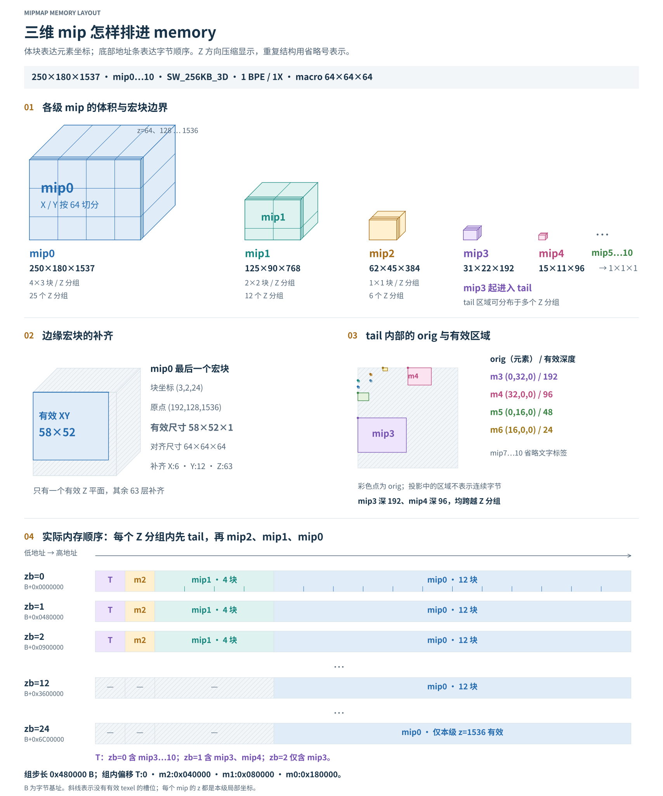
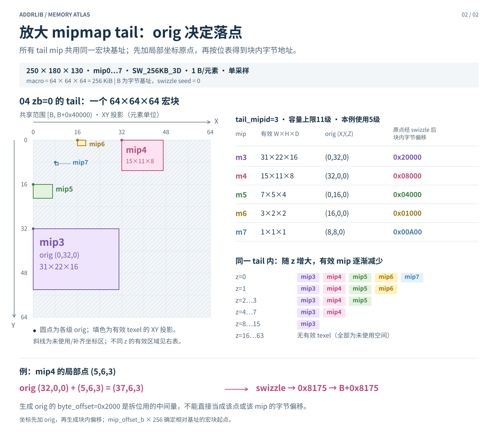

# 多 mipmap 内存分布图

本页记录三维配图的参数与再生成入口。当前讲解稿使用 19 和 31，参数为 250×180×1537、mip0～10；07/08 及本页后半部分保留 250×180×130、mip0～7 的独立图例。两组都使用 ADDRLIB.md 的计算规则，不能混用深度、访问点和验证计数。图内与讲解正文仅展示技术内容，来源与检查范围留在管理资料中。

## 当前六章讲解稿使用的图



19 展示同一三维资源的各级 mip、Z 分组、边缘补齐、tail orig 和内存顺序。31 放大 mip4 的 (5,6,69)：其 orig 为 (32,0,0)，位于 zb=1，宏块偏移 0x480000 B，最终地址 0x304881D5。综合图用省略号压缩重复 Z 结构，mip1 的 X/Y 宏块网格保留。

输入、中间量与实际检查结果见 [ADDRLIB_MAS_3D_WALKTHROUGH_CHECK.json](../../docs/ADDRLIB_MAS_3D_WALKTHROUGH_CHECK.json)。148,630 个有效 tail 元素地址无重叠，354 个普通宏块的 2,784 个有效角点通过地址检查；不扩展为上游分配器或 RTL 验证。

```text
node scripts/verify_mas_3d_walkthrough.cjs
python scripts/render_mas_3d_walkthrough.py
```

以下尺寸、表格和检查计数仅属于 07/08 的 250×180×130 图例。

## 总览：mip、Z 分组与 macro block 对齐


[PNG](diagrams/07_mipmap_memory_layout.png) · [可缩放 SVG](diagrams/07_mipmap_memory_layout.svg)

## 放大 tail：各 mip 的 orig 与深度截面



[PNG](diagrams/08_mipmap_tail_layout.png) · [可缩放 SVG](diagrams/08_mipmap_tail_layout.svg)

## 输入与计算口径

| 项目 | 值 |
| --- | --- |
| mip0 宽、高、深 | 250、180、130；减一编码为 249、179、129 |
| 模式、元素大小、采样 | SW_256KB_3D、1 BPE、1X；log2_element_bytes=0、log2_num_samples=0 |
| mip 链 | maxmip=7，即 mip0～7 |
| 宏块 / 微块 | 64×64×64 / 8×4×8；分别为 256 KiB / 256 B |
| 基址、swizzle 种子 | 图中地址相对字节基址 B，计算数据取 B=0、seed=0；B 应满足示例的对齐和零种子条件 |
| 位宽 | MAXMIP=17；tail reverse 按有符号负数判断；BYTE_OFFSET_IN_MIPTAIL_WIDTH=20；其余乘加用足宽整数 |
| 逻辑尺寸 | 为展示有效 texel，采用 max(1, floor(mip0尺寸 / 2^m))；不拿它替换文档的块数递推 |

文档的 mipmap 参数模块不使用深度输入。这里使用逻辑深度区分各 mip 中哪些 z 坐标有效，不额外推断上游分配器的裁剪策略。**z 是当前 mip 内的局部坐标**；例如 mip1 的 z=64 并不等于 mip0 的同一物理切片。

## 为什么是这种排布

按 `pad_to_log2sz_gc` 和逐级块数递推，mip0 的 XY 块数为 `ceil(250/64) × ceil(180/64) = 4×3`，随后依次为 `2×2、1×1、…`。tail 容量为 11，宽高阈值为 64×32。检查 mip3 时，用 mip2 的块数检查下一 mip：`Wb[2]≤2、Hb[2]≤1` 均成立，得到 `tail_mipid=3`。

| mip | 逻辑宽×高×深 | 对链步长的宏块贡献 | 组内宏块偏移 | 字节偏移 |
| ---: | --- | ---: | ---: | --- |
| 0 | 250×180×130 | 12 | 6 | 0x180000 |
| 1 | 125×90×65 | 4 | 2 | 0x080000 |
| 2 | 62×45×32 | 1 | 1 | 0x040000 |
| 3 | 31×22×16 | 1 | 0 | 0 |
| 4 | 15×11×8 | 0，已计入共享 tail | 0 | 0 |
| 5 | 7×5×4 | 0，已计入共享 tail | 0 | 0 |
| 6 | 3×2×2 | 0，已计入共享 tail | 0 | 0 |
| 7 | 1×1×1 | 0，已计入共享 tail | 0 | 0 |

`mip_offset` 是当前 mip 后面各有效贡献的和，因此低地址先放 tail，再放 mip2、mip1、mip0。`slice=18×64×64=73728` 是模块原始输出；在本例厚块寻址中，跨一个 `zb=z>>6` 分组的字节步长是 `18×256 KiB=0x480000`，不能把 73728 直接当整个 3D 表面的字节大小。

以 mip0 最后一个宏块为例，`xb=3、yb=2、zb=2`，宏块全局序号为 `6+2×18+2×4+3=53`，字节范围为 `[B+0xD40000, B+0xD80000)`。其局部有效尺寸为 `58×52×2`，补齐到 `64×64×64`。这些补齐坐标经 swizzle 后不一定集中在该块的末尾连续字节区间。

第一图各条表示**统一步长下的地址槽位**，不是所有槽位都有逻辑数据：mip1 仅 z=0～64 有效，mip2 仅 z=0～31 有效；tail 各级的深度更小。覆盖 mip0 所需三个 Z 分组得到的 `0xD80000` 只是此公式的地址覆盖上界，不声称是上游精确资源分配大小。

## tail 里的 orig 到底是什么

所有 tail mip 的宏块偏移都为 0，但它们的原点不同。按原文，`reverse=11-(mip_in_tail+1)`，从中间 `byte_offset` 拆出 X/Y 微块坐标，再乘微块尺寸得到 texel 原点；Z 原点为 0。

| mip | reverse | 生成 orig 的中间 byte_offset | orig | orig 经完整 swizzle 后的字节偏移 |
| ---: | ---: | --- | --- | --- |
| 3 | 10 | 0x4000 | (0,32,0) | 0x20000 |
| 4 | 9 | 0x2000 | (32,0,0) | 0x08000 |
| 5 | 8 | 0x1000 | (0,16,0) | 0x04000 |
| 6 | 7 | 0x0800 | (16,0,0) | 0x01000 |
| 7 | 6 | 0x0600 | (8,8,0) | 0x00A00 |

右列只是每级局部 `(0,0,0)` 的地址，不能理解为图中彩色矩形的连续字节起止区间。第二图画的是**texel 坐标空间**，并以表格对应真实字节偏移；XY 面积未编码深度，深度有效范围另行展开。

mip4 的 `(5,6,3)` 先变为 `(37,6,3)`，再通过 `SW_256KB_3D / AA_1X / BPE_1` 的位表得到 `0x8175`。最终是 `B+0x8175`，不能直接加中间 `byte_offset=0x2000`。这与可信 case0 的原点和选定访问点一致，但本图的资源尺寸和 maxmip 不同。

## 依据、验证与再生成

- `ADDRLIB.md`：`mipmap_param_calc_core_gc`（块数、tail 和偏移）、`calc_mip_inside_tail_xyz_orig`（原点）、`SW_256KB_3D / AA_1X / BPE_1` 表项、`block_index_calc`（Z 分组步长与宏块索引）。
- 参数复算使用现有 [document.cjs](../../scripts/mipmap_compare/document.cjs)；原点和该表项在绘图脚本中直接转写，并记录源哈希。
- 验证范围：本例五个 tail mip 合计 12,385 个有效 texel 均落在宏块内，完整块内地址两两不重叠；另核对可信 case0/case1 的两个选定访问点。没有开展 RTL 仿真、全域证明或新的 GFX12 地址链路验证。
- [机器可读输入、计算值及源哈希](diagrams/mipmap_memory_data.json)。
- [绘图源码](../../scripts/render_mipmap_memory.py)，生成 SVG 和 2 倍分辨率 PNG。需要 Python、Pillow、Node.js 与中文字体；可用 `NODE_BINARY`、`DIAGRAM_FONT`、`DIAGRAM_BOLD_FONT` 指定路径。

```text
python scripts/render_mipmap_memory.py
```

GFX12 修订版已验证的范围是 mipmap 参数与相应跨度适配，本配图并不把该结论扩大为完整三维资源分配或完整地址链路的一致性声明。
