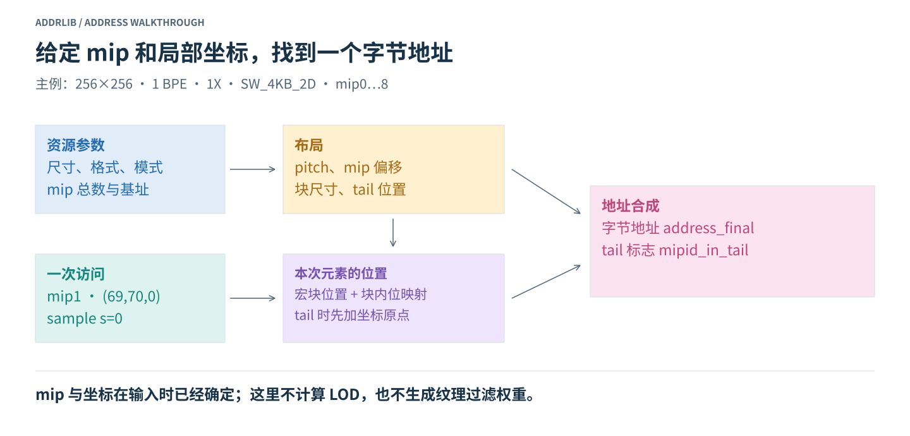
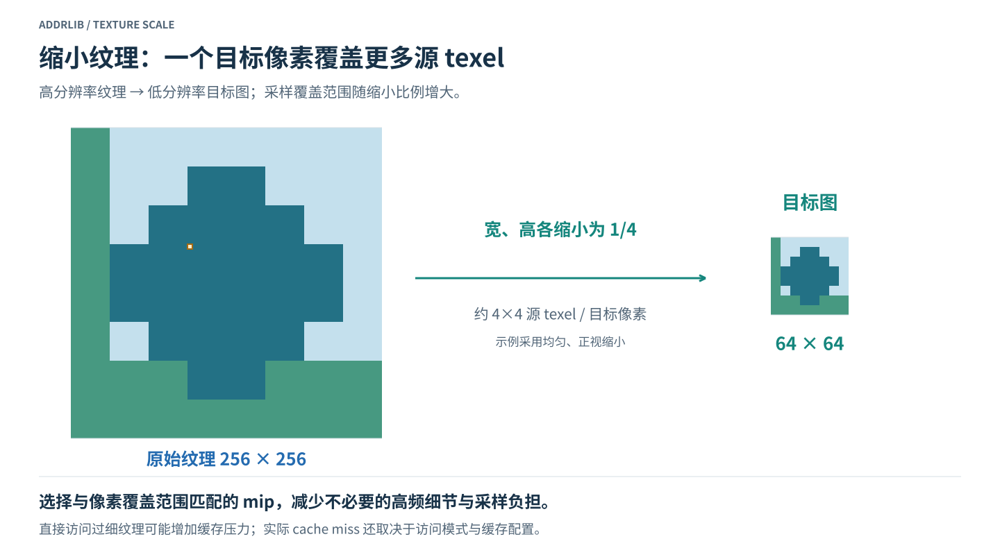
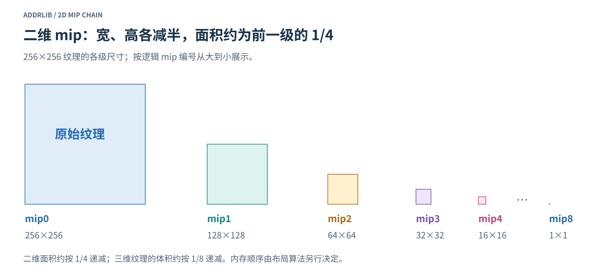
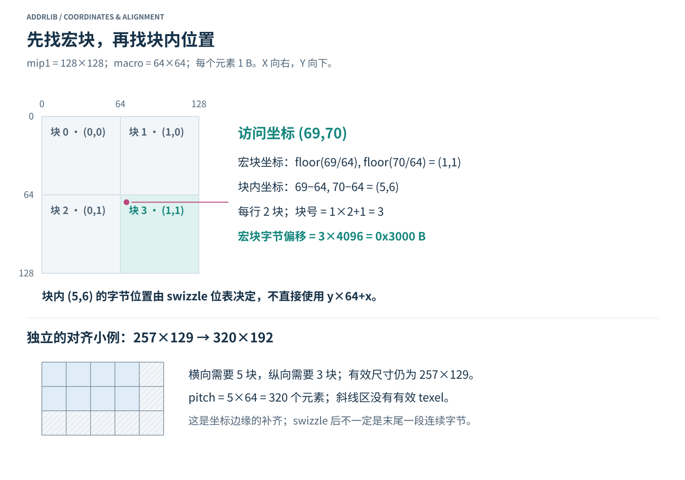
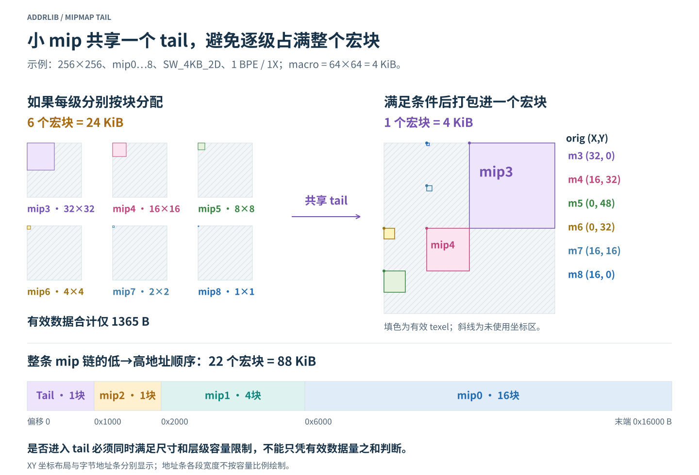
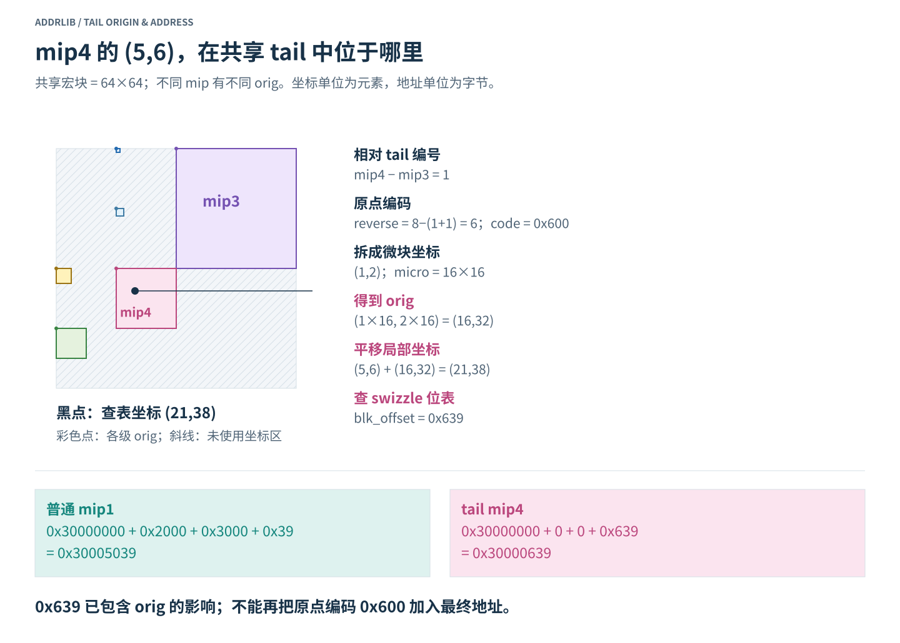
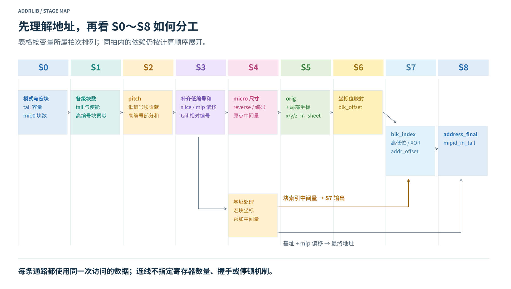
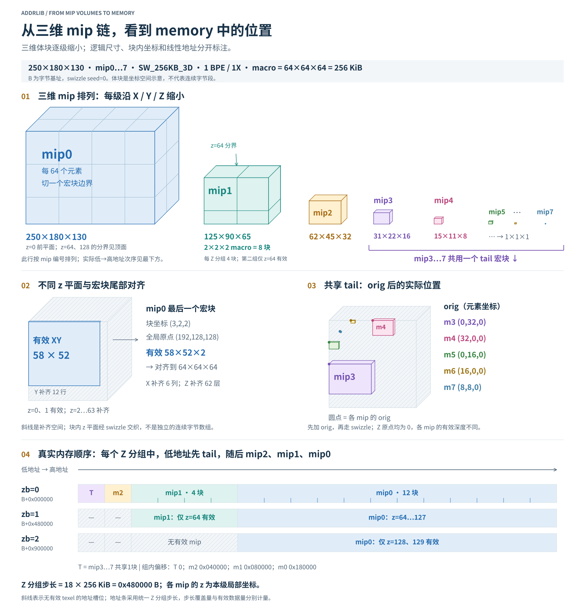

# AddrLib：从 mip 坐标到内存地址

## 1. 从一个坐标开始

有一张 256×256 的纹理，它保存了多个分辨率的版本。现在要访问 **mip1 中坐标为 `(69,70)` 的元素**。纹理已经放在内存里，但它经过了分块和块内重排，所以不能直接用 `基址 + y×宽度 + x` 找到这个元素。

AddrLib 地址计算需要回答两个问题：**当前 mip 放在哪里，以及这个元素在该 mip 的哪个位置。** 最终得到一个字节地址，同时给出当前 mip 是否位于 tail 的标志。



输入可先分成两组理解：

| 一组资源共用的参数 | 每次访问指定的参数 |
| --- | --- |
| mip0 尺寸、元素大小、采样数、布局模式、最大 mip 编号、内存基址 | 当前 mip 编号、本级局部坐标 x/y/z、sample 编号 s |

布局参数确定后，多次访问可以使用同一套布局规则。访问坐标改变时，需要重新确定宏块位置和块内地址。具体硬件是否缓存布局结果，是另一项实现选择。

这里的地址模块接收已经选好的 mip 和坐标，不负责选择 LOD、生成 mip 图像或计算过滤权重。正文先展开二维、单采样的计算，再介绍拍次分工与三维扩展。

### 1.1 贯穿全文的二维例子

| 参数 | 取值 | 含义 |
| --- | --- | --- |
| mip0 尺寸 | 256×256×1 | 元素数量；二维资源的深度为 1 |
| 元素大小 | 1 BPE | 每个元素 1 字节，即 8 bit |
| 采样数 | 1 | sample 编号 s=0 |
| 布局模式 | SW_4KB_2D | 使用 4 KiB 的二维宏块 |
| mip 范围 | mip0～mip8 | maxmip=8，共 9 级 |
| 字节基址 B | 0x30000000 | 宏块对齐，swizzle seed=0 |
| baseAddr256B | 0x00300000 | 基址以 256 B 为单位编码 |

本例的一个宏块覆盖 **64×64 个元素**，容量为 `64×64×1 B = 4096 B = 4 KiB`。后面分别计算两次访问：普通 mip1 的 `(69,70,0)`，以及 tail 内 mip4 的 `(5,6,0)`。

`KiB` 表示 1024 字节。模式名中的 `4KB` 是名称的一部分，其容量按 4096 字节计算。

## 2. 为什么同一张纹理有多个 mip

### 2.1 屏幕像素与纹理元素

屏幕像素是最终图像上的一个位置；纹理元素通常称为 texel，是纹理中的一个样点。一个物体远离视点时，同一块纹理会覆盖更少的屏幕像素，一个屏幕像素可能对应很多 texel。

如果只取少量样点来代表整片覆盖区域，细纹理容易出现走样、摩尔纹或运动中的闪烁。提前生成经过过滤的低分辨率纹理，可以让采样更接近当前需要的尺度。



纹理缩小时，较低分辨率的 mip 也可能减少数据访问并改善缓存利用率，但 cache miss 还取决于访问顺序、过滤方式和缓存实现。不能只由原始分辨率高，就推出 miss 率一定高。

反过来，放大纹理不会凭空增加细节。插值可以使过渡平滑，但不能恢复纹理中不存在的高频内容。

### 2.2 mip 编号表示什么

在本例中，每增加一级 mip，宽和高各减半，直到 1×1：



| mip 编号 | 本级尺寸 | 本级有效数据量 |
| --- | --- | --- |
| 0 | 256×256 | 65536 B |
| 1 | 128×128 | 16384 B |
| 2 | 64×64 | 4096 B |
| 3 | 32×32 | 1024 B |
| 4 | 16×16 | 256 B |
| 5 | 8×8 | 64 B |
| 6 | 4×4 | 16 B |
| 7 | 2×2 | 4 B |
| 8 | 1×1 | 1 B |

**坐标属于当前 mip。** 访问 mip1 的 `(69,70)`，就是访问 128×128 图像上的这个位置，地址模块不再把这两个坐标右移一级。mip4 的 `(5,6)` 同理，是其 16×16 图像中的局部坐标。

生成较小 mip 时，需要适当的低通预过滤，不能简单理解为丢掉隔行、隔列的样点。LOD 决定选哪一级；双线性过滤在一级内插值；三线性过滤还会混合相邻两级。

### 2.3 多存这些 mip 需要多少空间

本例每级有效元素数是前一级的四分之一，因此有效数据合计为：

```text
65536 + 16384 + 4096 + 1024 + 256 + 64 + 16 + 4 + 1
= 87381 B
```

对这种边长为二次幂的正方形二维纹理，完整 mip 链的理想数据量接近 mip0 的 4/3，即额外增加约三分之一。这个估算尚未考虑宏块对齐；长宽差别很大的纹理、三维纹理或压缩格式不能直接套用同一比例。

## 3. 图像怎样变成分块存储

### 3.1 宏块坐标与块内坐标

二维图像是坐标网格，内存是一维字节地址。tiled 布局先把图像切成宏块，再确定宏块内部的元素排列。

主例的 mip1 为 128×128，一个宏块为 64×64，因此正好切成 2×2 共 4 个宏块。宏块按行编号为 0、1、2、3。



访问 `(69,70)` 时：

```text
宏块坐标 xb = floor(69 / 64) = 1
宏块坐标 yb = floor(70 / 64) = 1

块内坐标 x_local = 69 − 1×64 = 5
块内坐标 y_local = 70 − 1×64 = 6
```

高位坐标决定宏块位置，低位坐标参与块内位映射。块宽和块高都是 64，即 2^6，所以分块计算可以写成右移 6 位；块内坐标则取低 6 位。

### 3.2 对齐尺寸与 pitch

本例的普通 mip1 宽度刚好对齐，`pitch=128` 个元素。为了看清补齐的作用，单独考虑一张 257×129 的图像，宏块仍为 64×64：

```text
横向块数 = ceil(257 / 64) = 5
纵向块数 = ceil(129 / 64) = 3
对齐宽度 = 5×64 = 320 个元素
对齐高度 = 3×64 = 192 个元素
```

有效图像仍然只有 257×129，补齐区域不产生新的 texel。这里的 `pitch` 为 320 个元素，用来恢复每行宏块数；在 tiled 布局中，它不表示任意相邻两行 texel 的字节地址差都是 320。

补齐首先发生在坐标空间的右侧和下侧。经过 swizzle 后，这些未使用位置可能分散在宏块内部，不能统一画成内存末尾的一段连续空白。

### 3.3 swizzle 是坐标位到地址位的映射

找到宏块以后，还需要决定块内元素的字节次序。最简单的行优先排列会使用 `y_local×块宽+x_local`；swizzle 则按指定规则重新组合坐标位。

例如，某个模式可以把坐标的 x[2] 放到地址 bit3，把 y[2] 放到地址 bit5。坐标位的角色没有改变，改变的是它在字节偏移中占据的位置。

Morton 排列是理解位交织的一种简单例子，例如 `{y[1],x[1],y[0],x[0]}`。具体模式的位表可能有不同的交织顺序、sample 位和元素内字节位，因此计算时要使用所选模式的完整规则。

主例稍后只展开 `SW_4KB_2D / AA_1X / BPE_1` 这一行，完整模式表放在附录。

## 4. mip tail 怎样共享空间

### 4.1 小 mip 单独占一个宏块会怎样

主例的 mip3～8 分别只有 1024、256、64、16、4、1 字节，有效数据合计 1365 B。若每一级都单独按 4 KiB 分配，需要 6 个宏块，即 24 KiB。

tail 允许满足条件的小 mip 共享一个宏块。本例中这六级共用 4 KiB，各级在共享区域中仍有各自的位置。



### 4.2 怎样判断首个 tail mip

入 tail 需要同时满足两项条件：尺寸足够小，且后面剩余的 mip 级数不超过 tail 的容量。有效数据量之和能放进一块，并不能单独决定是否入 tail。

主例的宏块为 64×64，`y_bias=0`，因此尺寸阈值是宽 32、高 64；tail 容量上限为 8 级。`maxmip=8`，对 mip m 而言，剩余级数为 `8−m+1`。

| 待判定 mip | 逻辑尺寸 | 剩余级数 ≤ 8 | 尺寸满足 32×64 阈值 | 进入 tail |
| --- | --- | --- | --- | --- |
| 0 | 256×256 | 否，剩余 9 级 | 否 | 否 |
| 1 | 128×128 | 是 | 否 | 否 |
| 2 | 64×64 | 是 | 否 | 否 |
| 3 | 32×32 | 是 | 是 | 是，首个 tail |
| 4～8 | 16×16～1×1 | 是 | 是 | 是 |

在这组二次幂尺寸中，直接看逻辑尺寸就容易理解结果。实现里的后续 mip 判定使用**前一级的块数**递推：

```text
y_bias=0：判断 mip(m+1) 时，检查 Wb[m]≤1、Hb[m]≤2

判断 mip1：用 mip0 的块数 4×4 → 不满足
判断 mip2：用 mip1 的块数 2×2 → 宽度条件不满足
判断 mip3：用 mip2 的块数 1×1 → 两项满足
```

每次还要同时检查待判定级别的数量条件 `in_tail_chk[m+1]`。前一级块数不能错写成当前级别的块数；非整齐尺寸也应按规定的块数递推式计算。

### 4.3 各 mip 怎样贡献存储空间

普通 mip 按本级的宏块数量计入；首个 tail 计一块，后续 tail mip 计零，因为共享区域已经分配。

| mip | 逻辑尺寸 | 每级块贡献 mipsize | 相对 B 的宏块字节偏移 |
| --- | --- | --- | --- |
| 0 | 256×256 | 16 | 0x6000 |
| 1 | 128×128 | 4 | 0x2000 |
| 2 | 64×64 | 1 | 0x1000 |
| 3 | 32×32 | 1，共享 tail | 0 |
| 4～8 | 16×16～1×1 | 0，使用共享 tail | 0 |

`mipsize=0` 不表示这个 mip 没有内容。它表示当前级别没有额外增加一整块分配。

本例的低到高地址顺序为：

```text
[B+0x0000, B+0x1000)   共享 tail：mip3～8
[B+0x1000, B+0x2000)   mip2：1 块
[B+0x2000, B+0x6000)   mip1：4 块
[B+0x6000, B+0x16000)  mip0：16 块
```

方括号表示包含起点，右括号表示不包含终点。这里 mip 编号的大小与地址顺序不同，mip0 不在最低地址。

```text
总块数 = 16 + 4 + 1 + 1 = 22
布局占用 = 22×4096 = 90112 B = 88 KiB
有效数据 = 87381 B
未使用地址槽位 = 90112−87381 = 2731 B
```

这组尺寸下普通 mip 恰好整块对齐，2731 B 来自 tail 宏块中没有有效 texel 的位置。

### 4.4 三个容易混淆的 tail 量

| 量 | 含义 | mip1 的值 | mip4 的值 |
| --- | --- | --- | --- |
| tail_mipid | 整条链中首个 tail 的绝对 mip 编号 | 3 | 3 |
| mip_in_tail | 当前 mip 在 tail 中的相对编号；无 tail 使用 17 | 17 | 4−3=1 |
| mipid_in_tail | 顶层输出的布尔标志 | 0 | 1 |

`mip_in_tail=1` 表示 tail 中的第二级；`mipid_in_tail=1` 只表示“在 tail 中”。17 是内部哨兵，不是一个合法的 tail 相对编号。

## 5. 普通 mip1 的一次完整访问

现在只跟踪 mip1 的 `(69,70,0)`。sample 编号为 0，字节基址为 `B=0x30000000`。

### 5.1 取出 mip1 的布局参数

```text
本级逻辑尺寸 = 128×128
pitch = 128 个元素
横向宏块数 pitch_b = 128 / 64 = 2

mip1 前面的区域 = tail 1 块 + mip2 1 块 = 2 块
mip_offset_bytes = 2×4096 = 8192 B = 0x2000
mip_offset_b = 8192 / 256 = 32 = 0x20
```

`mip_offset_b` 的单位是 256 B，转成字节要再左移 8 位；它不是字节偏移本身。

### 5.2 计算当前元素所在宏块

```text
xb = 69 >> 6 = 1
yb = 70 >> 6 = 1
zb = 0

当前 mip 内的宏块号 = yb×pitch_b + xb = 1×2+1 = 3
blk_index = 3×4096 = 12288 B = 0x3000
```

虽然变量名为 `blk_index`，经过乘宏块容量后，它已经是字节偏移。到这一步，当前宏块从 `B+0x2000+0x3000 = B+0x5000` 开始。

### 5.3 计算块内偏移

普通 mip 的 tail 原点为零，所以查表坐标仍为 `(69,70,0)`。本模式只使用 X/Y 的低 6 位，高位已经用于选宏块。

```text
X 的低 6 位 = 5 = 000101
Y 的低 6 位 = 6 = 000110

blk_offset[11:0] =
{x5, y5, x4, y4, y3, x3, y2, y1, x2, y0, x1, x0}
```

这里 x5 表示 x[5]，其余相同。有效位如下：

| 为 1 的坐标位 | 放入哪个地址位 | 对字节偏移的贡献 |
| --- | --- | --- |
| y[2] | bit5 | 0x20 |
| y[1] | bit4 | 0x10 |
| x[2] | bit3 | 0x08 |
| x[0] | bit0 | 0x01 |

```text
blk_offset = 0x20 + 0x10 + 0x08 + 0x01 = 0x39 = 57 B
```

因此块内 `(5,6)` 并不按行优先计算成 `6×64+5=389`，而是映射到第 57 字节。

### 5.4 合成最终地址

4 KiB 模式对应 `l2_ms=12`，相对 128 B 的指数为 5，所以 `ms_mask_128B=0x1F`，再右移一位得到 `ms_mask_256B=0xF`。

基址字段 `baseAddr256B=0x00300000` 的低 12 位全为 0，因此 seed 为 0，清理后基址不变：

```text
mipoffset_BaseAddr256B_out = 0x00300000 + 0x20 = 0x00300020

blk_offset_final = 0x39 & 0xFF = 0x39
swizzle_bits = ((0x39 >> 8) & 0xF) XOR 0 = 0
addr_offset = 0x3000 OR (0 << 8) OR 0x39 = 0x3039

address_final = (0x00300020 << 8) + 0x3039
              = 0x30005039
mipid_in_tail = 0
```

宏块偏移的低 12 位为零，块内偏移仅占这 12 位，因此这里 OR 合成与相加得到相同数值。这个关系依赖字段不重叠，不能推广成“任意 OR 都能替换为加法”。

回到内存区域看，本次访问位于 mip1 的第四个宏块内：`B+0x5000` 再向后 57 字节，得到 `B+0x5039`。

## 6. tail mip4 的一次完整访问

mip4 的逻辑尺寸为 16×16，访问坐标为 `(5,6,0)`。它位于共享 tail 中，需要先把局部坐标放到共享宏块的正确位置。



### 6.1 从相对编号得到原点编码

本例首个 tail 为 mip3，因此：

```text
mip_in_tail = 4−3 = 1
num_mips_in_tail = 8
reverse = 8−(1+1) = 6
```

原点生成使用 256 B 微块。二维、1 BPE、单采样时，一个微块的尺寸为 16×16，因此微块宽高的 log2 都是 4。

原点编码的分支是：负数时为 0，大于 6 时使用 `16 << reverse`，其余使用 `reverse << 8`。本次落入最后一支：

```text
byte_offset = 6 << 8 = 0x600
```

这里的 `byte_offset` 是生成原点的中间编码，后续步骤需要先把它拆成坐标。

### 6.2 拆位并得到 orig

编码的 bit9、11、13、15、17、19 依次构成 X 微块坐标，bit8、10、12、14、16、18 构成 Y 微块坐标。`0x600` 中 bit9 和 bit10 为 1，所以：

```text
x_mip_micro_block = 1
y_mip_micro_block = 2

l2_ms_odd = 12 的最低位 = 0，不交换 X/Y
orig_x = 1 << 4 = 16
orig_y = 2 << 4 = 32
orig_z = 0
```

mip4 的左上角是共享宏块中的 `(16,32)`。本次访问点变为：

```text
x_in_sheet = 16 + 5 = 21
y_in_sheet = 32 + 6 = 38
z_in_sheet = 0
```

### 6.3 使用平移后的坐标查位表

本次仍使用普通访问中的同一行位映射，但输入改为 `(21,38)`：

```text
X = 21 = 010101
Y = 38 = 100110
```

相对于块内 `(5,6)`，现在多了 x[4] 和 y[5]：

| 为 1 的坐标位 | 地址位 | 贡献 |
| --- | --- | --- |
| y[5] | bit10 | 0x400 |
| x[4] | bit9 | 0x200 |
| y[2]、y[1]、x[2]、x[0] | bit5、4、3、0 | 0x39 |

```text
blk_offset = 0x400 + 0x200 + 0x39 = 0x639
```

### 6.4 完成地址合成

共享 tail 从 B 开始，所以 `mip_offset_b=0`。本次局部坐标位于第一个宏块内，`xb=yb=zb=0`，因此 `blk_index=0`。

```text
mipoffset_BaseAddr256B_out = 0x00300000
blk_offset_final = 0x639 & 0xFF = 0x39
swizzle_bits = ((0x639 >> 8) & 0xF) XOR 0 = 6
addr_offset = 0 OR (6 << 8) OR 0x39 = 0x639

address_final = (0x00300000 << 8) + 0x639
              = 0x30000639
mipid_in_tail = 1
```

**0x639 已经包含 orig 的作用。** 若再把原点编码 0x600 加进去，就会重复计入，得到错误的 `0x30000C39`。

在这个二维模式中，原点编码 0x600 恰好也等于 orig 映射后的块内字节位置；计算路径仍是“编码 → 原点 → 平移坐标 → 位映射”。其他模式不保证这种数值相等关系。

### 6.5 比较两条访问路径

| 量 | 普通 mip1 | tail mip4 |
| --- | --- | --- |
| 本级逻辑尺寸 | 128×128 | 16×16 |
| 局部坐标 | (69,70,0) | (5,6,0) |
| pitch，元素 | 128 | 64 |
| mip 宏块字节偏移 | 0x2000 | 0 |
| orig，元素坐标 | (0,0,0) | (16,32,0) |
| 查表坐标 | (69,70,0) | (21,38,0) |
| blk_index，字节 | 0x3000 | 0 |
| blk_offset，字节 | 0x39 | 0x639 |
| 最终字节地址 | **0x30005039** | **0x30000639** |
| mipid_in_tail | 0 | 1 |

tail mip4 的逻辑宽度为 16，但这里输出 `pitch=64`，表示该计算规则下恢复的块对齐宽度，不能把它当成 16 个有效元素。两次访问使用同一条 mip 链，`slice=90112` 也相同；其单位和适用范围见后面的接口表。

## 7. 把计算过程对应到 S0～S8

### 7.1 拍次图怎样读

S0、S1 等表示变量所属的计算拍次。行尾的 stage 标记只指定该变量；独立行的标记指定后续段落，直到下一个独立 stage 标记。单变量标记不改变整段的默认归属。

`S2→S3` 表示后半段进入 S3。某个输出属于 S7，不表示产生它的所有中间量都必须放在 S7。变量的计算、传递与使用也需要分开看：同一次请求的坐标、模式和布局结果必须在使用处对齐。



这张图标出变量归属和数据依赖，不指定未定义的寄存器数量、valid/ready、停顿或复位行为。

### 7.2 S0：准备宏块与 tail 条件

两次访问共享以下结果：

| 变量 | 主例结果 | 单位或用途 |
| --- | --- | --- |
| blk_type / sw_type / linear | SZ_4KB / SW_D_2D / 0 | 模式解码 |
| l2_ms | 12 | 宏块字节数的 log2 |
| l2_ms_128B / ms_mask_128B | 5 / 0x1F | 相对 128 B 的指数与掩码 |
| block_size_elements | 12−(0+0)=12 | 宏块元素数的 log2 |
| l2_blk_w/h/d | 6 / 6 / 0 | 宏块为 64×64×1 |
| l2_blk_w_slice | 6 | slice 使用的块宽指数 |
| l2_ms_256B / l2_mip_offset | 4 / 4 | 256 B 单位换算 |
| num_mips_in_tail | 8 | tail 最大级数 |
| mips_outside_tail | 8−8=0 | 数量条件的阈值 |
| in_tail_chk[0:16] | 第 0 项为 0，其余为 1 | 标志不等于实际启用的 mip 范围 |
| y_bias | 0 | 宽度使用半块阈值 |
| Wb0 / Hb0 / Wb_slice0 | 4 / 4 / 4 | mip0 的块数 |
| pad_data_sz_w/h | 64 / 64 | 元素尺寸 |

`l2_eb=0` 表示每元素 1 B；`l2_ns=0` 表示单采样。这两个指数先从输入编码恢复其含义，不能把指数 0 理解成零字节或零采样。

### 7.3 S1：确定各级块数、tail 与使能

```text
Wb = Hb = Wb_slice = [4,2,1,1,1,...,1]，内部计算到 mip16
tail_mipid_raw = tail_mipid = 3
mipsize[16:6] = 全 0
maxmip_mask = (1 << 9)−1 = 0x1FF
slice_input_en = 0x1FF
```

内部计算到 mip16，不等于资源实际包含 17 级。主例只有 mip0～8 参与累计。

| 与当前访问有关的量 | mip1 | mip4 |
| --- | --- | --- |
| mip_mask | (1<<2)−1 = 0x003 | (1<<5)−1 = 0x01F |
| mip_off_input_en | 0x1FF & ~0x003 = 0x1FC | 0x1FF & ~0x01F = 0x1E0 |
| 累加偏移时选中的级别 | mip2～8 | mip5～8 |

### 7.4 S2 与 S3：分段累加，再转换输出单位

S2 计算本级 pitch、低编号 mip 的块贡献，以及高编号部分和：

```text
mipsize[0:5] = [16,4,1,1,0,0]
pitch(mip1) = 2 << 6 = 128
pitch(mip4) = 1 << 6 = 64

高编号部分和使用 mip6～16；本例选中项的贡献都是 0
```

S3 补入低编号贡献：

```text
slice_b = 0 + 16+4+1+1+0+0 = 22 块
slice = 22 << (6+6) = 90112 个 XY 元素位置

mip1：mip_offset_in_blks = 0 + 1+1 = 2 块
      mip_offset_b = 2 << 4 = 32 个 256B 单位
      mip_in_tail = 17

mip4：mip_offset_in_blks = 0
      mip_offset_b = 0
      mip_in_tail = 4−3 = 1
```

块尺寸指数在 S0 已经得到，pitch 在 S2 得到；S3 的接口输出还包含这些量的转接。分段累加不改变数学结果，但讲解中要保留它们的拍次边界。

### 7.5 S4：原点中间量、基址与宏块中间量

tail 原点计算需要的微块宽高指数都是 4。两条路径的相对 tail 编号不同，因此原点编码不同：

| 原点相关中间量 | mip1 | mip4 |
| --- | --- | --- |
| mip_in_tail_reverse | 8−(17+1)=−10 | 8−(1+1)=6 |
| 7 位补码 | 1110110 | 0000110 |
| byte_offset | 负数分支：0 | 6<<8 = 0x600 |
| x/y_mip_micro_block | 0 / 0 | 1 / 2 |
| l2_ms_odd | 0 | 0 |
| x/y_mip_micro_block_final | 0 / 0 | 1 / 2 |

基址和块索引中间量位于同一默认拍次段。`blk_index` 本身单独属于 S7，不能因此把下表所有中间计算都归到 S7。

| 中间量 | mip1 | mip4 | 用途 |
| --- | --- | --- | --- |
| swizzle_bits_256B | 0 | 0 | XOR 种子 |
| baseAddr256B_out | 0x00300000 | 0x00300000 | 清理后的基址 |
| mipoffset_BaseAddr256B_out | 0x00300020 | 0x00300000 | 基址加 mip 偏移，256 B 单位 |
| log2_blk_slice | 12 | 12 | 恢复块数 |
| pitch_b / slice_b | 2 / 22 | 1 / 22 | 块单位 |
| xb / yb / zb | 1 / 1 / 0 | 0 / 0 / 0 | 原始局部坐标对应的宏块 |
| slice_times_z_l / slice_times_z_h | 0 / 0 | 0 / 0 | Z 方向乘法的低、高段 |
| pitch_times_y | 2 | 0 | 行方向块数 |
| blk_index_pitch | 3 | 0 | XY 块号 |
| blk_index_slice | 0 | 0 | Z 方向块数 |
| l2_ms_slice | 12 | 12 | 转换为字节的指数 |

### 7.6 S5 与 S6：形成查表坐标，得到块内地址

| 拍次 | 变量 | mip1 | mip4 |
| --- | --- | --- | --- |
| S5 | x/y/z_mip_in_tail_orig | (0,0,0) | (16,32,0) |
| S5 | x/y/z_in_sheet | (69,70,0) | (21,38,0) |
| S6 | blk_offset | 0x39 | 0x639 |

orig 和 `in_sheet` 都属于 S5，S5 内仍有“先得到原点，再加坐标”的组合依赖。给 `blk_offset` 标记 S6，只指定这个位表结果，不会把其后出现的基址公式改归 S6。

### 7.7 S7 与 S8：两条地址通路汇合

| 拍次 | 变量 | mip1 | mip4 |
| --- | --- | --- | --- |
| S7 | blk_index | 0x3000 | 0 |
| S7 | ms_mask_256B | 0xF | 0xF |
| S7 | blk_offset_final | 0x39 | 0x39 |
| S7 | swizzle_bits | 0 | 6 |
| S7 | addr_offset | 0x3039 | 0x639 |
| S8 | address_final | 0x30005039 | 0x30000639 |
| S8 | mipid_in_tail | 0 | 1 |

S7 将宏块偏移、处理后的块内高位和低 8 位合成相对偏移；S8 再加上带 mip 偏移的字节基址。

## 8. 增加 Z 以后怎样理解

### 8.1 Z 平面与 Z 宏块分组

二维例子中 `z=0`。三维纹理每一级还具有深度，宏块也可能沿 Z 覆盖多个元素。若宏块深度为 64：

```text
zb = floor(z / 64)       // 第几个 Z 宏块分组
z_local = z mod 64       // 该宏块内的 Z 坐标
```

XY 决定组内的宏块位置，Z 宏块分组决定要跨过多少个组步长。块内 swizzle 则同时使用 X/Y/Z 的低位。

### 8.2 一组三维尺寸观察例

这里独立使用 **250×180×130、1 BPE、单采样、SW_256KB_3D、mip0～7**。其宏块为 64×64×64，共 256 KiB。

| mip | 逻辑尺寸 | 覆盖宏块的网格 | 说明 |
| --- | --- | --- | --- |
| 0 | 250×180×130 | 4×3×3 | 最后一个 Z 分组仅 z=128、129 有效 |
| 1 | 125×90×65 | 2×2×2 | 沿 X/Y/Z 的 64 处切分；第二个 Z 分组仅 z=64 有效 |
| 2 | 62×45×32 | 1×1×1 | 尺寸尚未满足本模式的 tail 条件 |
| 3～7 | 31×22×16 逐级缩小 | 共享 tail | 使用不同的原点 |

mip1 虽然比 mip0 小，仍需要 8 个宏块覆盖其三维坐标范围。不能仅画成一个未切分的小长方体。



三维综合图分开表达坐标空间和字节地址。每个 mip 的 z 都是本级局部坐标，不能把 mip0 的 z 原样当作其他 mip 上同一采样位置的坐标。

### 8.3 slice、组步长和有效数据量

这组尺寸的 XY 块贡献为 `12+4+1+1=18`：

```text
slice = 18×64×64 = 73728 个 XY 元素位置
Z 宏块组步长 = 18×256 KiB = 0x480000 B
```

`slice` 不是整个三维纹理的字节数。乘上元素大小、采样及宏块深度，才可以在这个模式中恢复 Z 宏块组的字节步长。

用统一步长排列各 Z 分组，会包含某些 mip 在该分组中没有有效 texel 的位置。步长覆盖量、实际有效体素量、具体分配器的资源占用是不同的计量对象，不能混为一个大小。

### 8.4 回头检查是否真正理解

| 检查问题 | 应能解释的结论 |
| --- | --- |
| mip0 一定在最低地址吗？ | 不一定；主例从低地址开始为 tail、mip2、mip1、mip0 |
| mip4 的 pitch=64，是否表示其逻辑宽度为 64？ | 不是；主例逻辑宽度为 16，pitch 使用块对齐表示 |
| orig 是字节偏移吗？ | orig 是坐标原点；平移后仍要执行位映射 |
| tail 后续 mip 的 mipsize=0，是否没有数据？ | 有数据，只是不重复增加整块分配 |
| blk_index 是块号还是字节偏移？ | 本模块输出已经完成字节换算 |
| S7 输出的变量，其所有中间量也在 S7 吗？ | 不能这样推断；需要分别看各变量的所属拍次 |

## 附录 A：接口、单位与命名

### A.1 顶层输入与输出

| 输入 | 含义 | 主例编码 |
| --- | --- | --- |
| x / y / z | 当前 mip 的局部坐标 | (69,70,0) 或 (5,6,0) |
| s | sample 编号 | 0 |
| map0_w_minus_1 | mip0 宽度减一 | 255 |
| map0_h_minus_1 | mip0 高度减一 | 255 |
| map0_d_minus_1 | mip0 深度减一 | 0 |
| baseAddr256B | 基址字段，256 B 单位，包含可提取的 swizzle 位 | 0x00300000 |
| log2_element_bytes | 每元素字节数的 log2 | 0，简称 l2_eb |
| log2_num_samples | 采样数的 log2 | 0，简称 l2_ns |
| sw_mode | 模式编码 | SW_4KB_2D |
| mip_level | 当前 mip 编号 | 1 或 4 |
| maxmip | 最后一个请求 mip 的编号 | 8 |

上表将 x/y/z 合并成一行，顶层共有 13 个输入。内部 `mipmap_param_calc_core_gc` 不接收基址，因此共有 12 个输入；其中坐标和深度字段在当前布局公式中没有参与计算。

| 顶层输出 | 含义 | 单位 |
| --- | --- | --- |
| address_final | 当前元素的最终地址 | 字节 |
| mipid_in_tail | 当前 mip 是否在 tail | 1 位布尔值 |

### A.2 mipmap 参数模块的九个输出

| 输出 | 含义与单位 | mip1 | mip4 |
| --- | --- | --- | --- |
| pitch | 本规则下的对齐横向跨度，元素 | 128 | 64 |
| slice | 整链有效 mip 的 XY 块贡献恢复为元素位置计数 | 90112 | 90112 |
| mip_in_tail | tail 相对编号；不在 tail 时为 17 | 17 | 1 |
| mip_offset_b | mip 宏块偏移，256 B 单位 | 32 | 0 |
| l2_ms | 宏块字节大小的 log2 | 12 | 12 |
| l2_blk_w | 宏块宽度的 log2 | 6 | 6 |
| l2_blk_h | 宏块高度的 log2 | 6 | 6 |
| l2_blk_d | 宏块深度的 log2 | 0 | 0 |
| l2_blk_w_slice | slice 使用的块宽指数 | 6 | 6 |

在二维、1 BPE、单采样的主例中，90112 个元素位置恰好对应 90112 B；更换元素大小、采样或三维模式时，要重新按单位换算。

```text
element_bytes = 1 << l2_eb
num_samples = 1 << l2_ns
bpp = 8 × element_bytes       // 普通非压缩格式，每像素对应一个元素
mip_offset_bytes = mip_offset_b << 8
```

| 等价变量名 | 统一名称 |
| --- | --- |
| maxmip_in | maxmip |
| mips_in_tail | num_mips_in_tail |
| pad_sz_w / pad_sz_h | pad_data_sz_w / pad_data_sz_h |
| l2_blk_width / l2_blk_height / l2_blk_depth | l2_blk_w / l2_blk_h / l2_blk_d |
| l2_block_ms | l2_ms |

同名量可能在不同模块中有各自的作用域。例如宏块尺寸和原点模块内的微块尺寸都可能使用 `l2_blk_w` 一类名称；解释坐标原点时以 `l2_ublk_w/h/d` 区分微块。

## 附录 B：模式与尺寸表

### B.1 模式解码

| sw_mode | blk_type | sw_type |
| --- | --- | --- |
| `SW_LINEAR` | `SZ_LIN (SZ_128B)` | `SW_L` |
| `SW_256B_2D` | `SZ_256B` | `SW_D_2D` |
| `SW_4KB_2D` | `SZ_4KB` | `SW_D_2D` |
| `SW_64KB_2D` | `SZ_64KB` | `SW_D_2D` |
| `SW_256KB_2D` | `SZ_256KB` | `SW_D_2D` |
| `SW_4KB_3D` | `SZ_4KB` | `SW_S_3D` |
| `SW_64KB_3D` | `SZ_64KB` | `SW_S_3D` |
| `SW_256KB_3D` | `SZ_256KB` | `SW_S_3D` |

```text
linear = (sw_type == SW_L)
```

`sw_mode` 是解码前输入，`sw_type` 是解码后的类型。判断 `sw_type` 时不能使用输入模式名 `SW_LINEAR`。

### B.2 宏块容量与掩码

| blk_type | l2_ms | l2_ms_128B | ms_mask_128B |
| --- | --- | --- | --- |
| SZ_LIN | 7 | 0 | 0x0 |
| SZ_256B | 8 | 1 | 0x1 |
| SZ_4KB | 12 | 5 | 0x1F |
| SZ_64KB | 16 | 9 | 0x1FF |
| SZ_256KB | 18 | 11 | 0x7FF |

Linear 的横向粒度按 128 B 处理，slice 另有 256 B 对齐规则。

### B.3 宏块维度

```text
dim3D = (sw_type == SW_S_3D)
msaa = (dim3D || linear) ? 0 : l2_ns
block_size_elements = l2_ms − (l2_eb + msaa)

二维 tiled：
    l2_blk_w = block_size_elements[4:1]
             + (block_size_elements[0] & (l2_eb[0] || l2_ns[0]))
    l2_blk_h = block_size_elements[4:1]
    l2_blk_d = 0
三维 tiled：
    l2_blk_w/h/d 使用下表
Linear：
    l2_blk_w = block_size_elements
    l2_blk_h = 0
    l2_blk_d = 0
```

表中数值为 log2，括号内为实际元素尺寸。

| 宏块容量、元素大小 | l2_ms[4:1]、l2_eb | l2_blk_w（宽） | l2_blk_h（高） | l2_blk_d（深） |
| --- | --- | --- | --- | --- |
| 4KB, 8bpp | 4'b0110, 3'd0 | 4 (16) | 4 (16) | 4 (16) |
| 4KB, 16bpp | 4'b0110, 3'd1 | 3 (8) | 4 (16) | 4 (16) |
| 4KB, 32bpp | 4'b0110, 3'd2 | 3 (8) | 4 (16) | 3 (8) |
| 4KB, 64bpp | 4'b0110, 3'd3 | 3 (8) | 3 (8) | 3 (8) |
| 4KB, 128bpp | 4'b0110, 3'd4 | 2 (4) | 3 (8) | 3 (8) |
| 64KB, 8bpp | 4'b1000, 3'd0 | 6 (64) | 5 (32) | 5 (32) |
| 64KB, 16bpp | 4'b1000, 3'd1 | 5 (32) | 5 (32) | 5 (32) |
| 64KB, 32bpp | 4'b1000, 3'd2 | 5 (32) | 5 (32) | 4 (16) |
| 64KB, 64bpp | 4'b1000, 3'd3 | 5 (32) | 4 (16) | 4 (16) |
| 64KB, 128bpp | 4'b1000, 3'd4 | 4 (16) | 4 (16) | 4 (16) |
| 256KB, 8bpp | 4'b1001, 3'd0 | 6 (64) | 6 (64) | 6 (64) |
| 256KB, 16bpp | 4'b1001, 3'd1 | 5 (32) | 6 (64) | 6 (64) |
| 256KB, 32bpp | 4'b1001, 3'd2 | 5 (32) | 6 (64) | 5 (32) |
| 256KB, 64bpp | 4'b1001, 3'd3 | 5 (32) | 5 (32) | 5 (32) |
| 256KB, 128bpp | 4'b1001, 3'd4 | 4 (16) | 5 (32) | 5 (32) |

### B.4 完整块内位映射

左侧是输出高位；x/y/z 使用 `x/y/z_in_sheet`，s 使用当前 sample 编号。末尾常数 0 表示元素内部的字节位；以下结果定位元素的起始字节。

| 模式、采样数、元素大小 | blk_offset（S6，高位在左） |
| --- | --- |
| `{SW_LINEAR, AA_1X, BPE_1}` | `{x[6], x[5], x[4], x[3], x[2], x[1], x[0]}` |
| `{SW_LINEAR, AA_1X, BPE_2}` | `{x[5], x[4], x[3], x[2], x[1], x[0], 1'b0}` |
| `{SW_LINEAR, AA_1X, BPE_4}` | `{x[4], x[3], x[2], x[1], x[0], 1'b0, 1'b0}` |
| `{SW_LINEAR, AA_1X, BPE_8}` | `{x[3], x[2], x[1], x[0], 1'b0, 1'b0, 1'b0}` |
| `{SW_LINEAR, AA_1X, BPE_16}` | `{x[2], x[1], x[0], 1'b0, 1'b0, 1'b0, 1'b0}` |
| `{SW_256B_2D, AA_1X, BPE_1}` | `{y[3], x[3], y[2], y[1], x[2], y[0], x[1], x[0]}` |
| `{SW_4KB_2D, AA_1X, BPE_1}` | `{x[5], y[5], x[4], y[4], y[3], x[3], y[2], y[1], x[2], y[0], x[1], x[0]}` |
| `{SW_64KB_2D, AA_1X, BPE_1}` | `{x[7], y[7], x[6], y[6], x[5], y[5], x[4], y[4], y[3], x[3], y[2], y[1], x[2], y[0], x[1], x[0]}` |
| `{SW_256KB_2D, AA_1X, BPE_1}` | `{x[8], y[8], x[7], y[7], x[6], y[6], x[5], y[5], x[4], y[4], y[3], x[3], y[2], y[1], x[2], y[0], x[1], x[0]}` |
| `{SW_256B_2D, AA_1X, BPE_2}` | `{x[3], y[2], x[2], y[1], x[1], y[0], x[0], 1'b0}` |
| `{SW_4KB_2D, AA_1X, BPE_2}` | `{x[5], y[4], x[4], y[3], x[3], y[2], x[2], y[1], x[1], y[0], x[0], 1'b0}` |
| `{SW_64KB_2D, AA_1X, BPE_2}` | `{x[7], y[6], x[6], y[5], x[5], y[4], x[4], y[3], x[3], y[2], x[2], y[1], x[1], y[0], x[0], 1'b0}` |
| `{SW_256KB_2D, AA_1X, BPE_2}` | `{x[8], y[7], x[7], y[6], x[6], y[5], x[5], y[4], x[4], y[3], x[3], y[2], x[2], y[1], x[1], y[0], x[0], 1'b0}` |
| `{SW_256B_2D, AA_1X, BPE_4}` | `{y[2], x[2], y[1], x[1], y[0], x[0], 1'b0, 1'b0}` |
| `{SW_4KB_2D, AA_1X, BPE_4}` | `{x[4], y[4], x[3], y[3], y[2], x[2], y[1], x[1], y[0], x[0], 1'b0, 1'b0}` |
| `{SW_64KB_2D, AA_1X, BPE_4}` | `{x[6], y[6], x[5], y[5], x[4], y[4], x[3], y[3], y[2], x[2], y[1], x[1], y[0], x[0], 1'b0, 1'b0}` |
| `{SW_256KB_2D, AA_1X, BPE_4}` | `{x[7], y[7], x[6], y[6], x[5], y[5], x[4], y[4], x[3], y[3], y[2], x[2], y[1], x[1], y[0], x[0], 1'b0, 1'b0}` |
| `{SW_256B_2D, AA_1X, BPE_8}` | `{y[1], x[2], x[1], y[0], x[0], 1'b0, 1'b0, 1'b0}` |
| `{SW_4KB_2D, AA_1X, BPE_8}` | `{x[4], y[3], x[3], y[2], y[1], x[2], x[1], y[0], x[0], 1'b0, 1'b0, 1'b0}` |
| `{SW_64KB_2D, AA_1X, BPE_8}` | `{x[6], y[5], x[5], y[4], x[4], y[3], x[3], y[2], y[1], x[2], x[1], y[0], x[0], 1'b0, 1'b0, 1'b0}` |
| `{SW_256KB_2D, AA_1X, BPE_8}` | `{x[7], y[6], x[6], y[5], x[5], y[4], x[4], y[3], x[3], y[2], y[1], x[2], x[1], y[0], x[0], 1'b0, 1'b0, 1'b0}` |
| `{SW_256B_2D, AA_1X, BPE_16}` | `{y[1], x[1], y[0], x[0], 1'b0, 1'b0, 1'b0, 1'b0}` |
| `{SW_4KB_2D, AA_1X, BPE_16}` | `{x[3], y[3], x[2], y[2], y[1], x[1], y[0], x[0], 1'b0, 1'b0, 1'b0, 1'b0}` |
| `{SW_64KB_2D, AA_1X, BPE_16}` | `{x[5], y[5], x[4], y[4], x[3], y[3], x[2], y[2], y[1], x[1], y[0], x[0], 1'b0, 1'b0, 1'b0, 1'b0}` |
| `{SW_256KB_2D, AA_1X, BPE_16}` | `{x[6], y[6], x[5], y[5], x[4], y[4], x[3], y[3], x[2], y[2], y[1], x[1], y[0], x[0], 1'b0, 1'b0, 1'b0, 1'b0}` |
| `{SW_256B_2D, AA_2X, BPE_1}` | `{x[3], y[2], x[2], y[1], x[1], y[0], x[0], s[0]}` |
| `{SW_4KB_2D, AA_2X, BPE_1}` | `{x[5], y[4], x[4], y[3], x[3], y[2], x[2], y[1], x[1], y[0], x[0], s[0]}` |
| `{SW_64KB_2D, AA_2X, BPE_1}` | `{x[7], y[6], x[6], y[5], x[5], y[4], x[4], y[3], x[3], y[2], x[2], y[1], x[1], y[0], x[0], s[0]}` |
| `{SW_256KB_2D, AA_2X, BPE_1}` | `{x[8], y[7], x[7], y[6], x[6], y[5], x[5], y[4], x[4], y[3], x[3], y[2], x[2], y[1], x[1], y[0], x[0], s[0]}` |
| `{SW_256B_2D, AA_2X, BPE_2}` | `{y[2], x[2], y[1], x[1], y[0], x[0], s[0], 1'b0}` |
| `{SW_4KB_2D, AA_2X, BPE_2}` | `{x[4], y[4], x[3], y[3], y[2], x[2], y[1], x[1], y[0], x[0], s[0], 1'b0}` |
| `{SW_64KB_2D, AA_2X, BPE_2}` | `{x[6], y[6], x[5], y[5], x[4], y[4], x[3], y[3], y[2], x[2], y[1], x[1], y[0], x[0], s[0], 1'b0}` |
| `{SW_256KB_2D, AA_2X, BPE_2}` | `{x[7], y[7], x[6], y[6], x[5], y[5], x[4], y[4], x[3], y[3], y[2], x[2], y[1], x[1], y[0], x[0], s[0], 1'b0}` |
| `{SW_256B_2D, AA_2X, BPE_4}` | `{x[2], y[1], x[1], y[0], x[0], s[0], 1'b0, 1'b0}` |
| `{SW_4KB_2D, AA_2X, BPE_4}` | `{x[4], y[3], x[3], y[2], x[2], y[1], x[1], y[0], x[0], s[0], 1'b0, 1'b0}` |
| `{SW_64KB_2D, AA_2X, BPE_4}` | `{x[6], y[5], x[5], y[4], x[4], y[3], x[3], y[2], x[2], y[1], x[1], y[0], x[0], s[0], 1'b0, 1'b0}` |
| `{SW_256KB_2D, AA_2X, BPE_4}` | `{x[7], y[6], x[6], y[5], x[5], y[4], x[4], y[3], x[3], y[2], x[2], y[1], x[1], y[0], x[0], s[0], 1'b0, 1'b0}` |
| `{SW_256B_2D, AA_2X, BPE_8}` | `{y[1], x[1], y[0], x[0], s[0], 1'b0, 1'b0, 1'b0}` |
| `{SW_4KB_2D, AA_2X, BPE_8}` | `{x[3], y[3], x[2], y[2], y[1], x[1], y[0], x[0], s[0], 1'b0, 1'b0, 1'b0}` |
| `{SW_64KB_2D, AA_2X, BPE_8}` | `{x[5], y[5], x[4], y[4], x[3], y[3], x[2], y[2], y[1], x[1], y[0], x[0], s[0], 1'b0, 1'b0, 1'b0}` |
| `{SW_256KB_2D, AA_2X, BPE_8}` | `{x[6], y[6], x[5], y[5], x[4], y[4], x[3], y[3], x[2], y[2], y[1], x[1], y[0], x[0], s[0], 1'b0, 1'b0, 1'b0}` |
| `{SW_256B_2D, AA_2X, BPE_16}` | `{x[1], y[0], x[0], s[0], 1'b0, 1'b0, 1'b0, 1'b0}` |
| `{SW_4KB_2D, AA_2X, BPE_16}` | `{x[3], y[2], x[2], y[1], x[1], y[0], x[0], s[0], 1'b0, 1'b0, 1'b0, 1'b0}` |
| `{SW_64KB_2D, AA_2X, BPE_16}` | `{x[5], y[4], x[4], y[3], x[3], y[2], x[2], y[1], x[1], y[0], x[0], s[0], 1'b0, 1'b0, 1'b0, 1'b0}` |
| `{SW_256KB_2D, AA_2X, BPE_16}` | `{x[6], y[5], x[5], y[4], x[4], y[3], x[3], y[2], x[2], y[1], x[1], y[0], x[0], s[0], 1'b0, 1'b0, 1'b0, 1'b0}` |
| `{SW_256B_2D, AA_4X, BPE_1}` | `{y[2], x[2], y[1], x[1], y[0], x[0], s[1], s[0]}` |
| `{SW_4KB_2D, AA_4X, BPE_1}` | `{x[4], y[4], x[3], y[3], y[2], x[2], y[1], x[1], y[0], x[0], s[1], s[0]}` |
| `{SW_64KB_2D, AA_4X, BPE_1}` | `{x[6], y[6], x[5], y[5], x[4], y[4], x[3], y[3], y[2], x[2], y[1], x[1], y[0], x[0], s[1], s[0]}` |
| `{SW_256KB_2D, AA_4X, BPE_1}` | `{x[7], y[7], x[6], y[6], x[5], y[5], x[4], y[4], x[3], y[3], y[2], x[2], y[1], x[1], y[0], x[0], s[1], s[0]}` |
| `{SW_256B_2D, AA_4X, BPE_2}` | `{x[2], y[1], x[1], y[0], x[0], s[1], s[0], 1'b0}` |
| `{SW_4KB_2D, AA_4X, BPE_2}` | `{x[4], y[3], x[3], y[2], x[2], y[1], x[1], y[0], x[0], s[1], s[0], 1'b0}` |
| `{SW_64KB_2D, AA_4X, BPE_2}` | `{x[6], y[5], x[5], y[4], x[4], y[3], x[3], y[2], x[2], y[1], x[1], y[0], x[0], s[1], s[0], 1'b0}` |
| `{SW_256KB_2D, AA_4X, BPE_2}` | `{x[7], y[6], x[6], y[5], x[5], y[4], x[4], y[3], x[3], y[2], x[2], y[1], x[1], y[0], x[0], s[1], s[0], 1'b0}` |
| `{SW_256B_2D, AA_4X, BPE_4}` | `{y[1], x[1], y[0], x[0], s[1], s[0], 1'b0, 1'b0}` |
| `{SW_4KB_2D, AA_4X, BPE_4}` | `{x[3], y[3], x[2], y[2], y[1], x[1], y[0], x[0], s[1], s[0], 1'b0, 1'b0}` |
| `{SW_64KB_2D, AA_4X, BPE_4}` | `{x[5], y[5], x[4], y[4], x[3], y[3], x[2], y[2], y[1], x[1], y[0], x[0], s[1], s[0], 1'b0, 1'b0}` |
| `{SW_256KB_2D, AA_4X, BPE_4}` | `{x[6], y[6], x[5], y[5], x[4], y[4], x[3], y[3], x[2], y[2], y[1], x[1], y[0], x[0], s[1], s[0], 1'b0, 1'b0}` |
| `{SW_256B_2D, AA_4X, BPE_8}` | `{x[1], y[0], x[0], s[1], s[0], 1'b0, 1'b0, 1'b0}` |
| `{SW_4KB_2D, AA_4X, BPE_8}` | `{x[3], y[2], x[2], y[1], x[1], y[0], x[0], s[1], s[0], 1'b0, 1'b0, 1'b0}` |
| `{SW_64KB_2D, AA_4X, BPE_8}` | `{x[5], y[4], x[4], y[3], x[3], y[2], x[2], y[1], x[1], y[0], x[0], s[1], s[0], 1'b0, 1'b0, 1'b0}` |
| `{SW_256KB_2D, AA_4X, BPE_8}` | `{x[6], y[5], x[5], y[4], x[4], y[3], x[3], y[2], x[2], y[1], x[1], y[0], x[0], s[1], s[0], 1'b0, 1'b0, 1'b0}` |
| `{SW_256B_2D, AA_4X, BPE_16}` | `{y[0], x[0], s[1], s[0], 1'b0, 1'b0, 1'b0, 1'b0}` |
| `{SW_4KB_2D, AA_4X, BPE_16}` | `{x[2], y[2], x[1], y[1], y[0], x[0], s[1], s[0], 1'b0, 1'b0, 1'b0, 1'b0}` |
| `{SW_64KB_2D, AA_4X, BPE_16}` | `{x[4], y[4], x[3], y[3], x[2], y[2], x[1], y[1], y[0], x[0], s[1], s[0], 1'b0, 1'b0, 1'b0, 1'b0}` |
| `{SW_256KB_2D, AA_4X, BPE_16}` | `{x[5], y[5], x[4], y[4], x[3], y[3], x[2], y[2], x[1], y[1], y[0], x[0], s[1], s[0], 1'b0, 1'b0, 1'b0, 1'b0}` |
| `{SW_256B_2D, AA_8X, BPE_1}` | `{x[2], y[1], x[1], y[0], x[0], s[2], s[1], s[0]}` |
| `{SW_4KB_2D, AA_8X, BPE_1}` | `{x[4], y[3], x[3], y[2], x[2], y[1], x[1], y[0], x[0], s[2], s[1], s[0]}` |
| `{SW_64KB_2D, AA_8X, BPE_1}` | `{x[6], y[5], x[5], y[4], x[4], y[3], x[3], y[2], x[2], y[1], x[1], y[0], x[0], s[2], s[1], s[0]}` |
| `{SW_256KB_2D, AA_8X, BPE_1}` | `{x[7], y[6], x[6], y[5], x[5], y[4], x[4], y[3], x[3], y[2], x[2], y[1], x[1], y[0], x[0], s[2], s[1], s[0]}` |
| `{SW_256B_2D, AA_8X, BPE_2}` | `{y[1], x[1], y[0], x[0], s[2], s[1], s[0], 1'b0}` |
| `{SW_4KB_2D, AA_8X, BPE_2}` | `{x[3], y[3], x[2], y[2], y[1], x[1], y[0], x[0], s[2], s[1], s[0], 1'b0}` |
| `{SW_64KB_2D, AA_8X, BPE_2}` | `{x[5], y[5], x[4], y[4], x[3], y[3], x[2], y[2], y[1], x[1], y[0], x[0], s[2], s[1], s[0], 1'b0}` |
| `{SW_256KB_2D, AA_8X, BPE_2}` | `{x[6], y[6], x[5], y[5], x[4], y[4], x[3], y[3], x[2], y[2], y[1], x[1], y[0], x[0], s[2], s[1], s[0], 1'b0}` |
| `{SW_256B_2D, AA_8X, BPE_4}` | `{x[1], y[0], x[0], s[2], s[1], s[0], 1'b0, 1'b0}` |
| `{SW_4KB_2D, AA_8X, BPE_4}` | `{x[3], y[2], x[2], y[1], x[1], y[0], x[0], s[2], s[1], s[0], 1'b0, 1'b0}` |
| `{SW_64KB_2D, AA_8X, BPE_4}` | `{x[5], y[4], x[4], y[3], x[3], y[2], x[2], y[1], x[1], y[0], x[0], s[2], s[1], s[0], 1'b0, 1'b0}` |
| `{SW_256KB_2D, AA_8X, BPE_4}` | `{x[6], y[5], x[5], y[4], x[4], y[3], x[3], y[2], x[2], y[1], x[1], y[0], x[0], s[2], s[1], s[0], 1'b0, 1'b0}` |
| `{SW_256B_2D, AA_8X, BPE_8}` | `{y[0], x[0], s[2], s[1], s[0], 1'b0, 1'b0, 1'b0}` |
| `{SW_4KB_2D, AA_8X, BPE_8}` | `{x[2], y[2], x[1], y[1], y[0], x[0], s[2], s[1], s[0], 1'b0, 1'b0, 1'b0}` |
| `{SW_64KB_2D, AA_8X, BPE_8}` | `{x[4], y[4], x[3], y[3], x[2], y[2], x[1], y[1], y[0], x[0], s[2], s[1], s[0], 1'b0, 1'b0, 1'b0}` |
| `{SW_256KB_2D, AA_8X, BPE_8}` | `{x[5], y[5], x[4], y[4], x[3], y[3], x[2], y[2], x[1], y[1], y[0], x[0], s[2], s[1], s[0], 1'b0, 1'b0, 1'b0}` |
| `{SW_256B_2D, AA_8X, BPE_16}` | `{x[0], s[2], s[1], s[0], 1'b0, 1'b0, 1'b0, 1'b0}` |
| `{SW_4KB_2D, AA_8X, BPE_16}` | `{x[2], y[1], x[1], y[0], x[0], s[2], s[1], s[0], 1'b0, 1'b0, 1'b0, 1'b0}` |
| `{SW_64KB_2D, AA_8X, BPE_16}` | `{x[4], y[3], x[3], y[2], x[2], y[1], x[1], y[0], x[0], s[2], s[1], s[0], 1'b0, 1'b0, 1'b0, 1'b0}` |
| `{SW_256KB_2D, AA_8X, BPE_16}` | `{x[5], y[4], x[4], y[3], x[3], y[2], x[2], y[1], x[1], y[0], x[0], s[2], s[1], s[0], 1'b0, 1'b0, 1'b0, 1'b0}` |
| `{SW_4KB_3D, AA_1X, BPE_1}` | `{y[3], z[3], x[3], y[2], z[2], x[2], z[1], y[1], y[0], z[0], x[1], x[0]}` |
| `{SW_64KB_3D, AA_1X, BPE_1}` | `{x[5], y[4], z[4], x[4], y[3], z[3], x[3], y[2], z[2], x[2], z[1], y[1], y[0], z[0], x[1], x[0]}` |
| `{SW_256KB_3D, AA_1X, BPE_1}` | `{y[5], z[5], x[5], y[4], z[4], x[4], y[3], z[3], x[3], y[2], z[2], x[2], z[1], y[1], y[0], z[0], x[1], x[0]}` |
| `{SW_4KB_3D, AA_1X, BPE_2}` | `{y[3], z[3], x[2], y[2], z[2], y[1], z[1], x[1], y[0], z[0], x[0], 1'b0}` |
| `{SW_64KB_3D, AA_1X, BPE_2}` | `{x[4], y[4], z[4], x[3], y[3], z[3], x[2], y[2], z[2], y[1], z[1], x[1], y[0], z[0], x[0], 1'b0}` |
| `{SW_256KB_3D, AA_1X, BPE_2}` | `{y[5], z[5], x[4], y[4], z[4], x[3], y[3], z[3], x[2], y[2], z[2], y[1], z[1], x[1], y[0], z[0], x[0], 1'b0}` |
| `{SW_4KB_3D, AA_1X, BPE_4}` | `{y[3], z[2], x[2], y[2], z[1], y[1], z[0], x[1], y[0], x[0], 1'b0, 1'b0}` |
| `{SW_64KB_3D, AA_1X, BPE_4}` | `{x[4], y[4], z[3], x[3], y[3], z[2], x[2], y[2], z[1], y[1], z[0], x[1], y[0], x[0], 1'b0, 1'b0}` |
| `{SW_256KB_3D, AA_1X, BPE_4}` | `{y[5], z[4], x[4], y[4], z[3], x[3], y[3], z[2], x[2], y[2], z[1], y[1], z[0], x[1], y[0], x[0], 1'b0, 1'b0}` |
| `{SW_4KB_3D, AA_1X, BPE_8}` | `{y[2], z[2], x[2], y[1], z[1], x[1], z[0], y[0], x[0], 1'b0, 1'b0, 1'b0}` |
| `{SW_64KB_3D, AA_1X, BPE_8}` | `{x[4], y[3], z[3], x[3], y[2], z[2], x[2], y[1], z[1], x[1], z[0], y[0], x[0], 1'b0, 1'b0, 1'b0}` |
| `{SW_256KB_3D, AA_1X, BPE_8}` | `{y[4], z[4], x[4], y[3], z[3], x[3], y[2], z[2], x[2], y[1], z[1], x[1], z[0], y[0], x[0], 1'b0, 1'b0, 1'b0}` |
| `{SW_4KB_3D, AA_1X, BPE_16}` | `{y[2], z[2], x[1], y[1], z[1], y[0], z[0], x[0], 1'b0, 1'b0, 1'b0, 1'b0}` |
| `{SW_64KB_3D, AA_1X, BPE_16}` | `{x[3], y[3], z[3], x[2], y[2], z[2], x[1], y[1], z[1], y[0], z[0], x[0], 1'b0, 1'b0, 1'b0, 1'b0}` |
| `{SW_256KB_3D, AA_1X, BPE_16}` | `{y[4], z[4], x[3], y[3], z[3], x[2], y[2], z[2], x[1], y[1], z[1], y[0], z[0], x[0], 1'b0, 1'b0, 1'b0, 1'b0}` |

## 附录 C：计算公式与拍次细节

### C.1 S0 的数量条件和块数

```text
l2_blk_w_slice = (linear && (l2_blk_w < 8)) ? (8−l2_eb) : l2_blk_w
l2_ms_256B = (l2_ms_128B == 0) ? 0 : (l2_ms_128B−1)
l2_mip_offset = (l2_ms < 8) ? 0 : (l2_ms−8)

is_3d_blk_size = (sw_type == SW_S_3D)
l2_ms_256B_3d = 查表：4→3，8→6，10→7
l2_ms_256B_eff = is_3d_blk_size ? l2_ms_256B_3d : l2_ms_256B

num_mips_in_tail：
    l2_ms_256B_eff=0 时为 1
    l2_ms_256B_eff=3 时为 5
    l2_ms_256B_eff=4、6、7、8、9、10、11、12 时为 l2_ms_256B_eff+4

mips_outside_tail = maxmip−num_mips_in_tail
in_tail_chk[m] = (m > mips_outside_tail) || (mips_outside_tail < 0)

pad_sz_mask = (1 << l2_pad_sz_in)−1
pad_out = (dim_in >> l2_pad_sz_in) + |(dim_in & pad_sz_mask)
Wb0 = pad_to_log2sz_gc(map0_w, l2_blk_w)
Hb0 = pad_to_log2sz_gc(map0_h, l2_blk_h)
Wb_slice0 = pad_to_log2sz_gc(map0_w, l2_blk_w_slice)
pad_data_sz_w = 1 << l2_blk_w
pad_data_sz_h = 1 << l2_blk_h
y_bias = (sw_type == SW_S_3D) && (blk_type 为 4KB 或 256KB)
```

`|(...)` 表示归约 OR：括号内只要有一位为 1，结果就是 1。因此 `pad_out` 表达向上取整后的块数。负数判断需要保留符号位，不能先截断成无符号小整数再比较。

### C.2 S1 的尺寸与 tail 判断

```text
Wb[m] = ceil(Wb0 / 2^m)
Hb[m] = ceil(Hb0 / 2^m)
Wb_slice[m] = ceil(Wb_slice0 / 2^m)

w_tail_sz = y_bias ? pad_data_sz_w : (pad_data_sz_w >> 1)
h_tail_sz = y_bias ? (pad_data_sz_h >> 1) : pad_data_sz_h

in_miptail[0] = (map0_w <= w_tail_sz)
             && (map0_h <= h_tail_sz) && in_tail_chk[0]
in_miptail[m+1] = (y_bias ? Wb[m]<=2 : Wb[m]<=1)
                && (y_bias ? Hb[m]<=1 : Hb[m]<=2)
                && in_tail_chk[m+1]

tail_mipid_raw 初始为 17
检查 mip0 标志以及相邻 mip 标志的变化，得到首个 tail 编号
tail_mipid = ((maxmip==0) || ((l2_ms_128B>>1)==0)) ? 17 : tail_mipid_raw
```

逻辑尺寸用于描述有效 texel，块数递推用于布局计算。对非整齐尺寸，不用另一套逐级缩小再对齐的规则替换这里的递推。

`y_bias` 决定尺寸阈值的方向；`l2_ms_odd` 决定原点微块坐标是否交换，两者不是同一标志。

### C.3 块贡献和分段求和

S1 处理 mip16～6，S2 处理 mip5～0。tail 后续级贡献为 0，首个 tail 贡献为 1，其余使用 `Wb_slice[m]×Hb[m]`；S1 中 mip16 还有特殊的 1 块分支，但必须遵守分支优先级和有效 mip 掩码。

```text
S1 对 mip16～6：
    if m > tail_mipid: mipsize[m] = 0
    else if m == tail_mipid || m == 16: mipsize[m] = 1
    else: mipsize[m] = Wb_slice[m] × Hb[m]

S2 对 mip5～0：
    if m > tail_mipid: mipsize[m] = 0
    else if m == tail_mipid: mipsize[m] = 1
    else: mipsize[m] = Wb_slice[m] × Hb[m]

S1：
    mip_mask = (1 << (mip_level+1))−1
    maxmip_mask = (1 << (maxmip+1))−1
    slice_input_en = maxmip_mask
    mip_off_input_en = slice_input_en & ~mip_mask

S2：
    pitch = Wb[mip_level] << l2_blk_w
    mip_offset_in_blks = 对 mip16～6 的使能项求和
    slice_b = 对 mip16～6 的使能项求和

S3：
    mip_offset_in_blks += 对 mip5～1 的使能项求和
    slice_b += 对 mip5～0 的使能项求和
    slice = slice_b << (l2_blk_w_slice+l2_blk_h)
    mip_offset_b = mip_offset_in_blks << l2_mip_offset
    mip_in_tail = (mip_level < tail_mipid) ? 17 : (mip_level−tail_mipid)
```

这些求和写法表示选中项的整数累加，不指定加法树形状。掩码表达式按足够宽度解释，不能因演示使用短写法就缩窄硬件字段。

### C.4 S4～S6 的原点和位映射

```text
block_bits = 4'(8−(l2_eb+l2_ns))
l2_2d_blk_w = block_bits[3:1] + block_bits[0]
l2_2d_blk_h = block_bits[3:1]

三维对 block_bits=4…8 查 q_3/r_3（除以 3 的商/余数）：
    l2_3d_blk_d = q_3 + (r_3>0)
    l2_3d_blk_w = q_3 + (r_3>1)
    l2_3d_blk_h = q_3
选择二维或三维结果，记为 l2_ublk_w/h/d

reverse = num_mips_in_tail−(mip_in_tail+1)
byte_offset = (reverse<0) ? 0 : ((reverse>6) ? (16<<reverse) : (reverse<<8))

{x_micro[5],y_micro[5],...,x_micro[0],y_micro[0]} = byte_offset[19:8]
x_micro_final = l2_ms_odd ? y_micro : x_micro
y_micro_final = l2_ms_odd ? x_micro : y_micro

S5：
    x_mip_in_tail_orig = 10'(x_micro_final << l2_ublk_w)
    y_mip_in_tail_orig = 10'(y_micro_final << l2_ublk_h)
    z_mip_in_tail_orig = 0
    x/y/z_in_sheet = x/y/z_mip_in_tail_orig + x/y/z

S6：
    blk_offset = 根据 sw_mode、l2_ns、l2_eb 选择位表并拼接
```

主例及详细三维算例使用 `MAXMIP_WIDTH=5`，reverse 以 7 位补码判断负数；原点编码取 20 位，X/Y 原点显式保留低 10 位。未列出的微块查表组合不自行外推。

### C.5 基址、宏块索引和最终合成

```text
S4：
    swizzle_bits_256B = baseAddr256B[11:0] & (ms_mask_128B >> 1)[11:0]
    baseAddr256B_out = {
        baseAddr256B[ADDR_WIDTH_256B-1:BLK_256B_WIDTH],
        baseAddr256B[BLK_256B_WIDTH-1:0] & (~ms_mask_128B >> 1)
    }
    mipoffset_BaseAddr256B_out = baseAddr256B_out + mip_offset_b

    log2_blk_slice = l2_blk_w_slice + l2_blk_h
    pitch_b = pitch >> l2_blk_w
    slice_b = slice >> log2_blk_slice
    xb = x >> l2_blk_w
    yb = y >> l2_blk_h
    zb = z >> l2_blk_d
    slice_times_z_l = slice_b[15:0] × zb
    slice_times_z_h = slice_b[SLICE_WIDTH_B-1:16] × zb
    pitch_times_y = pitch_b × yb
    blk_index_pitch = pitch_times_y + xb
    blk_index_slice = slice_times_z_l + (slice_times_z_h << 16)
    l2_ms_slice = max(l2_ms,8)
    micro_offset_linear[6:0] = x[6:0] << l2_eb

S7：
    blk_index = (blk_index_pitch << l2_ms) + (blk_index_slice << l2_ms_slice)
    ms_mask_256B = ms_mask_128B >> 1
    blk_offset_final = linear ? {1'b0,micro_offset_linear} : blk_offset[7:0]
    swizzle_bits = (blk_offset[DATA_BLK_OFFSET_WIDTH-1:8]
                   & ms_mask_256B[DATA_BLK_OFFSET_WIDTH-8-1:0]) ^ swizzle_bits_256B
    addr_offset = blk_index[47:0] | (swizzle_bits << 8)[19:0] | blk_offset_final[45:0]

S8：
    address_final = {mipoffset_BaseAddr256B_out,8'd0} + addr_offset
    mipid_in_tail = (mip_in_tail != 17)
```

上述基址取反、移位的顺序不能互换。数值算例使用 48 位字节地址、40 位 256B 基址字段、12 位低基址字段；两例的低字段均为零，清理过程不改变基址。其它未声明中间量按足宽整数复算，不由此推定实际寄存器位宽。

XOR 处理的是块内高位。低位候选必须使用 `blk_offset[7:0]`：例如高位 `0x81 XOR 0x01=0x80`，与低位 `0x75` 合成得到 `0x8075`。若再 OR 完整的 `0x8175`，被清掉的 bit8 会重新变为 1。

XOR 的使能条件与具体模式有关。主算例使用 seed=0；非零 seed 的位运算演示不代表所有模式都允许这样的配置。

## 附录 D：特殊配置与阅读边界

| 配置或量 | 需要额外注意的内容 |
| --- | --- |
| Linear | 横向按 128 B 粒度处理，slice 按 256 B 对齐；低位候选有明确的 7 位宽 |
| 256 B tiled | 无 mip tail，不能套用 4 KiB 主例的 tail 结论 |
| 只请求一个 mip | maxmip=0 时 tail_mipid 使用哨兵 17 |
| MSAA | 元素大小和 sample 数共同影响块尺寸及位映射；不能只在最终地址后增加一个 sample 偏移 |
| 三维 | 深度参与访问坐标和有效范围；布局模块的当前公式不读取 map0_d |
| 非整齐尺寸 | 按块数递推计算后续 mip，区分逻辑尺寸、对齐尺寸和有效坐标 |
| 超出常规 mip 链 | 可用于公式分析，不等同于图形 API 接受的资源配置 |
| stage 标记 | 表达变量所属拍次；同名变量需按模块作用域区分，输出标记不改变其它中间变量 |

尾内原点通过加到坐标后再查表实现。宏块索引通路使用原始 mip 局部坐标；两条主例在原点平移前后都没有跨越额外的宏块边界。

## 附录 E：256³ 的两条三维访问

这一节独立使用 256×256×256、1 BPE、单采样、SW_256KB_3D、`maxmip=12` 和字节基址 0x30000000。常规尺寸缩到 1³ 截止于 mip8，mip9～12 在这里仅用于展开指定的公式输入。

### E.1 公共布局

```text
l2_ms = 18；macro = 64×64×64；micro = 8×4×8
l2_blk_w/h/d = 6/6/6；l2_blk_w_slice = 6
Wb0 = Hb0 = 4
num_mips_in_tail = 11；y_bias = 1；tail 尺寸阈值 = 64×32
mips_outside_tail = 12−11 = 1
首个 tail 为 mip3

有效 mip 的块贡献：16、4、1、1、0、...、0
slice_b = 22
slice = 22 << 12 = 90112
Z 宏块组步长 = 22×256 KiB = 0x580000 B
```

本例 `maxmip_mask=0x1FFF`。首个 tail 的判定要检查前一级块数：mip2 使用 mip1 的 2×2，未满足高度条件；mip3 使用 mip2 的 1×1，同时满足宽高和数量条件。

### E.2 普通 mip0 的 (69,134,195)

```text
pitch = 256；pitch_b = 4；slice_b = 22
mip_offset_in_blks = 4+1+1 = 6
mip_offset_b = 6 << 10 = 0x1800
mip_offset_bytes = 0x180000
mip_in_tail = 17；orig = (0,0,0)

(xb,yb,zb) = (1,2,3)
宏块数 = 3×22 + 2×4 + 1 = 75
blk_index = 75×0x40000 = 0x012C0000

位映射的低 6 位坐标 = (5,6,3)
blk_offset = 0x175
address_final = 0x30000000 + 0x180000 + 0x012C0000 + 0x175
              = 0x31440175
mipid_in_tail = 0
```

### E.3 tail mip4 的 (5,6,3)

```text
pitch = 64；mip_offset_b = 0；mip_in_tail = 4−3 = 1
reverse = 11−(1+1) = 9
byte_offset = 16 << 9 = 0x2000
微块坐标 = (4,0)
orig = (4×8,0×4,0) = (32,0,0)
查表坐标 = (37,6,3)

宏块坐标 = (0,0,0)；blk_index = 0
blk_offset = 0x8175
address_final = 0x30000000 + 0x8175 = 0x30008175
mipid_in_tail = 1
```

本模式将 x[5] 映射到地址 bit15，因此 X 原点 32 对应的块内位置为 0x8000，与生成原点时的编码 0x2000 不同。这说明必须完整经过“编码、原点、坐标平移、位映射”的路径。

本节位表为：

```text
blk_offset[17:0] =
{y5,z5,x5,y4,z4,x4,y3,z3,x3,y2,z2,x2,z1,y1,y0,z0,x1,x0}
```

以上各例展示明确参数、单位和位宽约定下的计算关系。流水拍次、组合依赖和数值结果需要分别理解，算术复算不等同于 RTL 仿真或综合时序结果。
