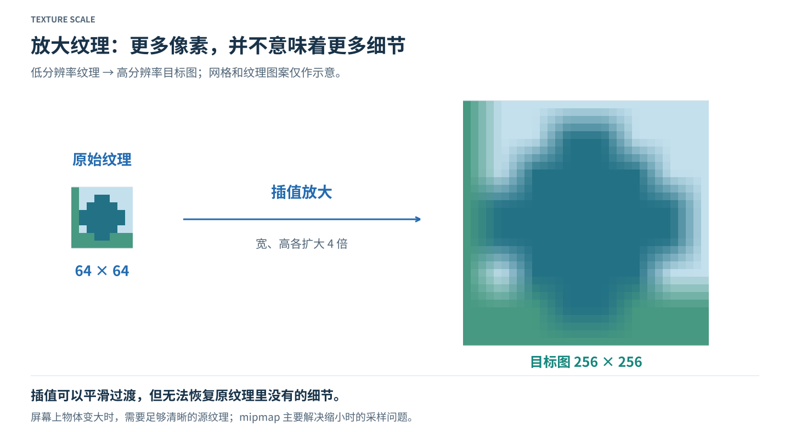
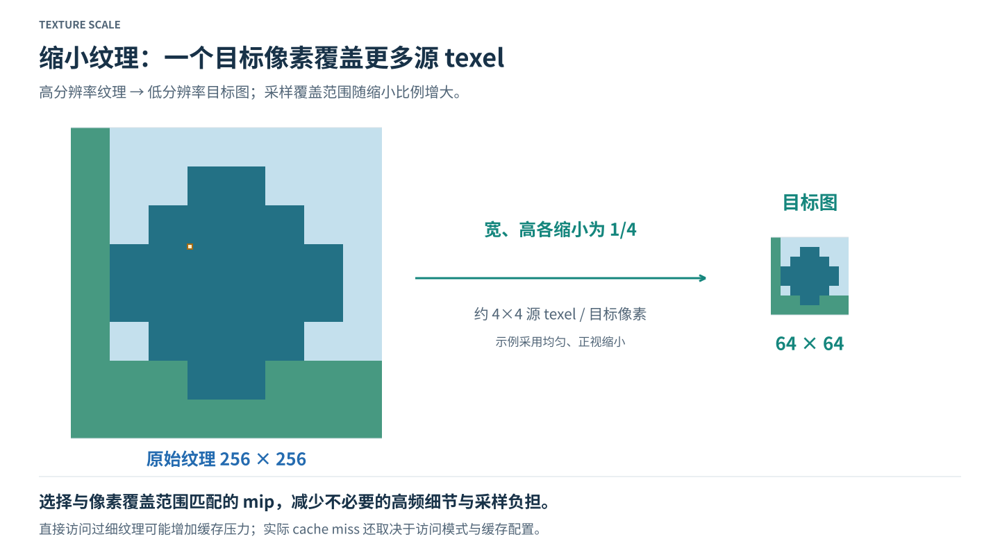
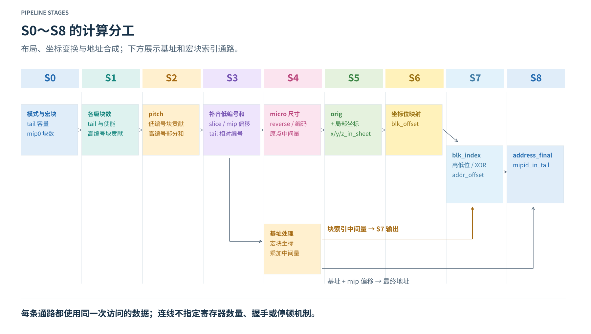
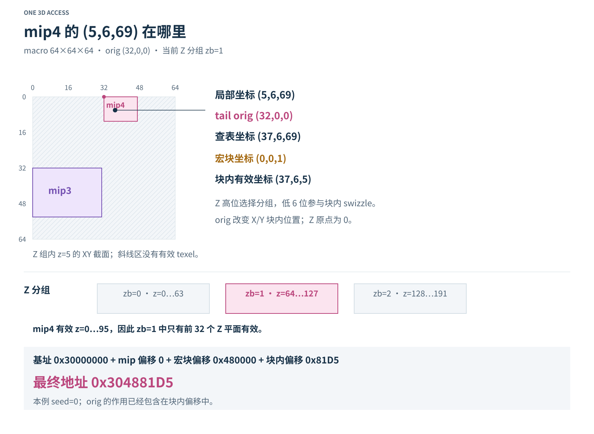

# 从纹理采样到内存地址

## 第一章 为什么需要 mipmap

### 1.1 纹理放大：插值与过滤

纹理由一个个纹理元素组成，通常称为 texel；屏幕图像则由像素组成。纹理被贴到物体表面以后，一个屏幕像素对应纹理中的一个采样位置，这个位置不一定恰好落在某个 texel 的中心。

当纹理被放大时，同一个 texel 会覆盖多个屏幕像素。若每次只取最近的 texel，放大后容易看见明显的方块边界；若结合相邻 texel 做插值，颜色过渡会更平滑。二维双线性过滤会组合周围四个 texel 的值，但插值不能恢复纹理中本来没有的细节。



放大通常使用最精细的 mip0。mipmap 保存的是逐级缩小的纹理，并不会额外生成比 mip0 更清晰的图像。因此，放大的主要问题是怎样在已有 texel 之间重建颜色；缩小还需要解决一个屏幕像素覆盖大量 texel 时的过滤问题。

### 1.2 纹理缩小：mipmap 与层级选择

当物体在屏幕上变小，同一个屏幕像素可能覆盖纹理中的许多 texel。如果仍在最精细的纹理上只取少量邻点，细线、棋盘格等高频图案可能出现锯齿、摩尔纹，或者随着视角变化不断闪烁，并且cache miss率也会变得很高。

mipmap 为同一纹理准备一串逐级缩小的图像。mip0 保存最精细的图像，mip1 的宽、高通常约为 mip0 的一半，后面的层级继续缩小。每一级已经对更大范围的原始纹理进行了过滤，因此缩小时可以选择接近当前像素覆盖范围的一级，再在该级内进行采样。



LOD 描述适合使用的精细程度。选择单个 mip 后，可以在该层内过滤；也可以在相邻两级分别取样后再混合，使层级切换更平滑。二维纹理中的三线性过滤通常指两次双线性过滤结果在相邻 mip 之间的混合，不应与三维纹理中沿 X/Y/Z 的插值混为一谈。

mipmap 用额外存储换取更合适的缩小采样。对于理想的二维二次幂纹理，后续级的有效 texel 总量约为 mip0 的三分之一；实际分配还会受到块大小、对齐和 tail 打包方式影响。使用较小的 mip 可能改善局部访问与带宽需求，但缓存命中率还取决于访问顺序、工作集和缓存结构。

### 1.3 从纹理采样到内存地址

过滤需要取得若干 texel 的值，而每个 texel 都必须先被定位到内存。地址计算接收已经选好的 mip、该 mip 内的局部坐标，以及资源的尺寸、布局模式、元素大小和基址，输出本次访问的字节地址。

整个过程可以理解为：先确定这条 mip 链的布局，再找到访问点所在的宏块，最后找到宏块中的元素位置，并与基址合成地址。mip tail 会增加一个坐标原点转换；swizzle 会改变宏块内坐标位与地址位的对应关系。

本文讨论普通非压缩元素的地址计算。mip 图像的生成、LOD 选择和过滤权重属于采样流程的其他部分。计算一个元素的地址，也不等于一次过滤所需的全部内存访问。

## 第二章 基本概念

### 2.1 纹理元素、采样数与 mip 坐标

一个元素可以占用一个或多个字节。BPE 表示每元素字节数，bpp 表示每像素位数；对于每像素一个普通非压缩元素的格式，两者相差一个八倍换算。`log2_element_bytes` 以二进制对数编码 BPE，简称 `l2_eb`。

`log2_num_samples` 表示每位置采样数的对数，简称 `l2_ns`；`s` 表示当前访问的是其中哪个 sample。采样数属于资源布局参数，sample 编号属于本次访问的坐标，二者不能互换。

| 参数 | 含义 |
| --- | --- |
| `mip_level` | 当前访问的 mip 编号 |
| `maxmip` | 最后一个请求 mip 的编号，总级数为 `maxmip+1` |
| `x / y / z` | 当前 mip 内的局部元素坐标 |
| `s` | 当前元素位置内的 sample 编号 |
| `map0_w / map0_h / map0_d` | mip0 的有效宽、高、深 |

每个 mip 都有自己的坐标范围。三维纹理的 `z` 是本级深度坐标；mip0 的 z=1 与 mip1 的 z=1 不是同一尺度的切片，也不应被当作同一个物理平面。普通三维 mip 链中，逻辑宽、高、深逐级减半，取整后最小保留一个元素。

### 2.2 宏块、微块与 swizzle

宏块（macro block）是布局中的大块。它有固定的字节容量，也有对应的元素宽、高、深。改变 BPE 或采样数以后，即使宏块字节容量不变，可容纳的元素尺寸也可能变化。

微块（micro block）是更小的布局单位。这里的原点计算采用 256 B 微块；它帮助表达小 mip 在 tail 内的位置。宏块与微块的尺寸指数是不同的量，后文用 `l2_blk_*` 与 `l2_ublk_*` 区分。

一次访问可以拆为两个层次：**宏块坐标决定访问哪个块，块内坐标决定访问块里的哪个元素。** 二维宏块深度为 1，三维宏块具有实际厚度，因此 Z 同时影响宏块选择和块内位置。

Linear 布局的横向地址关系较直接。Tiled 布局先分块，再按规则排布块内元素；swizzle 则将 X/Y/Z/sample 的特定位重新组合为地址位。图上相邻的两个 texel，未必是内存中紧挨着的两个字节。微块、Z 平面或矩形区域也不能仅凭几何外形判断是否占据连续字节段。

### 2.3 有效尺寸、对齐尺寸与 pitch、slice

有效尺寸规定哪些坐标真的属于图像。对齐尺寸则用于安排块边界和地址跨度：有效区域不能铺满边缘宏块时，剩余坐标仍留在该块的地址空间中，但不对应有效 texel。

`pitch` 表示当前 mip 使用的对齐横向跨度，单位为元素。它不是有效宽度，也不是字节数。在 tiled 布局中，它用于求横向宏块数；不能直接拿它与 y 相乘，就代替全部 swizzle 地址计算。

`slice` 的名字容易造成误解。这里先累加整条有效 mip 链的 XY 块贡献，再按块宽、高换回元素位置计数。它用于计算 Z 分组之间的地址跨度，不能直接当作当前 mip 的有效面积、整个三维资源大小或者字节数。

| 量 | 计量单位 | 用途 |
| --- | --- | --- |
| 有效宽、高、深 | 元素 | 确定合法局部坐标 |
| `pitch` | 元素 | 恢复当前 mip 的横向块数 |
| `slice` | 整链的 XY 元素位置计数 | 恢复 Z 分组步长所需的块贡献 |
| `mip_offset_b` | 256 B | 定位 mip 所在宏块区域 |
| `blk_index` | 字节 | 表达本次访问的宏块偏移 |
| `blk_offset` | 字节 | 表达宏块内部偏移 |

同名 `slice_b` 在布局累加和块索引计算中处于不同模块作用域；后者通过对 `slice` 移位，恢复先前累加的块贡献。判断一个量的含义，应同时看单位和使用位置。

## 第三章 多 mip 的完整内存布局

### 3.1 各级 mip、Z 平面与宏块划分

下面的综合图从三维体块开始，逐步展开到宏块边缘、tail 和一维地址条。颜色始终表示同一级 mip，图中的重复结构用省略号压缩；Z 方向的绘图比例也经过压缩，不适合用尺量图推断尺寸。


先看图的上半部分。各级 mip 的有效体积逐渐变小，而宏块尺寸由模式与元素格式决定。普通 mip 按宏块宽、高、深切开，mip1 同样具有自己的完整宏块网格，不是一个未经分块的小立方体。

固定一个 z 可以得到本级的一张 XY 平面。沿 Z 累积一个宏块深度，形成一个 Z 分组；每个分组内再按 X/Y 方向划分宏块。这样，三维坐标中的 Z 高位负责选择分组，Z 低位参与宏块内部的地址排列。

### 3.2 宏块边缘对齐与 Z 分组

图左下放大的是 mip0 最后一个边缘宏块。有效数据可能只占其部分宽度、部分高度，甚至只占少数 Z 平面，但地址布局仍按完整宏块容纳这个区域。

补齐是坐标空间中的保留区域。X 方向不足一块时补列，Y 方向不足一块时补行，Z 方向不足一个分组时补深度。经过 swizzle 后，这些补齐字节可能与有效区域的字节交织，不能一概画成“有效数据后面追加一段连续空白”。

不同 mip 的深度不同，因此有效 Z 分组数量也不同。在同一个分组编号下，某些 mip 仍有有效 texel，另一些 mip 已经没有。图中地址条的斜线槽位正是这种差别；统一的分组步长不表示每个槽位都有有效图像数据。

### 3.3 mip tail 及其内部 orig 布局

当 mip 足够小，若继续让每一级独占完整宏块，块内大部分空间都会闲置。mip tail 把若干小 mip 放进共享尾区，以各自的原点区分位置。

判断 tail 时需要考虑两个方面：尺寸是否满足布局条件，以及剩余层级是否超过 tail 的容量。首个进入 tail 的 mip 称为 `tail_mipid`；当前 mip 相对于它的编号是 `mip_in_tail`。不在 tail 时，`mip_in_tail` 使用哨兵 17；顶层的 `mipid_in_tail` 则只是一个“是否在 tail”的布尔标志。

tail 内的 `orig` 是元素坐标原点。当前 mip 的局部坐标先加上自己的 orig，再参与块内 swizzle。不同 mip 使用不同原点和有效范围，因此可以共享一个宏块而不覆盖彼此。原点生成过程中的 `byte_offset` 是用于拆位的编码，不能把它再次直接加进最终地址。

三维 tail 还要考虑深度。这里的 tail 判定使用宽、高与层级数量，深度并不参与该判定。如果一个 tail mip 的有效深度跨越多个 Z 分组，它会在这些分组的尾区中分别具有有效数据。因此，“共享 tail 宏块”应在相应 Z 分组内理解，不能把整条三维 tail 限定在一个全局宏块里。

### 3.4 从三维布局到一维内存顺序

逻辑 mip 编号按精细程度排列，物理地址则由偏移公式决定。在图示的布局中，同一 Z 分组内的低地址先安排 tail，随后安排靠近 tail 的普通 mip，再到更大的 mip。mip0 因而不位于该分组的最低地址。

普通 mip 在自己的区域中按宏块行展开：先沿 X 方向递增，再进入下一行 Y。移动到下一个 Z 分组时，跨过的是整条 mip 链的组步长。与此同时，每个宏块内部仍按 swizzle 排列；一维地址条中的一个块，不代表其内部按普通逐行顺序存储。

一次访问因此需要同时回答三个问题：处于哪个 Z 分组及宏块、当前 mip 在 tail 内是否有原点平移、平移后的坐标映射到块内哪个字节。这三个位置关系最终汇合成一个字节地址。

## 第四章 S0～S8 的计算分工



### 4.1 S0～S3：mip 布局参数计算

这几拍先处理资源本身的布局，不依赖本次访问的 x/y/z/sample 坐标。

| 拍次 | 主要计算内容 | 为后续提供什么 |
| --- | --- | --- |
| S0 | 解码模式、宏块维度、tail 容量和数量条件，求 mip0 块数 | 块参数与各级递推的起点 |
| S1 | 求后续块数、入 tail 标志和首个 tail，准备高编号 mip 的占用与求和使能 | 哪些 mip 独占块、哪些共享 tail |
| S2 | 求 pitch、低编号 mip 占用及高编号部分和 | 当前 mip 横向跨度及累加中间结果 |
| S3 | 补上低编号贡献，得到 slice、mip 偏移和相对 tail 编号 | 宏块寻址与 tail 坐标转换所需参数 |

`pitch` 在 S2 已计算，其他结果在 S3 汇总；已产生的数据需要与同一次访问的后续计算保持对应。

### 4.2 S4～S6：坐标转换与地址计算准备

这里开始处理本次访问的位置。tail 路径计算原点并平移坐标，块内映射路径将坐标位组合成偏移；基址和宏块索引中间量也在相应通路中准备。

| 拍次 | 主要计算内容 | 为后续提供什么 |
| --- | --- | --- |
| S4 | 微块尺寸、tail 原点编码及拆位；基址处理、宏块坐标和乘加中间量 | 原点输出与两条地址通路的准备结果 |
| S5 | 输出 tail orig，与局部坐标相加得到 in_sheet 坐标 | 块内位映射的输入坐标 |
| S6 | 按模式、元素大小和采样数拼接坐标位 | 宏块内字节偏移 blk_offset |

宏块索引通路使用原始局部坐标，块内映射通路使用加过 orig 的坐标。两条通路承担不同任务，不能因为后者完成了坐标平移，就把前者的输入也随之替换。

### 4.3 S7～S8：地址合成与最终输出

S7 输出宏块字节偏移 `blk_index`，并把块内地址分成低位和需要进行 XOR 的高位，形成 `addr_offset`。S8 再将处理过的基址与 mip 偏移加上去，得到 `address_final`，同时给出 `mipid_in_tail`。

| 拍次 | 主要结果 |
| --- | --- |
| S7 | blk_index、掩码与 XOR 结果、addr_offset |
| S8 | address_final、mipid_in_tail |

拍次图描述变量的计算分工。连线表示依赖关系，不额外规定延迟寄存器数量、握手、停顿或复位方式；在实现流水线时，各通路仍需保证同一次访问的数据对齐。

## 第五章 一个三维 tail 访问的完整算例

### 5.1 算例输入与整条 mip 链的布局计算

现在只选一个访问点，从全部输入一直算到最终地址。资源具有非整齐的宽、高、深，既包含普通 mip，也包含 tail；访问点位于第二个 Z 分组，使宏块偏移不为零。

| 输入 | 取值 |
| --- | --- |
| mip0 有效尺寸 W×H×D | 250×180×1537 |
| map0_w_minus_1 / map0_h_minus_1 / map0_d_minus_1 | 249 / 179 / 1536 |
| sw_mode | SW_256KB_3D |
| log2_element_bytes / log2_num_samples | 0 / 0，即 1 BPE、单采样 |
| maxmip | 10，请求 mip0～mip10 |
| mip_level | 4 |
| x / y / z / s | 5 / 6 / 69 / 0 |
| 字节基址 / baseAddr256B | 0x30000000 / 0x00300000 |
| swizzle seed | 0，由所选基址低位提取得到 |

**先求块参数（S0）。** 256 KiB 宏块的容量指数为 18，三维、1 BPE 的宏块宽、高、深指数均为 6。这里每个元素只占一个字节，也没有额外 sample，所以宏块实际尺寸为 64×64×64 个元素。

```text
l2_ms = 18
l2_blk_w = 6
l2_blk_h = 6
l2_blk_d = 6
l2_blk_w_slice = 6
macro_bytes = 1 << 18 = 262144 B = 0x40000 B

l2_ms_128B = 18 - 7 = 11
l2_ms_256B = 11 - 1 = 10
l2_ms_256B_eff = 7
num_mips_in_tail = 7 + 4 = 11
l2_mip_offset = 18 - 8 = 10
```

这里 11 是 tail 可容纳层级数的上限，不等于本例实际进入 tail 的级数。请求链的最后一级为 10，因此数量检查中的差值为负，各级都通过数量条件；是否真正进入 tail，还要继续检查尺寸。

```text
mips_outside_tail = maxmip - num_mips_in_tail = 10 - 11 = -1
in_tail_chk[m] = 1
y_bias = 1

Wb[0] = ceil(250 / 64) = 4
Hb[0] = ceil(180 / 64) = 3
Wb_slice[0] = 4
```

**再求后续 mip 块数，并判断 tail（S1）。** 后续块数从 mip0 的块数递推，即对 `Wb[0]`、`Hb[0]` 按 mip 编号做向上取整的缩小。判断 mip0 时直接检查原始宽高；判断 mip1 及以后各级时，使用前一级的块数。

| 待判断的 mip | 实际使用的尺寸或块数 | 本例的尺寸条件 | 结果 |
| --- | --- | --- | --- |
| mip0 | W=250、H=180 | W≤64 且 H≤32 | 不满足 |
| mip1 | Wb[0]=4、Hb[0]=3 | Wb[0]≤2 且 Hb[0]≤1 | 不满足 |
| mip2 | Wb[1]=2、Hb[1]=2 | Wb[1]≤2 且 Hb[1]≤1 | 不满足 |
| mip3 | Wb[2]=1、Hb[2]=1 | Wb[2]≤2 且 Hb[2]≤1 | 满足 |

因此首个 tail 是 mip3，实际进入 tail 的是 mip3～mip10，共八级。注意，最后一行是在用 **mip2 的块数判断 mip3**，不是把 `Wb[2]` 当作 mip3 自己的块数。

下面将整条链放在一张表中。逻辑尺寸描述有效坐标；`Wb/Hb` 描述布局递推。普通 mip 的块贡献为两者乘积，首个 tail 贡献一块，之后各级共享该尾区、不再重复贡献。

| mip | 有效尺寸 W×H×D | Wb / Hb | 有效 Z 分组数 | 块贡献 mipsize |
| --- | --- | --- | --- | --- |
| 0 | 250×180×1537 | 4 / 3 | 25 | 12 |
| 1 | 125×90×768 | 2 / 2 | 12 | 4 |
| 2 | 62×45×384 | 1 / 1 | 6 | 1 |
| 3 | 31×22×192 | 1 / 1 | 3 | 1 |
| 4 | 15×11×96 | 1 / 1 | 2 | 0 |
| 5 | 7×5×48 | 1 / 1 | 1 | 0 |
| 6 | 3×2×24 | 1 / 1 | 1 | 0 |
| 7 | 1×1×12 | 1 / 1 | 1 | 0 |
| 8 | 1×1×6 | 1 / 1 | 1 | 0 |
| 9 | 1×1×3 | 1 / 1 | 1 | 0 |
| 10 | 1×1×1 | 1 / 1 | 1 | 0 |

表中的块贡献针对一个 Z 分组的链布局，不是各 mip 全部深度合计后的独占块数。tail 中的零贡献也不代表该级没有有效数据。

**最后汇总输出（S2～S3）。** 对 mip4 而言，pitch 根据其递推块数恢复；slice 则汇总全部请求级的贡献。高编号 mip6～mip10 的贡献在本例都为零，低编号部分补入普通 mip 和首个 tail 的贡献。

```text
pitch = Wb[4] << 6 = 1 << 6 = 64

maxmip_mask = (1 << 11) - 1 = 0x7FF
mip_mask = (1 << 5) - 1 = 0x01F
mip_off_input_en = 0x7FF & ~0x01F = 0x7E0

slice_b = 12 + 4 + 1 + 1 = 18
slice = 18 << (6 + 6) = 73728
mip_offset_in_blks = mipsize[5] + ... + mipsize[10] = 0
mip_offset_b = 0 << 10 = 0
mip_in_tail = 4 - 3 = 1
```

`slice=73728` 是 XY 元素位置计数。恢复为每个 Z 分组的字节步长时，还需要计入宏块深度和元素大小。

```text
Z_group_stride = 18 × 64 × 64 × 64 × 1 B = 0x480000 B
```

同一 Z 分组内的各区域由小 mip 的块贡献向前累加，得到以下相对字节范围。它们也确定了综合图底部的内存顺序。

| 区域 | 起始字节偏移 | 长度 | 结束偏移，不包含 |
| --- | --- | --- | --- |
| tail，mip3～mip10 共享 | 0x000000 | 0x040000 | 0x040000 |
| mip2 | 0x040000 | 0x040000 | 0x080000 |
| mip1 | 0x080000 | 0x100000 | 0x180000 |
| mip0 | 0x180000 | 0x300000 | 0x480000 |

有效区域在不同 Z 分组内并不完全相同。mip3 深 192，使用分组 0～2；mip4 深 96，使用分组 0～1；mip5 及以后只使用分组 0。mip0 最后一组中的最后一个宏块，原点为 (192,128,1536)，剩余有效尺寸是 58×52×1，需要在 X/Y/Z 方向分别补齐 6、12、63 个元素。

### 5.2 tail orig 计算与坐标转换

mip4 的逻辑尺寸为 15×11×96，因此访问点 (5,6,69) 在有效范围内。它在 tail 中的相对编号为 1，接下来求其原点。

**原点中间计算位于 S4。** 对 1 BPE、单采样的三维微块，256 B 对应八个地址位。按三维微块维度规则得到宽、高、深分别为 8、4、8 个元素。

```text
block_bits = 8 - (0 + 0) = 8
q_3 = 2
r_3 = 2
l2_ublk_w = 2 + 1 = 3
l2_ublk_h = 2
l2_ublk_d = 2 + 1 = 3
micro_dimensions = (8,4,8)

mip_in_tail_reverse = 11 - (1 + 1) = 9
byte_offset = 16 << 9 = 8192 = 0x2000
byte_offset[19:8] = 0x020 = 0000_0010_0000₂
```

把这个十二位编码交替拆给 X/Y 微块坐标，最高位依次对应 `x_micro[5]`、`y_micro[5]`，直到最低位的 `x_micro[0]`、`y_micro[0]`。本例只有编码中的 bit13 为 1，它进入 `x_micro[2]`。

```text
x_micro = 000100₂ = 4
y_micro = 000000₂ = 0
l2_ms_odd = l2_ms[0] = 0
x_micro_final = 4
y_micro_final = 0
```

**S5 输出原点并平移坐标。** 宏块容量指数是偶数，因此 X/Y 微块坐标不交换。把微块坐标换成元素坐标，就得到 mip4 的 orig。

```text
x_mip_in_tail_orig = 4 << 3 = 32
y_mip_in_tail_orig = 0 << 2 = 0
z_mip_in_tail_orig = 0

x_in_sheet = 5 + 32 = 37
y_in_sheet = 6 + 0 = 6
z_in_sheet = 69 + 0 = 69
```

`byte_offset=0x2000` 的作用到拆位时已经完成。原点的作用则通过 `(37,6,69)` 进入块内位映射；两者都不能在最后再当作额外字节偏移加一次。



图中高亮的是 Z 分组 1 内部 z=5 的截面，对应 mip4 的局部 z=69。这个分组中的 tail 同时有 mip3 和 mip4 的有效数据，但二者占据不同的 XY 区域。

### 5.3 非零宏块定位与块内偏移计算

先处理宏块索引通路。它用原始局部坐标 (5,6,69)，不是平移后的 in_sheet 坐标。布局参数恢复为块单位以后，可以直接得到当前宏块坐标及分组贡献。

```text
pitch_b = pitch >> l2_blk_w = 64 >> 6 = 1
slice_b = slice >> (l2_blk_w_slice + l2_blk_h)
        = 73728 >> 12 = 18

xb = 5 >> 6 = 0
yb = 6 >> 6 = 0
zb = 69 >> 6 = 1

slice_times_z_l = 18 × 1 = 18
slice_times_z_h = 0 × 1 = 0
pitch_times_y = 1 × 0 = 0
blk_index_pitch = 0 + 0 = 0
blk_index_slice = 18 + (0 << 16) = 18
```

这些中间量在 S4 准备，`blk_index` 在 S7 输出。三维宏块与 slice 的字节尺度在本例相同，都是 256 KiB。

```text
l2_ms_slice = 18
blk_index = (0 << 18) + (18 << 18)
          = 4718592 B
          = 0x480000 B
```

因此本次访问确实不在 `blk_index=0` 的区域。X/Y 宏块坐标虽然都是零，Z 宏块坐标已经是 1；跨过一整组 mip 链后，宏块偏移就不为零。

再看块内偏移通路，它在 S6 使用 `(x_in_sheet,y_in_sheet,z_in_sheet)=(37,6,69)`。本模式的位映射只读取每个坐标的低六位，所以参与块内定位的有效值是 (37,6,5)。Z 的更高位已经交给宏块索引通路处理。

```text
x_in_sheet[5:0] = 37 = 100101₂
y_in_sheet[5:0] =  6 = 000110₂
z_in_sheet[5:0] =  5 = 000101₂
```

本次使用的完整十八位映射如下。左边是最高地址位，右边是最低地址位。

```text
blk_offset[17:0] = {
    y[5], z[5], x[5], y[4], z[4], x[4],
    y[3], z[3], x[3], y[2], z[2], x[2],
    z[1], y[1], y[0], z[0], x[1], x[0]
}
```

| 地址位 | 17 | 16 | 15 | 14 | 13 | 12 | 11 | 10 | 9 | 8 | 7 | 6 | 5 | 4 | 3 | 2 | 1 | 0 |
| --- | --- | --- | --- | --- | --- | --- | --- | --- | --- | --- | --- | --- | --- | --- | --- | --- | --- | --- |
| 坐标位 | y5 | z5 | x5 | y4 | z4 | x4 | y3 | z3 | x3 | y2 | z2 | x2 | z1 | y1 | y0 | z0 | x1 | x0 |
| 本例值 | 0 | 0 | 1 | 0 | 0 | 0 | 0 | 0 | 0 | 1 | 1 | 1 | 0 | 1 | 0 | 1 | 0 | 1 |

```text
blk_offset = 2^15 + 2^8 + 2^7 + 2^6 + 2^4 + 2^2 + 2^0
           = 32768 + 256 + 128 + 64 + 16 + 4 + 1
           = 33237 B
           = 0x81D5 B
```

这里不能使用 `z×64×64+y×64+x` 代替位映射。宏块容量虽然仍是 64×64×64，块内顺序已经由坐标位组合决定。

### 5.4 最终地址合成与内存位置核对

最后将基址、mip 区域、宏块位置和块内位置合到一起。先处理基址字段：256 KiB 的宏块掩码为 `0x7FF`，转成 256 B 单位后为 `0x3FF`。所选基址低十二位为零，所以提取出的 swizzle seed 为零，清理后基址不变。

```text
ms_mask_128B = 0x7FF
ms_mask_256B = 0x7FF >> 1 = 0x3FF
swizzle_bits_256B = baseAddr256B[11:0] & 0x3FF = 0
baseAddr256B_out = 0x00300000
mipoffset_BaseAddr256B_out = 0x00300000 + 0 = 0x00300000
```

S7 将块内偏移拆成两部分。低八位直接参与合成，高位先做掩码与 XOR。这样，即使 XOR 改变了某一高位，也不会因为后续又 OR 了一遍完整的 `blk_offset` 而被改回去。

```text
blk_offset_final = 0x81D5 & 0xFF = 0xD5
swizzle_bits = ((0x81D5 >> 8) & 0x3FF) XOR 0
             = 0x81
addr_offset = 0x480000 OR (0x81 << 8) OR 0xD5
            = 0x4881D5
```

在本例中，宏块、块内高位和低位占据互不重叠的字段，因此这个 OR 结果也等于三部分之和。这是当前输入下的结果，不应据此把一般公式里的 OR/XOR 全部改成加法。

```text
address_final = (0x00300000 << 8) + 0x4881D5
              = 0x304881D5
mipid_in_tail = (mip_in_tail != 17) = 1
```

回到内存布局：基址是 `0x30000000`；第二个 Z 分组从 `0x30480000` 开始；该组的 tail 位于组内偏移零处；访问点位于这块 tail 的 `0x81D5` 字节处。它属于 mip4 的有效 XY 区域，组内 z=5 也在 mip4 该组的有效深度内。

| 核对量 | 结果 |
| --- | --- |
| 当前 mip 的有效尺寸 | 15×11×96 |
| 首个 tail / 相对 tail 编号 | mip3 / 1 |
| orig / in_sheet 坐标 | (32,0,0) / (37,6,69) |
| 宏块坐标 / 块内有效坐标 | (0,0,1) / (37,6,5) |
| mip 宏块字节偏移 | 0 |
| blk_index / blk_offset | 0x480000 B / 0x81D5 B |
| 最终字节地址 | **0x304881D5** |

## 第六章 完整计算公式

### 6.1 输入编码、模式解码与块参数

以下公式使用非负整数坐标和足够宽的中间整数。`|v` 表示归约 OR，`a | b` 表示逐位 OR；`^` 表示逐位 XOR；`[h:l]` 表示取位；`n'(v)` 表示保留 n 位。右移尺寸量按无符号解释，负数判断保留独立的符号语义。

```text
MAXMIP = 17
map0_w = map0_w_minus_1 + 1
map0_h = map0_h_minus_1 + 1
map0_d = map0_d_minus_1 + 1
l2_eb = log2_element_bytes
l2_ns = log2_num_samples
element_bytes = 1 << l2_eb
num_samples = 1 << l2_ns

{blk_type, sw_type} = sw_mode_dec(sw_mode)
linear = (sw_type == SW_L)
dim3D = (sw_type == SW_S_3D)
{l2_ms, l2_ms_128B, ms_mask_128B} = macro_blk_size_calc(blk_type)
msaa = (dim3D || linear) ? 0 : l2_ns
block_size_elements = l2_ms - (l2_eb + msaa)
```

模式解码、宏块容量和三维块维度使用表项选择。二维 tiled 的块维度按以下式子形成，三维 tiled 选择对应容量和 BPE 的维度；Linear 的 Y/Z 维度均为一个元素。

```text
if (!linear && sw_type == SW_D_2D) {
    l2_blk_w = block_size_elements[4:1]
             + (block_size_elements[0] & (l2_eb[0] || l2_ns[0]))
    l2_blk_h = block_size_elements[4:1]
    l2_blk_d = 0
} else if (!linear && sw_type == SW_S_3D) {
    {l2_blk_w, l2_blk_h, l2_blk_d} = macro_dims_3d(l2_ms, l2_eb)
} else {
    l2_blk_w = block_size_elements
    l2_blk_h = 0
    l2_blk_d = 0
}

l2_blk_w_slice = (linear && l2_blk_w < 8) ? (8 - l2_eb) : l2_blk_w
l2_ms_256B = (l2_ms_128B == 0) ? 0 : (l2_ms_128B - 1)
l2_mip_offset = (l2_ms < 8) ? 0 : (l2_ms - 8)
pad_data_sz_w = 1 << l2_blk_w
pad_data_sz_h = 1 << l2_blk_h
```

Linear 的横向粒度为 128 B，而 slice 仍按 256 B 粒度计算，因此 `l2_blk_w_slice` 不能一律替换为 `l2_blk_w`。二维块宽公式中的元素大小和采样数奇偶条件也必须保留，不能只把剩余地址位均分后向上取整。

### 6.2 mip 布局、tail 判定与各级偏移

tail 容量先由宏块大小形成有效指数。三维模式对指数进行专门映射，再求可以容纳的级数；数量条件使用带符号的差值。

```text
is_3d_blk_size = (sw_type == SW_S_3D)
l2_ms_256B_3d = tail_effective_3d(l2_ms_256B)
l2_ms_256B_eff = is_3d_blk_size ? l2_ms_256B_3d : l2_ms_256B
num_mips_in_tail = tail_capacity(l2_ms_256B_eff)
mips_outside_tail = maxmip - num_mips_in_tail
in_tail_chk[m] = (m > mips_outside_tail) || (mips_outside_tail < 0)

y_bias = (sw_type == SW_S_3D) && (blk_type[0] == 1)
```

`blk_type[0]` 在这里选择 4 KiB 或 256 KiB 的块类型。它控制尺寸判断的方向，与后面根据 `l2_ms[0]` 交换微块坐标的判断不是同一件事。

对齐函数输出的是块数。mip0 使用实际宽、高，后续 mip 使用 mip0 已对齐块数的移位与低位非零判断。

```text
pad_sz_mask = (1 << l2_pad_sz_in) - 1
pad_out = (dim_in >> l2_pad_sz_in) + |(dim_in & pad_sz_mask)

Wb[0] = Wb0 = pad_to_log2sz_gc(map0_w, l2_blk_w)
Hb[0] = Hb0 = pad_to_log2sz_gc(map0_h, l2_blk_h)
Wb_slice[0] = Wb_slice0 = pad_to_log2sz_gc(map0_w, l2_blk_w_slice)

PAD_W_MSB(m) = (m < W0_B_WIDTH) ? (m - 1) : (W0_B_WIDTH - 1)
PAD_H_MSB(m) = (m < H0_B_WIDTH) ? (m - 1) : (H0_B_WIDTH - 1)
Wb[m] = (Wb0 >> m) + |Wb0[PAD_W_MSB(m):0]
Hb[m] = (Hb0 >> m) + |Hb0[PAD_H_MSB(m):0]
Wb_slice[m] = (Wb_slice0 >> m) + |Wb_slice0[PAD_W_MSB(m):0]
```

后三式应用于 m=1～16。在输入块数能由相应字段完整表示的条件下，它们分别等价于对 `Wb0/2^m`、`Hb0/2^m`、`Wb_slice0/2^m` 向上取整。逻辑 mip 尺寸仍用于确定有效坐标，不能拿它代替这里的块数递推。

```text
w_tail_sz = y_bias ? pad_data_sz_w : (pad_data_sz_w >> 1)
h_tail_sz = y_bias ? (pad_data_sz_h >> 1) : pad_data_sz_h
in_miptail[0] = (map0_w <= w_tail_sz)
             && (map0_h <= h_tail_sz) && in_tail_chk[0]

for (m = 0; m < 16; m = m + 1) {
    height_in_tail = y_bias ? (Hb[m] <= 1) : (Hb[m] <= 2)
    width_in_tail = y_bias ? (Wb[m] <= 2) : (Wb[m] <= 1)
    in_miptail[m+1] = height_in_tail && width_in_tail && in_tail_chk[m+1]
}

tail_mipid_raw = 17
for (i = 0; i < 17; i = i + 1) {
    if (i == 0) {
        if (in_miptail[i]) tail_mipid_raw = i
    } else {
        if (in_miptail[i] ^ in_miptail[i-1]) tail_mipid_raw = i
    }
}
tail_mipid = ((maxmip == 0) || ((l2_ms_128B >> 1) == 0))
           ? 17 : tail_mipid_raw
```

单级资源、Linear 与 256 B tiled 使用无 tail 的哨兵。有效正尺寸下，入 tail 标志在满足条件以后保持为真，因此相邻变化对应首个 tail。上面的循环保留完整赋值顺序，不把可能出现的多次变化悄悄改成优先编码器语义。

各级占用按分支优先级形成。S1 计算 mip16～6，S2 计算 mip5～0；mip16 的特殊一块规则只有在尚未命中“首个 tail 之后贡献为零”的分支时才生效。

```text
for (m = 16; m >= 6; m = m - 1) {
    if (m > tail_mipid) mipsize[m] = 0
    else if (m == tail_mipid || m == 16) mipsize[m] = 1
    else mipsize[m] = Wb_slice[m] * Hb[m]
}
for (m = 5; m >= 0; m = m - 1) {
    if (m > tail_mipid) mipsize[m] = 0
    else if (m == tail_mipid) mipsize[m] = 1
    else mipsize[m] = Wb_slice[m] * Hb[m]
}

mip_mask = (1 << (mip_level + 1)) - 1
maxmip_mask = (1 << (maxmip + 1)) - 1
slice_input_en = maxmip_mask
mip_off_input_en = slice_input_en & ~mip_mask
pitch = Wb[mip_level] << l2_blk_w
```

用 `SUM(a..b, en)` 表示从 a 到 b 对 `en[m] ? mipsize[m] : 0` 做整数求和；这个记号不指定加法树结构。先累加高编号部分，再补入低编号部分。

```text
// S2
mip_offset_in_blks = SUM(6..16, mip_off_input_en)
slice_b = SUM(6..16, slice_input_en)

// S3
mip_offset_in_blks = mip_offset_in_blks + SUM(1..5, mip_off_input_en)
slice_b = slice_b + SUM(0..5, slice_input_en)
slice = slice_b << (l2_blk_w_slice + l2_blk_h)
mip_offset_b = mip_offset_in_blks << l2_mip_offset
mip_in_tail = (mip_level < tail_mipid) ? 17 : (mip_level - tail_mipid)
```

`l2_ms`、`l2_blk_w/h/d` 和 `l2_blk_w_slice` 同时作为布局输出提供给后续计算。这里的坐标和深度输入不参与布局运算；深度仍用于判断三维访问点是否合法。通常要求 `0≤mip_level≤maxmip≤16`，超长请求链与资源类型是否合法还需要单独约束。

### 6.3 tail 坐标转换、宏块偏移与块内偏移

原点计算先恢复 tail 容量，再求微块维度。二维微块把 256 B 中剩余的坐标位分到 X/Y；三维微块使用除以三的商与余数分配三个方向的位数。

```text
l2_block_ms = l2_ms
l2_ms_odd = l2_block_ms[0]
l2_block_ms_128B = l2_ms - 7
l2_data_block_size_256B = (l2_block_ms_128B == 0)
                        ? 0 : (l2_block_ms_128B - 1)
num_mips_in_tail = al_num_mips_inside_tail(l2_data_block_size_256B, sw_type)

block_bits = 4'(8 - (l2_eb + l2_ns))
l2_2d_blk_w = block_bits[3:1] + block_bits[0]
l2_2d_blk_h = block_bits[3:1]
{q_3, r_3} = micro_div3(block_bits)
l2_3d_blk_d = q_3 + (r_3 > 0)
l2_3d_blk_w = q_3 + (r_3 > 1)
l2_3d_blk_h = q_3

l2_ublk_w = dim3D ? l2_3d_blk_w : l2_2d_blk_w
l2_ublk_h = dim3D ? l2_3d_blk_h : l2_2d_blk_h
l2_ublk_d = dim3D ? l2_3d_blk_d : 0
```

三维微块表定义了 `block_bits=4～8` 的结果，未列组合不自行外推。原点生成中的 reverse 保留有符号负数判断，输出原点显式截取十位。

```text
mip_in_tail_reverse = (MAXMIP_WIDTH+2)'(num_mips_in_tail - (mip_in_tail + 1))
if (mip_in_tail_reverse[MAXMIP_WIDTH+1]) {
    byte_offset = 0
} else if (mip_in_tail_reverse > 6) {
    byte_offset = (MSB_BYTE_OFFSET+1)'(16 << mip_in_tail_reverse)
} else {
    byte_offset = (MSB_BYTE_OFFSET+1)'(mip_in_tail_reverse << 8)
}

{x_micro[5], y_micro[5], x_micro[4], y_micro[4],
 x_micro[3], y_micro[3], x_micro[2], y_micro[2],
 x_micro[1], y_micro[1], x_micro[0], y_micro[0]}
    = byte_offset[BYTE_OFFSET_IN_MIPTAIL_WIDTH-1:8]

x_micro_final = l2_ms_odd ? y_micro : x_micro
y_micro_final = l2_ms_odd ? x_micro : y_micro
x_mip_in_tail_orig = 10'(x_micro_final << l2_ublk_w)
y_mip_in_tail_orig = 10'(y_micro_final << l2_ublk_h)
z_mip_in_tail_orig = 0

x_in_sheet = x_mip_in_tail_orig + x
y_in_sheet = y_mip_in_tail_orig + y
z_in_sheet = z_mip_in_tail_orig + z
```

无 tail 的相对编号为 17，在已列容量范围内会得到负 reverse，进而使原点为零。原点输出和 in_sheet 坐标属于 S5；前面的编码与拆位属于 S4。

宏块索引通路恢复块单位，使用原始局部坐标。slice 乘 Z 的计算拆成高、低十六位部分，最后重组；这只是乘法的分解，不改变 slice 的计量口径。

```text
log2_blk_slice = l2_blk_w_slice + l2_blk_h
pitch_b = pitch >> l2_blk_w
slice_b = slice >> log2_blk_slice
xb = x >> l2_blk_w
yb = y >> l2_blk_h
zb = z >> l2_blk_d

slice_times_z_l = slice_b[15:0] * zb
slice_times_z_h = slice_b[SLICE_WIDTH_B-1:16] * zb
pitch_times_y = pitch_b * yb
blk_index_pitch = pitch_times_y + xb
blk_index_slice = slice_times_z_l + (slice_times_z_h << 16)
l2_ms_slice = (l2_block_ms < 8) ? 8 : l2_block_ms
blk_index = (blk_index_pitch << l2_ms) + (blk_index_slice << l2_ms_slice)
```

块内偏移由 `sw_mode`、`l2_ns`、`l2_eb` 共同选表，依次拼接表中的坐标位。表内 x/y/z 均指 in_sheet 坐标，sample 位仍取 s；填零位使地址落在元素起始字节。Linear 另外生成明确的七位低偏移候选。

```text
blk_offset = swizzle_map(sw_mode, l2_ns, l2_eb,
                         x_in_sheet, y_in_sheet, z_in_sheet, s)
micro_offset_linear[6:0] = x[6:0] << l2_eb
```

### 6.4 基址处理、地址合成与输出

基址字段以 256 B 为单位。先从指定低位中提取 swizzle 信息，再清理相应基址位，并加入 mip 的宏块偏移。这组中间计算属于 S4。

```text
swizzle_bits_256B = baseAddr256B[11:0] & (ms_mask_128B >> 1)[11:0]
baseAddr256B_out = {
    baseAddr256B[ADDR_WIDTH_256B-1:BLK_256B_WIDTH],
    baseAddr256B[BLK_256B_WIDTH-1:0] & (~ms_mask_128B >> 1)
}
mipoffset_BaseAddr256B_out = baseAddr256B_out + mip_offset_b
```

这里的取反和移位顺序需要保留。`~ms_mask_128B >> 1` 不能改写成 `~(ms_mask_128B >> 1)`；取反的有效位宽及右移方式也必须由实现约定明确。一般非零低基址字段的行为不能只凭 seed 为零的算例推断。

S7 合成宏块偏移和块内字段。XOR 只处理对应的块内高位，低位候选应当先截取，不能把整个 `blk_offset` 再 OR 进来。

```text
ms_mask_256B = ms_mask_128B >> 1
blk_offset_final = linear ? {1'b0, micro_offset_linear} : blk_offset[7:0]
swizzle_bits = (blk_offset[DATA_BLK_OFFSET_WIDTH-1:8]
               & ms_mask_256B[DATA_BLK_OFFSET_WIDTH-9:0]) ^ swizzle_bits_256B
addr_offset = blk_index[47:0] | (swizzle_bits << 8)[19:0] | blk_offset_final[45:0]

// S8
address_final = {mipoffset_BaseAddr256B_out, 8'd0} + addr_offset
mipid_in_tail = (mip_in_tail != MAXMIP)
```

非零 XOR 的启用仍受模式条件约束，不能把任意低基址位都解释为任意模式可用的 seed。最终字节地址也受地址字段宽度限制；未明确的中间位宽应保持参数化，不能为了简化演算擅自截断。

## 附录 A：接口、变量与单位表

| 顶层输入 | 含义与单位 |
| --- | --- |
| x / y / z | 当前 mip 的局部元素坐标 |
| s | sample 编号 |
| map0_w_minus_1 / map0_h_minus_1 / map0_d_minus_1 | mip0 有效尺寸减一编码 |
| baseAddr256B | 256 B 单位基址字段，包含可提取的 swizzle 信息 |
| log2_element_bytes | 每元素字节数的 log2，别名 l2_eb |
| log2_num_samples | 每位置采样数的 log2，别名 l2_ns |
| sw_mode | 布局模式编码 |
| mip_level / maxmip | 当前 mip / 最后一个请求 mip 的编号 |

顶层共有十三个输入；`mipmap_param_calc_core_gc` 不接收基址，共有十二个输入。它输出以下九个布局量。

| 布局输出 | 含义与单位 |
| --- | --- |
| pitch | 当前 mip 的对齐横向跨度，元素 |
| slice | 整链 XY 块贡献换算后的元素位置计数 |
| mip_in_tail | tail 相对编号；无 tail 时为 17 |
| mip_offset_b | mip 宏块区域偏移，256 B |
| l2_ms | 宏块字节容量的 log2 |
| l2_blk_w / l2_blk_h / l2_blk_d | 宏块元素宽、高、深的 log2 |
| l2_blk_w_slice | slice 所用块宽指数 |

| 顶层输出 | 含义与单位 |
| --- | --- |
| address_final | 最终字节地址 |
| mipid_in_tail | 当前 mip 是否位于 tail，布尔值 |

| 其他名称 | 对应名称或含义 |
| --- | --- |
| maxmip_in | maxmip |
| mips_in_tail | num_mips_in_tail |
| pad_sz_w / pad_sz_h | pad_data_sz_w / pad_data_sz_h |
| l2_blk_width / l2_blk_height / l2_blk_depth | l2_blk_w / l2_blk_h / l2_blk_d |
| l2_block_ms | l2_ms |
| l2_ublk_w / l2_ublk_h / l2_ublk_d | 原点计算中的微块尺寸指数 |
| byte_offset | tail 原点生成的拆位编码 |
| blk_index | 宏块字节偏移，不是未缩放的块编号 |

## 附录 B：模式、宏块与微块参数表

**模式解码：sw_mode_dec**

| sw_mode | blk_type | sw_type |
| --- | --- | --- |
| SW_LINEAR | SZ_LIN / SZ_128B | SW_L |
| SW_256B_2D | SZ_256B | SW_D_2D |
| SW_4KB_2D | SZ_4KB | SW_D_2D |
| SW_64KB_2D | SZ_64KB | SW_D_2D |
| SW_256KB_2D | SZ_256KB | SW_D_2D |
| SW_4KB_3D | SZ_4KB | SW_S_3D |
| SW_64KB_3D | SZ_64KB | SW_S_3D |
| SW_256KB_3D | SZ_256KB | SW_S_3D |

**宏块容量：macro_blk_size_calc**

| blk_type | l2_ms | l2_ms_128B | ms_mask_128B |
| --- | --- | --- | --- |
| SZ_LIN | 7 | 0 | 0x0 |
| SZ_256B | 8 | 1 | 0x1 |
| SZ_4KB | 12 | 5 | 0x1F |
| SZ_64KB | 16 | 9 | 0x1FF |
| SZ_256KB | 18 | 11 | 0x7FF |

**三维宏块维度：macro_dims_3d**

表内格式为“log2 指数（实际元素数）”，元素位数为 BPE×8。

| 宏块容量、元素位数 | l2_blk_w | l2_blk_h | l2_blk_d |
| --- | --- | --- | --- |
| 4KB, 8bpp | 4 (16) | 4 (16) | 4 (16) |
| 4KB, 16bpp | 3 (8) | 4 (16) | 4 (16) |
| 4KB, 32bpp | 3 (8) | 4 (16) | 3 (8) |
| 4KB, 64bpp | 3 (8) | 3 (8) | 3 (8) |
| 4KB, 128bpp | 2 (4) | 3 (8) | 3 (8) |
| 64KB, 8bpp | 6 (64) | 5 (32) | 5 (32) |
| 64KB, 16bpp | 5 (32) | 5 (32) | 5 (32) |
| 64KB, 32bpp | 5 (32) | 5 (32) | 4 (16) |
| 64KB, 64bpp | 5 (32) | 4 (16) | 4 (16) |
| 64KB, 128bpp | 4 (16) | 4 (16) | 4 (16) |
| 256KB, 8bpp | 6 (64) | 6 (64) | 6 (64) |
| 256KB, 16bpp | 5 (32) | 6 (64) | 6 (64) |
| 256KB, 32bpp | 5 (32) | 6 (64) | 5 (32) |
| 256KB, 64bpp | 5 (32) | 5 (32) | 5 (32) |
| 256KB, 128bpp | 4 (16) | 5 (32) | 5 (32) |

**tail 容量的三维指数映射：tail_effective_3d**

| l2_ms_256B | l2_ms_256B_3d |
| --- | --- |
| 4 | 3 |
| 8 | 6 |
| 10 | 7 |

**tail 容量：tail_capacity**

| l2_ms_256B_eff | num_mips_in_tail |
| --- | --- |
| 0 | 1 |
| 3 | 5 |
| 4、6、7、8、9、10、11、12 | l2_ms_256B_eff+4 |

**三维微块的商与余数：micro_div3**

| block_bits | q_3 | r_3 | l2_ublk_w | l2_ublk_h | l2_ublk_d |
| --- | --- | --- | --- | --- | --- |
| 4 | 1 | 1 | 1 | 1 | 2 |
| 5 | 1 | 2 | 2 | 1 | 2 |
| 6 | 2 | 0 | 2 | 2 | 2 |
| 7 | 2 | 1 | 2 | 2 | 3 |
| 8 | 2 | 2 | 3 | 2 | 3 |

## 附录 C：完整 swizzle 地址位映射表

表项从最高地址位写到最低地址位。x/y/z 表示 in_sheet 坐标，s 表示 sample 编号；`1'b0` 表示固定零位。AA_1X/2X/4X/8X 对应 l2_ns=0/1/2/3，BPE_1/2/4/8/16 对应 l2_eb=0/1/2/3/4。

| {sw_mode, AA, BPE} | blk_offset，从高位到低位 |
| --- | --- |
| `{SW_LINEAR, AA_1X, BPE_1}` | `{x[6], x[5], x[4], x[3], x[2], x[1], x[0]}` |
| `{SW_LINEAR, AA_1X, BPE_2}` | `{x[5], x[4], x[3], x[2], x[1], x[0], 1'b0}` |
| `{SW_LINEAR, AA_1X, BPE_4}` | `{x[4], x[3], x[2], x[1], x[0], 1'b0, 1'b0}` |
| `{SW_LINEAR, AA_1X, BPE_8}` | `{x[3], x[2], x[1], x[0], 1'b0, 1'b0, 1'b0}` |
| `{SW_LINEAR, AA_1X, BPE_16}` | `{x[2], x[1], x[0], 1'b0, 1'b0, 1'b0, 1'b0}` |
| `{SW_256B_2D, AA_1X, BPE_1}` | `{y[3], x[3], y[2], y[1], x[2], y[0], x[1], x[0]}` |
| `{SW_4KB_2D, AA_1X, BPE_1}` | `{x[5], y[5], x[4], y[4], y[3], x[3], y[2], y[1], x[2], y[0], x[1], x[0]}` |
| `{SW_64KB_2D, AA_1X, BPE_1}` | `{x[7], y[7], x[6], y[6], x[5], y[5], x[4], y[4], y[3], x[3], y[2], y[1], x[2], y[0], x[1], x[0]}` |
| `{SW_256KB_2D, AA_1X, BPE_1}` | `{x[8], y[8], x[7], y[7], x[6], y[6], x[5], y[5], x[4], y[4], y[3], x[3], y[2], y[1], x[2], y[0], x[1], x[0]}` |
| `{SW_256B_2D, AA_1X, BPE_2}` | `{x[3], y[2], x[2], y[1], x[1], y[0], x[0], 1'b0}` |
| `{SW_4KB_2D, AA_1X, BPE_2}` | `{x[5], y[4], x[4], y[3], x[3], y[2], x[2], y[1], x[1], y[0], x[0], 1'b0}` |
| `{SW_64KB_2D, AA_1X, BPE_2}` | `{x[7], y[6], x[6], y[5], x[5], y[4], x[4], y[3], x[3], y[2], x[2], y[1], x[1], y[0], x[0], 1'b0}` |
| `{SW_256KB_2D, AA_1X, BPE_2}` | `{x[8], y[7], x[7], y[6], x[6], y[5], x[5], y[4], x[4], y[3], x[3], y[2], x[2], y[1], x[1], y[0], x[0], 1'b0}` |
| `{SW_256B_2D, AA_1X, BPE_4}` | `{y[2], x[2], y[1], x[1], y[0], x[0], 1'b0, 1'b0}` |
| `{SW_4KB_2D, AA_1X, BPE_4}` | `{x[4], y[4], x[3], y[3], y[2], x[2], y[1], x[1], y[0], x[0], 1'b0, 1'b0}` |
| `{SW_64KB_2D, AA_1X, BPE_4}` | `{x[6], y[6], x[5], y[5], x[4], y[4], x[3], y[3], y[2], x[2], y[1], x[1], y[0], x[0], 1'b0, 1'b0}` |
| `{SW_256KB_2D, AA_1X, BPE_4}` | `{x[7], y[7], x[6], y[6], x[5], y[5], x[4], y[4], x[3], y[3], y[2], x[2], y[1], x[1], y[0], x[0], 1'b0, 1'b0}` |
| `{SW_256B_2D, AA_1X, BPE_8}` | `{y[1], x[2], x[1], y[0], x[0], 1'b0, 1'b0, 1'b0}` |
| `{SW_4KB_2D, AA_1X, BPE_8}` | `{x[4], y[3], x[3], y[2], y[1], x[2], x[1], y[0], x[0], 1'b0, 1'b0, 1'b0}` |
| `{SW_64KB_2D, AA_1X, BPE_8}` | `{x[6], y[5], x[5], y[4], x[4], y[3], x[3], y[2], y[1], x[2], x[1], y[0], x[0], 1'b0, 1'b0, 1'b0}` |
| `{SW_256KB_2D, AA_1X, BPE_8}` | `{x[7], y[6], x[6], y[5], x[5], y[4], x[4], y[3], x[3], y[2], y[1], x[2], x[1], y[0], x[0], 1'b0, 1'b0, 1'b0}` |
| `{SW_256B_2D, AA_1X, BPE_16}` | `{y[1], x[1], y[0], x[0], 1'b0, 1'b0, 1'b0, 1'b0}` |
| `{SW_4KB_2D, AA_1X, BPE_16}` | `{x[3], y[3], x[2], y[2], y[1], x[1], y[0], x[0], 1'b0, 1'b0, 1'b0, 1'b0}` |
| `{SW_64KB_2D, AA_1X, BPE_16}` | `{x[5], y[5], x[4], y[4], x[3], y[3], x[2], y[2], y[1], x[1], y[0], x[0], 1'b0, 1'b0, 1'b0, 1'b0}` |
| `{SW_256KB_2D, AA_1X, BPE_16}` | `{x[6], y[6], x[5], y[5], x[4], y[4], x[3], y[3], x[2], y[2], y[1], x[1], y[0], x[0], 1'b0, 1'b0, 1'b0, 1'b0}` |
| `{SW_256B_2D, AA_2X, BPE_1}` | `{x[3], y[2], x[2], y[1], x[1], y[0], x[0], s[0]}` |
| `{SW_4KB_2D, AA_2X, BPE_1}` | `{x[5], y[4], x[4], y[3], x[3], y[2], x[2], y[1], x[1], y[0], x[0], s[0]}` |
| `{SW_64KB_2D, AA_2X, BPE_1}` | `{x[7], y[6], x[6], y[5], x[5], y[4], x[4], y[3], x[3], y[2], x[2], y[1], x[1], y[0], x[0], s[0]}` |
| `{SW_256KB_2D, AA_2X, BPE_1}` | `{x[8], y[7], x[7], y[6], x[6], y[5], x[5], y[4], x[4], y[3], x[3], y[2], x[2], y[1], x[1], y[0], x[0], s[0]}` |
| `{SW_256B_2D, AA_2X, BPE_2}` | `{y[2], x[2], y[1], x[1], y[0], x[0], s[0], 1'b0}` |
| `{SW_4KB_2D, AA_2X, BPE_2}` | `{x[4], y[4], x[3], y[3], y[2], x[2], y[1], x[1], y[0], x[0], s[0], 1'b0}` |
| `{SW_64KB_2D, AA_2X, BPE_2}` | `{x[6], y[6], x[5], y[5], x[4], y[4], x[3], y[3], y[2], x[2], y[1], x[1], y[0], x[0], s[0], 1'b0}` |
| `{SW_256KB_2D, AA_2X, BPE_2}` | `{x[7], y[7], x[6], y[6], x[5], y[5], x[4], y[4], x[3], y[3], y[2], x[2], y[1], x[1], y[0], x[0], s[0], 1'b0}` |
| `{SW_256B_2D, AA_2X, BPE_4}` | `{x[2], y[1], x[1], y[0], x[0], s[0], 1'b0, 1'b0}` |
| `{SW_4KB_2D, AA_2X, BPE_4}` | `{x[4], y[3], x[3], y[2], x[2], y[1], x[1], y[0], x[0], s[0], 1'b0, 1'b0}` |
| `{SW_64KB_2D, AA_2X, BPE_4}` | `{x[6], y[5], x[5], y[4], x[4], y[3], x[3], y[2], x[2], y[1], x[1], y[0], x[0], s[0], 1'b0, 1'b0}` |
| `{SW_256KB_2D, AA_2X, BPE_4}` | `{x[7], y[6], x[6], y[5], x[5], y[4], x[4], y[3], x[3], y[2], x[2], y[1], x[1], y[0], x[0], s[0], 1'b0, 1'b0}` |
| `{SW_256B_2D, AA_2X, BPE_8}` | `{y[1], x[1], y[0], x[0], s[0], 1'b0, 1'b0, 1'b0}` |
| `{SW_4KB_2D, AA_2X, BPE_8}` | `{x[3], y[3], x[2], y[2], y[1], x[1], y[0], x[0], s[0], 1'b0, 1'b0, 1'b0}` |
| `{SW_64KB_2D, AA_2X, BPE_8}` | `{x[5], y[5], x[4], y[4], x[3], y[3], x[2], y[2], y[1], x[1], y[0], x[0], s[0], 1'b0, 1'b0, 1'b0}` |
| `{SW_256KB_2D, AA_2X, BPE_8}` | `{x[6], y[6], x[5], y[5], x[4], y[4], x[3], y[3], x[2], y[2], y[1], x[1], y[0], x[0], s[0], 1'b0, 1'b0, 1'b0}` |
| `{SW_256B_2D, AA_2X, BPE_16}` | `{x[1], y[0], x[0], s[0], 1'b0, 1'b0, 1'b0, 1'b0}` |
| `{SW_4KB_2D, AA_2X, BPE_16}` | `{x[3], y[2], x[2], y[1], x[1], y[0], x[0], s[0], 1'b0, 1'b0, 1'b0, 1'b0}` |
| `{SW_64KB_2D, AA_2X, BPE_16}` | `{x[5], y[4], x[4], y[3], x[3], y[2], x[2], y[1], x[1], y[0], x[0], s[0], 1'b0, 1'b0, 1'b0, 1'b0}` |
| `{SW_256KB_2D, AA_2X, BPE_16}` | `{x[6], y[5], x[5], y[4], x[4], y[3], x[3], y[2], x[2], y[1], x[1], y[0], x[0], s[0], 1'b0, 1'b0, 1'b0, 1'b0}` |
| `{SW_256B_2D, AA_4X, BPE_1}` | `{y[2], x[2], y[1], x[1], y[0], x[0], s[1], s[0]}` |
| `{SW_4KB_2D, AA_4X, BPE_1}` | `{x[4], y[4], x[3], y[3], y[2], x[2], y[1], x[1], y[0], x[0], s[1], s[0]}` |
| `{SW_64KB_2D, AA_4X, BPE_1}` | `{x[6], y[6], x[5], y[5], x[4], y[4], x[3], y[3], y[2], x[2], y[1], x[1], y[0], x[0], s[1], s[0]}` |
| `{SW_256KB_2D, AA_4X, BPE_1}` | `{x[7], y[7], x[6], y[6], x[5], y[5], x[4], y[4], x[3], y[3], y[2], x[2], y[1], x[1], y[0], x[0], s[1], s[0]}` |
| `{SW_256B_2D, AA_4X, BPE_2}` | `{x[2], y[1], x[1], y[0], x[0], s[1], s[0], 1'b0}` |
| `{SW_4KB_2D, AA_4X, BPE_2}` | `{x[4], y[3], x[3], y[2], x[2], y[1], x[1], y[0], x[0], s[1], s[0], 1'b0}` |
| `{SW_64KB_2D, AA_4X, BPE_2}` | `{x[6], y[5], x[5], y[4], x[4], y[3], x[3], y[2], x[2], y[1], x[1], y[0], x[0], s[1], s[0], 1'b0}` |
| `{SW_256KB_2D, AA_4X, BPE_2}` | `{x[7], y[6], x[6], y[5], x[5], y[4], x[4], y[3], x[3], y[2], x[2], y[1], x[1], y[0], x[0], s[1], s[0], 1'b0}` |
| `{SW_256B_2D, AA_4X, BPE_4}` | `{y[1], x[1], y[0], x[0], s[1], s[0], 1'b0, 1'b0}` |
| `{SW_4KB_2D, AA_4X, BPE_4}` | `{x[3], y[3], x[2], y[2], y[1], x[1], y[0], x[0], s[1], s[0], 1'b0, 1'b0}` |
| `{SW_64KB_2D, AA_4X, BPE_4}` | `{x[5], y[5], x[4], y[4], x[3], y[3], x[2], y[2], y[1], x[1], y[0], x[0], s[1], s[0], 1'b0, 1'b0}` |
| `{SW_256KB_2D, AA_4X, BPE_4}` | `{x[6], y[6], x[5], y[5], x[4], y[4], x[3], y[3], x[2], y[2], y[1], x[1], y[0], x[0], s[1], s[0], 1'b0, 1'b0}` |
| `{SW_256B_2D, AA_4X, BPE_8}` | `{x[1], y[0], x[0], s[1], s[0], 1'b0, 1'b0, 1'b0}` |
| `{SW_4KB_2D, AA_4X, BPE_8}` | `{x[3], y[2], x[2], y[1], x[1], y[0], x[0], s[1], s[0], 1'b0, 1'b0, 1'b0}` |
| `{SW_64KB_2D, AA_4X, BPE_8}` | `{x[5], y[4], x[4], y[3], x[3], y[2], x[2], y[1], x[1], y[0], x[0], s[1], s[0], 1'b0, 1'b0, 1'b0}` |
| `{SW_256KB_2D, AA_4X, BPE_8}` | `{x[6], y[5], x[5], y[4], x[4], y[3], x[3], y[2], x[2], y[1], x[1], y[0], x[0], s[1], s[0], 1'b0, 1'b0, 1'b0}` |
| `{SW_256B_2D, AA_4X, BPE_16}` | `{y[0], x[0], s[1], s[0], 1'b0, 1'b0, 1'b0, 1'b0}` |
| `{SW_4KB_2D, AA_4X, BPE_16}` | `{x[2], y[2], x[1], y[1], y[0], x[0], s[1], s[0], 1'b0, 1'b0, 1'b0, 1'b0}` |
| `{SW_64KB_2D, AA_4X, BPE_16}` | `{x[4], y[4], x[3], y[3], x[2], y[2], x[1], y[1], y[0], x[0], s[1], s[0], 1'b0, 1'b0, 1'b0, 1'b0}` |
| `{SW_256KB_2D, AA_4X, BPE_16}` | `{x[5], y[5], x[4], y[4], x[3], y[3], x[2], y[2], x[1], y[1], y[0], x[0], s[1], s[0], 1'b0, 1'b0, 1'b0, 1'b0}` |
| `{SW_256B_2D, AA_8X, BPE_1}` | `{x[2], y[1], x[1], y[0], x[0], s[2], s[1], s[0]}` |
| `{SW_4KB_2D, AA_8X, BPE_1}` | `{x[4], y[3], x[3], y[2], x[2], y[1], x[1], y[0], x[0], s[2], s[1], s[0]}` |
| `{SW_64KB_2D, AA_8X, BPE_1}` | `{x[6], y[5], x[5], y[4], x[4], y[3], x[3], y[2], x[2], y[1], x[1], y[0], x[0], s[2], s[1], s[0]}` |
| `{SW_256KB_2D, AA_8X, BPE_1}` | `{x[7], y[6], x[6], y[5], x[5], y[4], x[4], y[3], x[3], y[2], x[2], y[1], x[1], y[0], x[0], s[2], s[1], s[0]}` |
| `{SW_256B_2D, AA_8X, BPE_2}` | `{y[1], x[1], y[0], x[0], s[2], s[1], s[0], 1'b0}` |
| `{SW_4KB_2D, AA_8X, BPE_2}` | `{x[3], y[3], x[2], y[2], y[1], x[1], y[0], x[0], s[2], s[1], s[0], 1'b0}` |
| `{SW_64KB_2D, AA_8X, BPE_2}` | `{x[5], y[5], x[4], y[4], x[3], y[3], x[2], y[2], y[1], x[1], y[0], x[0], s[2], s[1], s[0], 1'b0}` |
| `{SW_256KB_2D, AA_8X, BPE_2}` | `{x[6], y[6], x[5], y[5], x[4], y[4], x[3], y[3], x[2], y[2], y[1], x[1], y[0], x[0], s[2], s[1], s[0], 1'b0}` |
| `{SW_256B_2D, AA_8X, BPE_4}` | `{x[1], y[0], x[0], s[2], s[1], s[0], 1'b0, 1'b0}` |
| `{SW_4KB_2D, AA_8X, BPE_4}` | `{x[3], y[2], x[2], y[1], x[1], y[0], x[0], s[2], s[1], s[0], 1'b0, 1'b0}` |
| `{SW_64KB_2D, AA_8X, BPE_4}` | `{x[5], y[4], x[4], y[3], x[3], y[2], x[2], y[1], x[1], y[0], x[0], s[2], s[1], s[0], 1'b0, 1'b0}` |
| `{SW_256KB_2D, AA_8X, BPE_4}` | `{x[6], y[5], x[5], y[4], x[4], y[3], x[3], y[2], x[2], y[1], x[1], y[0], x[0], s[2], s[1], s[0], 1'b0, 1'b0}` |
| `{SW_256B_2D, AA_8X, BPE_8}` | `{y[0], x[0], s[2], s[1], s[0], 1'b0, 1'b0, 1'b0}` |
| `{SW_4KB_2D, AA_8X, BPE_8}` | `{x[2], y[2], x[1], y[1], y[0], x[0], s[2], s[1], s[0], 1'b0, 1'b0, 1'b0}` |
| `{SW_64KB_2D, AA_8X, BPE_8}` | `{x[4], y[4], x[3], y[3], x[2], y[2], x[1], y[1], y[0], x[0], s[2], s[1], s[0], 1'b0, 1'b0, 1'b0}` |
| `{SW_256KB_2D, AA_8X, BPE_8}` | `{x[5], y[5], x[4], y[4], x[3], y[3], x[2], y[2], x[1], y[1], y[0], x[0], s[2], s[1], s[0], 1'b0, 1'b0, 1'b0}` |
| `{SW_256B_2D, AA_8X, BPE_16}` | `{x[0], s[2], s[1], s[0], 1'b0, 1'b0, 1'b0, 1'b0}` |
| `{SW_4KB_2D, AA_8X, BPE_16}` | `{x[2], y[1], x[1], y[0], x[0], s[2], s[1], s[0], 1'b0, 1'b0, 1'b0, 1'b0}` |
| `{SW_64KB_2D, AA_8X, BPE_16}` | `{x[4], y[3], x[3], y[2], x[2], y[1], x[1], y[0], x[0], s[2], s[1], s[0], 1'b0, 1'b0, 1'b0, 1'b0}` |
| `{SW_256KB_2D, AA_8X, BPE_16}` | `{x[5], y[4], x[4], y[3], x[3], y[2], x[2], y[1], x[1], y[0], x[0], s[2], s[1], s[0], 1'b0, 1'b0, 1'b0, 1'b0}` |
| `{SW_4KB_3D, AA_1X, BPE_1}` | `{y[3], z[3], x[3], y[2], z[2], x[2], z[1], y[1], y[0], z[0], x[1], x[0]}` |
| `{SW_64KB_3D, AA_1X, BPE_1}` | `{x[5], y[4], z[4], x[4], y[3], z[3], x[3], y[2], z[2], x[2], z[1], y[1], y[0], z[0], x[1], x[0]}` |
| `{SW_256KB_3D, AA_1X, BPE_1}` | `{y[5], z[5], x[5], y[4], z[4], x[4], y[3], z[3], x[3], y[2], z[2], x[2], z[1], y[1], y[0], z[0], x[1], x[0]}` |
| `{SW_4KB_3D, AA_1X, BPE_2}` | `{y[3], z[3], x[2], y[2], z[2], y[1], z[1], x[1], y[0], z[0], x[0], 1'b0}` |
| `{SW_64KB_3D, AA_1X, BPE_2}` | `{x[4], y[4], z[4], x[3], y[3], z[3], x[2], y[2], z[2], y[1], z[1], x[1], y[0], z[0], x[0], 1'b0}` |
| `{SW_256KB_3D, AA_1X, BPE_2}` | `{y[5], z[5], x[4], y[4], z[4], x[3], y[3], z[3], x[2], y[2], z[2], y[1], z[1], x[1], y[0], z[0], x[0], 1'b0}` |
| `{SW_4KB_3D, AA_1X, BPE_4}` | `{y[3], z[2], x[2], y[2], z[1], y[1], z[0], x[1], y[0], x[0], 1'b0, 1'b0}` |
| `{SW_64KB_3D, AA_1X, BPE_4}` | `{x[4], y[4], z[3], x[3], y[3], z[2], x[2], y[2], z[1], y[1], z[0], x[1], y[0], x[0], 1'b0, 1'b0}` |
| `{SW_256KB_3D, AA_1X, BPE_4}` | `{y[5], z[4], x[4], y[4], z[3], x[3], y[3], z[2], x[2], y[2], z[1], y[1], z[0], x[1], y[0], x[0], 1'b0, 1'b0}` |
| `{SW_4KB_3D, AA_1X, BPE_8}` | `{y[2], z[2], x[2], y[1], z[1], x[1], z[0], y[0], x[0], 1'b0, 1'b0, 1'b0}` |
| `{SW_64KB_3D, AA_1X, BPE_8}` | `{x[4], y[3], z[3], x[3], y[2], z[2], x[2], y[1], z[1], x[1], z[0], y[0], x[0], 1'b0, 1'b0, 1'b0}` |
| `{SW_256KB_3D, AA_1X, BPE_8}` | `{y[4], z[4], x[4], y[3], z[3], x[3], y[2], z[2], x[2], y[1], z[1], x[1], z[0], y[0], x[0], 1'b0, 1'b0, 1'b0}` |
| `{SW_4KB_3D, AA_1X, BPE_16}` | `{y[2], z[2], x[1], y[1], z[1], y[0], z[0], x[0], 1'b0, 1'b0, 1'b0, 1'b0}` |
| `{SW_64KB_3D, AA_1X, BPE_16}` | `{x[3], y[3], z[3], x[2], y[2], z[2], x[1], y[1], z[1], y[0], z[0], x[0], 1'b0, 1'b0, 1'b0, 1'b0}` |
| `{SW_256KB_3D, AA_1X, BPE_16}` | `{y[4], z[4], x[3], y[3], z[3], x[2], y[2], z[2], x[1], y[1], z[1], y[0], z[0], x[0], 1'b0, 1'b0, 1'b0, 1'b0}` |

## 附录 D：变量拍次、位宽与取位约定

拍次标记写在某个变量的行尾时，只指定该变量；独立成行时，为后续变量设置默认拍次，直到下一个独立拍次标记。行尾覆盖不改变默认段，模块边界也不自动启动新段。同名变量按模块区分，输出拍次与内部中间量的计算拍次分别记录。

| 拍次 | 变量或变量组 |
| --- | --- |
| S0 | 模式解码、l2_ms 及掩码、宏块维度、slice 对齐参数、tail 容量、mips_outside_tail、in_tail_chk、y_bias、Wb0/Hb0/Wb_slice0 |
| S1 | Wb/Hb/Wb_slice 后续项、tail 尺寸判断与 in_miptail、tail_mipid、mipsize[16:6]、mip/maxmip 掩码及求和使能 |
| S2 | pitch、mipsize[5:0]、mip_offset_in_blks 与 slice_b 的高编号部分和 |
| S3 | 低编号累加、slice、mip_offset_b、mip_in_tail；已生成的块参数继续提供后续使用 |
| S4 | 微块维度、reverse、byte_offset、微块坐标及交换中间量；基址提取与清理、mipoffset_BaseAddr256B_out；块索引通路的块坐标、乘积和部分和、l2_ms_slice、micro_offset_linear |
| S5 | x/y/z_mip_in_tail_orig、x/y/z_in_sheet |
| S6 | blk_offset 位映射结果 |
| S7 | blk_index 输出、ms_mask_256B、blk_offset_final、swizzle_bits、addr_offset |
| S8 | address_final、mipid_in_tail |

S2→S3 的分界发生在高编号部分和完成以后。基址处理和块索引中间量属于 S4，不因为夹在 S6 的单变量输出之后就整体改为 S6；`blk_index` 的 S7 标记也不把它的全部前级中间量移到 S7。

| 字段或运算 | 位宽与解释 |
| --- | --- |
| MAXMIP | 17；布局数组覆盖 mip0～mip16，17 同时作为无 tail 哨兵 |
| 尺寸与对数参数 | 尺寸解码必须容纳加一；移位前保留足够宽度 |
| mips_outside_tail | 减法需要能表达负数，不能先无符号截断再判断 |
| mip_in_tail_reverse | 宽度 MAXMIP_WIDTH+2，最高位用于判断负数 |
| 原点编码 | 输出宽度 MSB_BYTE_OFFSET+1，按 BYTE_OFFSET_IN_MIPTAIL_WIDTH 拆位 |
| x/y 原点 | 显式保留低十位；z 原点为零 |
| micro_offset_linear | 显式七位低偏移 |
| mip_mask / maxmip_mask | 至少容纳全部有效 mip 位，常量 1 的移位按足宽解释 |
| slice 乘 Z | 低十六位与高位分别相乘，再按十六位权重重组 |
| 地址字段 | 合成式取 blk_index[47:0]、移位字段[19:0] 和低位候选[45:0] |
| 取反与移位 | 保留运算顺序；有效宽度与符号扩展由字段约定决定 |

第五章的数值演算采用七位有符号 reverse、二十位原点编码、十位 X/Y 原点、四十八位字节地址、四十位 256 B 基址字段及十二位低基址字段。所选基址的低字段为零，未触发该字段取反宽度差异；其他未给定位宽的中间量按足宽整数处理。

这些约定足以解释本例的功能计算，但不自行定义全部寄存器宽度、溢出行为或流水握手。Linear、二维/三维模式、采样数和非零 seed 等组合应分别满足其表项与使能条件，不能由一个三维单采样算例推断全部组合都可使用。
